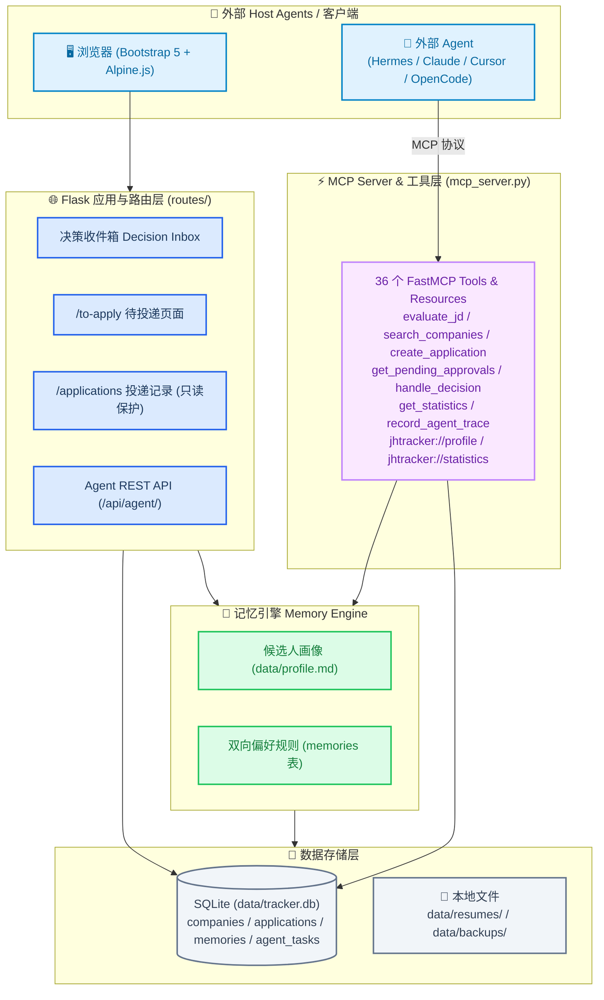

# JHTracker — AI 驱动的求职全流程管理

> 本地优先、AI 加持的求职管理工具。从公司筛选、投递跟踪到 Offer 决策，全流程覆盖。100% 本地数据，零云依赖。

## 特性

- **公司库管理**：500+ 公司清单，按行业/城市/优先级/AI 匹配分多维筛选
- **Agent-Native 原生接口与 MCP**：36 个 MCP 工具覆盖全部 11 个数据域，供 Claude Desktop、Cursor、Hermes 等智能体无缝对接；REST API 作为 fallback 备用
- **HITL 人机协同闭环**：Agent 推荐岗位 → 人在 Decision Inbox 审批 → 拒绝反馈自动反哺到下次评估，形成持续校准的推荐闭环
  ```mermaid
  flowchart TB
      Proposal["🤖 Agent 待审批提案<br/>(status='Pending Approval')"] --> Review["👤 人类在 Decision Inbox 审核"]
      Review -->|Approve 批准| PosMemory["🟢 写入正向记忆<br/>(prefer_tech / prefer_domain)"]
      Review -->|Reject 拒绝| NegMemory["🔴 写入负向记忆<br/>(exclude_tech / exclude_company)"]
      NegMemory --> DBMem[("memories 数据库表")]
      PosMemory --> DBMem
      DBMem --> Prefilter["⚡ Stage 1: 静态词库 + 动态记忆 预筛"]
      DBMem --> LLMScorer["🧠 Stage 2: LLM 批量深度评分"]
      NewJob["新岗位评估"] --> Prefilter
      Prefilter -->|触发负向记忆| Drop["0 分淘汰 (0 Token 开销)"]
      Prefilter -->|通过| LLMScorer
      LLMScorer -->|结合正向记忆加分| Proposal
  ```
- **Agent Trace 实时轨迹**：内置 `/traces` 页面与 SSE 广播，可视化追踪智能体的推理思考与操作日志
- **AI 智能体驱动与分层检索**：使用 Agent 配合 5 层工具链与三步防伪校验门搜寻岗位，杜绝幻觉与假数据
  ```mermaid
  flowchart TB
      Start["搜寻任务启动"] --> Profile["读取 profile.md (enterprise_preference)"]
      Profile --> Routing{"平台智能路由"}
      Routing -->|央国企| PlatformState["国聘 / 国资委 / 央企官网"]
      Routing -->|外企| PlatformForeign["猎聘 / LinkedIn / 外企官网"]
      Routing -->|民企| PlatformPrivate["BOSS直聘 / 拉勾 / 智联"]
      Routing -->|不限| PlatformAll["全平台梯队检索"]

      PlatformState & PlatformForeign & PlatformPrivate & PlatformAll --> L1["Layer 1: Firecrawl Scrape (Proxy)"]
      L1 -->|失败/无结果| L2["Layer 2: CDP 网络拦截 (Playwright)"]
      L2 -->|失败/无结果| L3["Layer 3: Exa 语义搜索"]
      L3 -->|失败/无结果| L4["Layer 4: Tavily 网页搜索"]
      L4 -->|失败/无结果| L5["Layer 5: WebFetch 兜底"]

      L1 & L2 & L3 & L4 & L5 -->|候选结果| Gate{"三步真实性校验门"}
      Gate -->|1. HTTP 200 可达| Gate2{"2. 标题与公司名一致"}
      Gate2 -->|通过| Gate3{"3. 交叉来源验证"}
      Gate3 -->|通过/单来源| Commit["写入 DB (Pending Approval + source_url)"]
      L5 -->|全层失败| Refuse["拒不编造协议：输出报告并结束任务"]
      Gate & Gate2 -->|未通过| Refuse
  ```
- **投递全流程跟踪与生命周期隔离**：前投递人机协同 + 后投递纯人工流水追踪（智能体只读保护）
  ```mermaid
  flowchart LR
      subgraph PreApply ["前投递阶段 (Pre-Application) - 人机协作区"]
          AgentSearch["Agent 搜网提案"] -->|status='Pending Approval'| Inbox["Decision Inbox 决策收件箱"]
          Inbox -->|Approve 批准| ToApply["/to-apply 待投递清单<br/>(status='待投递')"]
          Inbox -->|Reject 拒绝| RejectMem["记录负向偏好规则<br/>(status='已拒')"]
      end

      subgraph PostApply ["后投递阶段 (Post-Application) - 纯人工掌控区 🛡️ Agent只读"]
          ToApply -->|人类手动投递| Applied["/applications 投递记录<br/>(status='已投递')"]
          Applied --> Screening["简历筛选"]
          Screening --> Interview["笔试 / 面试 (一/二/终)"]
          Interview --> Offer["Offer / 已拒"]
      end

      classDef protected fill:#fee2e2,stroke:#ef4444,stroke-width:2px,color:#991b1b;
      class PostApply protected;
  ```
- **数据看板**：投递漏斗、转化率、城市分布、行业分布、优先级分布
- **甘特图时间线**：秋招/春招关键节点，支持近1月/近3月/秋招季/全部多视图切换；节点点击展开查看与编辑
- **笔记管理**：按公司/分类组织，点击卡片展开查看与二次编辑
- **简历版本管理**：多版本 PDF/DOCX 上传、预览、下载、设默认；支持上传新文件更新已有简历
- **简历智能解析**：Profile Skill 读取已上传简历，AI 自动生成结构化候选人画像
- **Offer 对比**：多 Offer 并排比较，辅助决策
- **投递记录归档**：超过指定天数（默认 15 天）未更新的投递自动归档，活跃列表更清爽；支持查看归档、手动恢复、单条归档、自定义阈值
- **备份恢复**：导出 ZIP 包（含数据库 JSON + 简历文件），支持跨机器完整恢复
- **100% 本地**：SQLite + 本地文件，数据不离开你的电脑

## 快速开始

### 环境要求
- Python 3.10+
- 任意现代浏览器

### 一键启动

**Windows**：双击 `start.bat`

**macOS / Linux**：
```bash
chmod +x start.sh
./start.sh
```

启动后打开 http://127.0.0.1:5000

### 手动启动

```bash
git clone <repo-url>
cd career-tracker
python -m venv venv

# Windows
venv\Scripts\activate
# macOS / Linux
source venv/bin/activate

pip install -r requirements.txt
python app.py
```

## Agent-Native & Career OS 架构一览

> **图 1：系统架构与接口拓扑图** — 展示外部 Host Agents、MCP 工具层、记忆引擎与本地 SQLite 存储之间的层级关系。



---

## Agent-Native & MCP Server 接入指南

JHTracker 现已原生支持 **Model Context Protocol (MCP)** 和标准 **Agent REST API**，使任意 AI 智能体（Hermes, Claude Desktop, Cursor, OpenCode 等）可以直接读写求职数据。

### 1. MCP 协议接入 (Hermes / Claude Desktop / Cursor)

在智能体的 MCP 配置文件中（如 `~/.hermes/mcp.json` 或 `claude_desktop_config.json`）添加：

```json
{
  "mcpServers": {
    "jhtracker": {
      "command": "python",
      "args": [
        "D:\\DJTU\\HermesWorkspace\\career-tracker\\mcp_server.py"
      ]
    }
  }
}
```

暴露给 Agent 的能力（36 个 MCP 工具，覆盖 11 个数据域）：

**👤 画像 & 偏好**
- `get_candidate_profile()` / `update_candidate_profile(content)` — 读写求职画像
- `get_user_preferences()` — 获取画像、正向规则（`positive_rules`）、负向规则（`negative_rules`）、拒绝反馈
- `add_memory_rule(category, rule_value, raw_feedback, polarity)` — 写入双向规则。`polarity='positive'` → `prefer_*` 类别；`polarity='negative'` → `exclude_*` 类别；留空则按 `category` 原样写入（向后兼容）。按 `(category, rule_value)` 去重
- `delete_memory_rule(memory_id, confirm)` — 删除记忆规则（`confirm=True` 才生效），覆盖正向/负向所有类别

**🏢 公司**
- `search_companies(query)` — 模糊搜索公司库
- `get_company(company_id)` — 获取公司完整详情
- `create_company(...)` / `update_company(...)` / `delete_company(company_id, confirm)` — 公司 CRUD
- `update_company_score(company_id, score, reason)` — 更新 AI 评分

**📮 投递**
- `create_application(...)` — 创建待审批投递
- `get_application(application_id)` / `list_applications(...)` — 查询投递
- `update_application_status(application_id, status)` — 更新状态
- `get_pending_approvals()` / `handle_decision(application_id, action, ...)` — HITL 审批
- `archive_application(application_id, archive)` — 归档/恢复

**🎙️ 面试反馈**
- `create_interview_feedback(...)` / `list_interview_feedbacks(application_id)` — 管理复盘

**📝 笔记**
- `create_note(...)` / `list_notes(company_id)` / `update_note(...)` / `delete_note(note_id, confirm)` — 笔记 CRUD

**📅 时间线**
- `create_timeline_event(...)` / `list_timeline_events()` / `toggle_timeline_event(event_id)` — 管理节点

**📄 简历**
- `list_resumes()` / `get_default_resume()` — 查询简历版本

**📊 统计**
- `get_statistics()` — 获取 Dashboard 核心指标

**🔍 评估**
- `evaluate_jd(jd_text, company_name, task_id)` — 单 JD 评估
- `batch_evaluate_jds(jds)` — 批量评估多个 JD

**🔄 轨迹 & 任务**
- `record_agent_trace(...)` — 记录任务轨迹
- `list_agent_tasks(status, limit)` / `get_agent_task(task_id)` — 查询任务
- `clear_agent_traces(confirm)` — 清空轨迹

**🔔 系统**
- `notify_db_changed()` — 通知 UI 刷新

### 2. Agent REST API 与 Task/Trace 轨迹

- **REST 接口**：`/api/v1/companies/search`、`/api/v1/companies/<id>/score`、`/api/v1/profile`、`/api/agent/tasks`、`/api/v1/traces`
- **Agent Task Center & Trace 界面**：访问 `http://127.0.0.1:5000/traces` 实时审查后台智能体的任务状态、思考推演与事件日志。

---

## 🎯 设计哲学

JHTracker 围绕三个核心原则构建，指导所有功能设计和开发决策：

### Agent-First（智能体优先）

MCP 是系统的主要编程接口，REST API 是 fallback。所有操作优先通过 MCP 工具暴露给 Agent，让智能体能完成一切能做的事。Skill 是 Agent 的操作手册，告诉 Agent 在什么场景下用什么工具、按什么顺序调用。

| 体现 | 说明 |
|---|---|
| 36 个 MCP 工具 | 覆盖全部 11 个数据域，Agent 无需 HTTP 即可操作全部功能 |
| MCP 是主通道 | Agent 通过 MCP 协议通信，REST API 仅在 MCP 不可用时作为备用 |
| Skill 驱动 | 4 个核心 Skill 指导 Agent 何时调用哪些工具，实现复杂工作流 |

### Human-in-the-Loop（人在回路）

AI Agent 负责所有能做的操作，但人在关键决策点保留最终控制权。删除操作需要显式确认，投递决策必须经过审批。

| 操作类型 | 权限 |
|---|---|
| 读操作（查询公司、投递、笔记等） | Agent 自主执行 |
| 创建/更新操作（创建公司、写笔记、更新状态等） | Agent 自主执行 |
| 删除操作（删除公司、笔记、记忆规则等） | 需传 `confirm=True` |
| 投递决策（批准/拒绝推荐岗位） | Agent 推荐 → 人在 Decision Inbox 审批 |

### Data Sovereignty（数据主权）

100% 本地存储，数据不离开用户电脑，零云依赖。所有数据可备份、可恢复、可迁移。

- SQLite 数据库 + 本地文件系统
- 备份导出 ZIP 包（JSON + 简历文件）
- 支持跨机器完整恢复

---

## 投递记录归档

长期无进展的投递记录会自动移出活跃列表，看板漏斗也只统计活跃记录。

### 归档规则

- **判定依据**：`updated_at` 距今天超过 N 天（默认 15 天）
- **自动归档**：每天首次启动或访问投递列表时触发（可关闭）
- **永不自动归档**：`Offer` 且 `offer_status` 为 `pending` 或 `accepted`（决策中的 Offer 保留可见）
- **其余状态**（含已拒、Offer 已拒绝、面试停滞等）满足天数即归档

### 配置

```bash
# 归档阈值（天），默认 15
set JH_ARCHIVE_STALE_DAYS=15        # Windows
export JH_ARCHIVE_STALE_DAYS=15     # macOS / Linux

# 是否启用自动归档，默认 1（启用）
set JH_ARCHIVE_AUTO=0               # 关闭自动归档
```

Web 界面可在「投递记录」页修改阈值与开关，设置保存在 `data/settings.json`，优先级高于环境变量。

### 操作

| 方式 | 说明 |
|---|---|
| Web 投递记录页 | 切换「活跃 / 已归档」Tab；单条归档/恢复；立即归档；修改阈值 |
| 命令行 | `python scripts/archive_applications.py --dry-run` 预览待归档条目 |

## AI 智能体驱动公司库（核心工作流）

JHTracker 的公司库由 AI 智能体深度检索网络生成，而非固定预设数据。

### 工作流

1. **生成候选人画像**：在「简历版本管理」页上传简历后，用 Profile Skill 让智能体自动解析简历生成 `data/profile.md`（详见下方 [Profile Skill](#career-tracker-profile-skill简历智能解析)）；也可手动复制 `prompts/profile.example.md` → `data/profile.md` 编辑
2. **生成公司清单**：打开 `prompts/company_list_prompt.md`，按 Prompt 模板喂给任何带联网搜索的 AI 智能体（ChatGPT / Claude / DeepSeek / Kimi / 智谱清言 等）
3. **保存清单**：AI 返回的 Markdown 表格保存到 `career_data/企业清单_X_xxx.md`
4. **导入数据库**：在 Web 界面「数据导入」页点击「执行导入」
5. **AI 评分（可选）**：对智能体说「给公司评分」触发 Scorer Skill，对每家公司做匹配度打分

详见 [prompts/company_list_prompt.md](prompts/company_list_prompt.md)。

### AI 评分配置（可选）

评分由 **Scorer Skill** 驱动（详见下方 [Scorer Skill](#career-tracker-scorer-skillai-评分)），不再在前端按钮触发。评分引擎采用**批量评分 + profile 指纹缓存**省 token 策略：默认一次 prompt 评 15 家（500 家从 500 次调用降到 ~34 次），且 profile 未变时跳过 LLM 调用。

安装 API Key 后，对智能体说即可触发评分：

| 指令 | 行为 |
|---|---|
| `给公司评分` | 增量评分（只评 score 为 NULL 的公司） |
| `重新评分所有公司` | 全量重评（profile 改了用这个） |
| `重新评 汇川技术` | 单公司重评分 |
| `预览待评分公司` | 仅列出待评公司，不调 LLM |

底层脚本 `scripts/ai_scorer.py` 仍可命令行直接调用（智能体内部也是调它）：

```bash
pip install -r requirements-ai.txt

# Windows
set ANTHROPIC_API_KEY=sk-ant-...
# macOS / Linux
export ANTHROPIC_API_KEY=sk-ant-...

# 增量评分（默认）
python scripts/ai_scorer.py

# 重新评分所有公司（profile 未变则自动跳过 LLM，仅重跑预筛）
python scripts/ai_scorer.py --force

# profile 修改后强制 LLM 重评所有公司
python scripts/ai_scorer.py --force --profile-changed

# 只评一家
python scripts/ai_scorer.py --company-id 1

# 自定义批量大小（一次 prompt 评 N 家，默认 15）
python scripts/ai_scorer.py --batch-size 20

# 仅预览待评分公司，不调 LLM
python scripts/ai_scorer.py --dry-run
```

未配置 API Key 时，系统自动降级为关键词预筛评分，功能不受影响。

### 批量归纳正向偏好规则

`scripts/induce_positive_rules.py` 从历史 `approve` 记录离线 LLM 归纳 `prefer_*` 正向偏好规则，反哺 `evaluate_jd` 的正向加分。复用 `ai_scorer.py` 的「裸 sqlite3 + 批量 LLM + profile 指纹缓存」骨架，省 token、质量优先：

```bash
# 增量归纳（approve 列表 + profile 未变则跳过 LLM）
python scripts/induce_positive_rules.py

# 强制重新归纳（忽略指纹缓存）
python scripts/induce_positive_rules.py --force

# 自定义批量大小（一次 prompt 处理 N 条 approve，默认 15）
python scripts/induce_positive_rules.py --batch-size 20

# 仅预览归纳结果，不写库
python scripts/induce_positive_rules.py --dry-run
```

指纹缓存文件 `data/.positive_induction_fingerprint`，无新 approve 时自动跳过 LLM 调用。归纳结果通过 `_upsert_memory_rule` 按 `(category, rule_value)` 去重写入 `memories` 表。未配置 API Key 时降级跳过并 log warning，不影响主流程。

> 也可通过 MCP `add_memory_rule(polarity='positive', ...)` 或 REST 端点手动增删正向规则，修正归纳偏差。

## Company Finder Skill（智能体自动检索入库）

JHTracker 内置一个跨平台 Skill，让 AI 智能体一句话触发"联网检索 → 去重 → 入库 → 归档"全流程，无需手动复制 Prompt。

### 支持的智能体平台

| 平台 | 安装方式 |
|---|---|
| Trae | 见下方「Trae」 |
| Claude Code | 见下方「Claude Code」 |
| Cursor | 见下方「Cursor」 |
| Codex / 其他 | 见下方「通用」 |

### Trae

在项目根目录已自带 `.trae/skills/`，但本仓库统一放在 `skills/` 下，需软链或复制：

```bash
# Windows（管理员 PowerShell）
New-Item -ItemType SymbolicLink -Path ".trae\skills\company-finder" -Target "skills\company-finder"

# macOS / Linux
ln -s ../../skills/company-finder .trae/skills/company-finder
```

或直接复制：
```bash
cp -r skills/company-finder .trae/skills/
```

安装后对 Trae 智能体说："帮我找机器人行业的公司"，即可触发。

### Claude Code

```bash
# 复制 skill 到 Claude 的 skills 目录
mkdir -p ~/.claude/skills
cp -r skills/company-finder ~/.claude/skills/
```

然后在 Claude Code 中打开本项目，说："帮我补充 3D打印 公司库"。

### Cursor

Cursor 通过 `.cursorrules` 或 MCP 触发，在 `.cursorrules` 中添加：
```
当用户要求查找/搜索/补充公司时，参考 skills/company-finder/SKILL.md 的工作流执行。
```

### 通用（Codex / 其他智能体）

把 `skills/company-finder/SKILL.md` 的内容粘贴给任何支持 web 搜索的智能体作为系统提示，然后正常对话即可。

### 使用示例

安装后，对智能体说：
- "帮我找 5 家深圳的协作机器人公司"
- "补充新能源汽车行业的公司库"
- "find 3D printing companies in Shanghai"

智能体会自动：
1. 读取 `data/profile.md` 候选人画像
2. 联网搜索（用平台自带的 web 搜索工具）
3. 去重后入库 + 存 Markdown 归档
4. 询问是否运行 AI 评分

### Skill 工作流详情

详见 [skills/company-finder/SKILL.md](skills/company-finder/SKILL.md)。

## Career Tracker Profile Skill（简历智能解析）

JHTracker 内置一个跨平台 Skill，让 AI 智能体读取「简历版本管理」中上传的简历，自动提取文本并调用 LLM 生成结构化候选人画像 `data/profile.md`，供 AI 评分使用。

### 支持的智能体平台

| 平台 | 安装方式 |
|---|---|
| Trae | 见下方「Trae」 |
| Claude Code | 见下方「Claude Code」 |
| Cursor | 见下方「Cursor」 |
| Codex / 其他 | 见下方「通用」 |

### Trae

```bash
# Windows（管理员 PowerShell）
New-Item -ItemType SymbolicLink -Path ".trae\skills\career-tracker-profile" -Target "skills\career-tracker-profile"

# macOS / Linux
ln -s ../../skills/career-tracker-profile .trae/skills/career-tracker-profile
```

或直接复制：
```bash
cp -r skills/career-tracker-profile .trae/skills/
```

安装后对 Trae 智能体说："解析我的简历生成画像"，即可触发。

### Claude Code

```bash
mkdir -p ~/.claude/skills
cp -r skills/career-tracker-profile ~/.claude/skills/
```

然后在 Claude Code 中打开本项目，说："根据简历更新画像"。

### Cursor

在 `.cursorrules` 中添加：
```
当用户要求解析简历/生成画像/更新 profile 时，参考 skills/career-tracker-profile/SKILL.md 的工作流执行。
```

### 通用（Codex / 其他智能体）

把 `skills/career-tracker-profile/SKILL.md` 的内容粘贴给任何支持文件读写 + LLM 调用的智能体作为系统提示，然后正常对话即可。

### 使用示例

安装后，先在「简历版本管理」页上传一份 PDF/DOCX 简历，然后对智能体说：
- "解析我的简历生成画像"
- "根据简历更新 profile"
- "parse my resume and generate profile"

智能体会自动：
1. 从数据库读取默认（或最新）简历
2. 提取文本（PDF → PyPDF2/pdfplumber；DOCX → python-docx，含表格）
3. 调用 LLM 结构化为标准画像格式
4. 写入 `data/profile.md`
5. 询问是否运行 AI 评分

### 依赖安装（一次性）

```bash
pip install python-docx pdfplumber
# 或
pip install -r requirements-ai.txt
```

### Skill 工作流详情

详见 [skills/career-tracker-profile/SKILL.md](skills/career-tracker-profile/SKILL.md)。

## Career Tracker Scorer Skill（AI 评分）

JHTracker 的 AI 评分由 **Scorer Skill** 驱动，不再在前端按钮触发。智能体读取 `data/profile.md` 候选人画像，先做关键词预筛（免费），再批量调 LLM 评分（一次 prompt 评 15 家，省 90%+ token），结果直接写入数据库。

### 支持的智能体平台

| 平台 | 安装方式 |
|---|---|
| Trae | 见下方「Trae」 |
| Claude Code | 见下方「Claude Code」 |
| Cursor | 见下方「Cursor」 |
| Codex / 其他 | 见下方「通用」 |

### Trae

```bash
# Windows（管理员 PowerShell）
New-Item -ItemType SymbolicLink -Path ".trae\skills\career-tracker-scorer" -Target "skills\career-tracker-scorer"

# macOS / Linux
ln -s ../../skills/career-tracker-scorer .trae/skills/career-tracker-scorer
```

或直接复制：
```bash
cp -r skills/career-tracker-scorer .trae/skills/
```

安装后对 Trae 智能体说："给公司评分"，即可触发。

### Claude Code

```bash
mkdir -p ~/.claude/skills
cp -r skills/career-tracker-scorer ~/.claude/skills/
```

然后在 Claude Code 中打开本项目，说："重新评分所有公司"。

### Cursor

在 `.cursorrules` 中添加：
```
当用户要求给公司评分/重新评分/AI 评分时，参考 skills/career-tracker-scorer/SKILL.md 的工作流执行。
```

### 通用（Codex / 其他智能体）

把 `skills/career-tracker-scorer/SKILL.md` 的内容粘贴给任何支持文件读写 + LLM 调用的智能体作为系统提示，然后正常对话即可。

### 使用示例

安装后，先确保 `data/profile.md` 已生成（用 Profile Skill 或手动创建），然后对智能体说：

- `给公司评分` — 增量评分未评分的公司
- `重新评分所有公司` — 全量重评（profile 改了用这个）
- `重新评 汇川技术` — 单公司重评分
- `预览待评分公司` — 仅列出待评公司，不调 LLM

智能体会自动：
1. 校验 `data/profile.md` 存在
2. 读取数据库中待评分公司（默认只评 score 为 NULL 的）
3. Stage 1：关键词预筛（免费，排除实习/销售/前端等明显不匹配）
4. Stage 2：批量调 LLM 评分（一次 prompt 评 15 家，省 token）
5. 写入 `companies.score` / `companies.score_reason`
6. LLM 失败的公司保持 NULL，下次增量评分自动重试

### 依赖安装（一次性）

```bash
pip install -r requirements-ai.txt
# 或单独安装
pip install anthropic openai python-dotenv
```

### Skill 工作流详情

详见 [skills/career-tracker-scorer/SKILL.md](skills/career-tracker-scorer/SKILL.md)。

## 数据目录说明

```
career-tracker/
├── data/                   # 运行时数据（已 gitignore）
│   ├── tracker.db          # SQLite 数据库
│   ├── resumes/            # 上传的简历文件
│   ├── backups/            # 导出的备份 ZIP 文件
│   ├── .secret_key         # 自动生成的 Flask 密钥
│   └── profile.md          # 你的候选人画像（AI 评分用）
├── career_data/            # 公司清单数据源（可编辑）
│   └── 企业清单_X_xxx.md
├── prompts/                # AI 提示词模板
│   ├── company_list_prompt.md   # 公司清单生成 Prompt
│   └── profile.example.md       # 候选人画像示例
├── skills/                 # 跨平台智能体 Skill
│   ├── company-finder/     # 自动检索入库 skill
│   ├── career-tracker-profile/  # 简历智能解析 skill
│   └── career-tracker-scorer/   # AI 评分 skill
├── requirements.txt        # 核心依赖
└── requirements-ai.txt     # AI 功能可选依赖
```

## 配置

所有配置项支持环境变量覆盖，见 [.env.example](.env.example)。

| 环境变量 | 默认值 | 说明 |
|---|---|---|
| `FLASK_DEBUG` | `0` | 调试模式，开发时设 `1` |
| `SECRET_KEY` | 自动生成 | Flask 密钥，不设则持久化到 `data/.secret_key` |
| `CAREER_DIR` | `./career_data` | 公司清单 Markdown 目录 |
| `JH_DATA_DIR` | `./data` | 运行时数据目录 |
| `AI_PROVIDER` | `anthropic` | AI 评分提供商 |
| `AI_MODEL` | `claude-sonnet-4-20250514` | AI 评分模型 |
| `ANTHROPIC_API_KEY` | 空 | Anthropic API Key |
| `OPENAI_API_KEY` | 空 | OpenAI 兼容 API Key |

## 技术栈

- **后端**：Flask 3.0 + SQLAlchemy + Flask-Migrate
- **前端**：Bootstrap 5 + Chart.js + 原生 JS
- **数据库**：SQLite（零配置，本地文件）
- **AI**：Anthropic Claude / OpenAI（可选）

## 开发

```bash
# 开发模式
set FLASK_DEBUG=1   # Windows
export FLASK_DEBUG=1  # macOS / Linux
python app.py

# 运行测试
python -m pytest tests/
```

贡献指南见 [CONTRIBUTING.md](CONTRIBUTING.md)。

## License

MIT，见 [LICENSE](LICENSE)。
