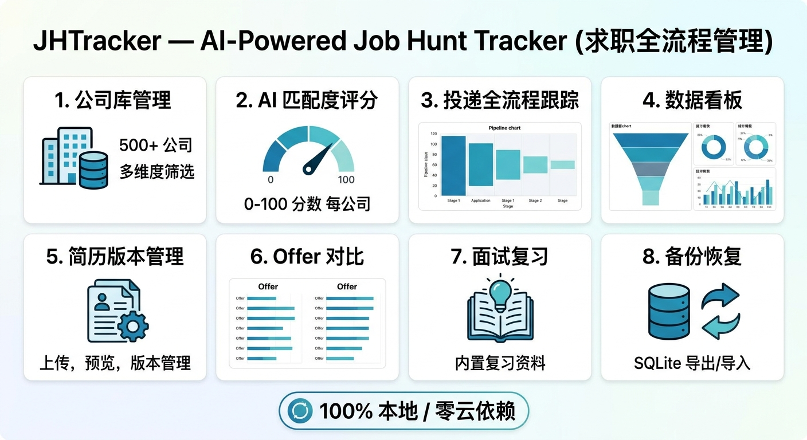

# JHTracker — AI 驱动的求职全流程管理

> 本地优先、AI 加持的求职管理工具。从公司筛选、投递跟踪到 Offer 决策，全流程覆盖。100% 本地数据，零云依赖。

<p align="center">
  
</p>

<p align="center">
  <em>系统框图：<a href="docs/product-diagram.html">交互式 HTML 版</a>（含产品总览 + 系统数据流）</em>
</p>

## 特性

- **公司库管理**：500+ 公司清单，按行业/城市/优先级/AI 匹配分多维筛选
- **AI 智能体驱动**：用 AI 智能体深度检索网络生成公司库；AI 评分引擎对每家公司做匹配度打分
- **投递全流程跟踪**：待投递 → 已投递 → 简历筛选 → 笔试 → 面试 → Offer/拒绝，状态流转 + 面试评价
- **数据看板**：投递漏斗、转化率、城市分布、行业分布、优先级分布
- **甘特图时间线**：秋招/春招关键节点，支持近1月/近3月/秋招季/全部多视图切换；节点点击展开查看与编辑
- **笔记管理**：按公司/分类组织，点击卡片展开查看与二次编辑
- **简历版本管理**：多版本 PDF/DOCX 上传、预览、下载、设默认；支持上传新文件更新已有简历
- **简历智能解析**：Profile Skill 读取已上传简历，AI 自动生成结构化候选人画像
- **Offer 对比**：多 Offer 并排比较，辅助决策
- **备份恢复**：导出 ZIP 包（含数据库 JSON + 简历文件），支持跨机器完整恢复
- **100% 本地**：SQLite + 本地文件，数据不离开你的电脑

## 快速开始

### 环境要求
- Python 3.10+
- 任意现代浏览器

### 一键启动

**Windows**：双击 `start.bat`

**macOS / Linux**：
```bash
chmod +x start.sh
./start.sh
```

启动后打开 http://127.0.0.1:5000

### 手动启动

```bash
git clone <repo-url>
cd career-tracker
python -m venv venv

# Windows
venv\Scripts\activate
# macOS / Linux
source venv/bin/activate

pip install -r requirements.txt
python app.py
```

## AI 智能体驱动公司库（核心工作流）

JHTracker 的公司库由 AI 智能体深度检索网络生成，而非固定预设数据。

### 工作流

1. **生成候选人画像**：在「简历版本管理」页上传简历后，用 Profile Skill 让智能体自动解析简历生成 `data/profile.md`（详见下方 [Profile Skill](#career-tracker-profile-skill简历智能解析)）；也可手动复制 `prompts/profile.example.md` → `data/profile.md` 编辑
2. **生成公司清单**：打开 `prompts/company_list_prompt.md`，按 Prompt 模板喂给任何带联网搜索的 AI 智能体（ChatGPT / Claude / DeepSeek / Kimi / 智谱清言 等）
3. **保存清单**：AI 返回的 Markdown 表格保存到 `career_data/企业清单_X_xxx.md`
4. **导入数据库**：在 Web 界面「数据导入」页点击「执行导入」
5. **AI 评分（可选）**：对智能体说「给公司评分」触发 Scorer Skill，对每家公司做匹配度打分

详见 [prompts/company_list_prompt.md](prompts/company_list_prompt.md)。

### AI 评分配置（可选）

评分由 **Scorer Skill** 驱动（详见下方 [Scorer Skill](#career-tracker-scorer-skillai-评分)），不再在前端按钮触发。评分引擎采用**批量评分 + profile 指纹缓存**省 token 策略：默认一次 prompt 评 15 家（500 家从 500 次调用降到 ~34 次），且 profile 未变时跳过 LLM 调用。

安装 API Key 后，对智能体说即可触发评分：

| 指令 | 行为 |
|---|---|
| `给公司评分` | 增量评分（只评 score 为 NULL 的公司） |
| `重新评分所有公司` | 全量重评（profile 改了用这个） |
| `重新评 汇川技术` | 单公司重评分 |
| `预览待评分公司` | 仅列出待评公司，不调 LLM |

底层脚本 `scripts/ai_scorer.py` 仍可命令行直接调用（智能体内部也是调它）：

```bash
pip install -r requirements-ai.txt

# Windows
set ANTHROPIC_API_KEY=sk-ant-...
# macOS / Linux
export ANTHROPIC_API_KEY=sk-ant-...

# 增量评分（默认）
python scripts/ai_scorer.py

# 重新评分所有公司（profile 未变则自动跳过 LLM，仅重跑预筛）
python scripts/ai_scorer.py --force

# profile 修改后强制 LLM 重评所有公司
python scripts/ai_scorer.py --force --profile-changed

# 只评一家
python scripts/ai_scorer.py --company-id 1

# 自定义批量大小（一次 prompt 评 N 家，默认 15）
python scripts/ai_scorer.py --batch-size 20

# 仅预览待评分公司，不调 LLM
python scripts/ai_scorer.py --dry-run
```

未配置 API Key 时，系统自动降级为关键词预筛评分，功能不受影响。

## Company Finder Skill（智能体自动检索入库）

JHTracker 内置一个跨平台 Skill，让 AI 智能体一句话触发"联网检索 → 去重 → 入库 → 归档"全流程，无需手动复制 Prompt。

### 支持的智能体平台

| 平台 | 安装方式 |
|---|---|
| Trae | 见下方「Trae」 |
| Claude Code | 见下方「Claude Code」 |
| Cursor | 见下方「Cursor」 |
| Codex / 其他 | 见下方「通用」 |

### Trae

在项目根目录已自带 `.trae/skills/`，但本仓库统一放在 `skills/` 下，需软链或复制：

```bash
# Windows（管理员 PowerShell）
New-Item -ItemType SymbolicLink -Path ".trae\skills\company-finder" -Target "skills\company-finder"

# macOS / Linux
ln -s ../../skills/company-finder .trae/skills/company-finder
```

或直接复制：
```bash
cp -r skills/company-finder .trae/skills/
```

安装后对 Trae 智能体说："帮我找机器人行业的公司"，即可触发。

### Claude Code

```bash
# 复制 skill 到 Claude 的 skills 目录
mkdir -p ~/.claude/skills
cp -r skills/company-finder ~/.claude/skills/
```

然后在 Claude Code 中打开本项目，说："帮我补充 3D打印 公司库"。

### Cursor

Cursor 通过 `.cursorrules` 或 MCP 触发，在 `.cursorrules` 中添加：
```
当用户要求查找/搜索/补充公司时，参考 skills/company-finder/SKILL.md 的工作流执行。
```

### 通用（Codex / 其他智能体）

把 `skills/company-finder/SKILL.md` 的内容粘贴给任何支持 web 搜索的智能体作为系统提示，然后正常对话即可。

### 使用示例

安装后，对智能体说：
- "帮我找 5 家深圳的协作机器人公司"
- "补充新能源汽车行业的公司库"
- "find 3D printing companies in Shanghai"

智能体会自动：
1. 读取 `data/profile.md` 候选人画像
2. 联网搜索（用平台自带的 web 搜索工具）
3. 去重后入库 + 存 Markdown 归档
4. 询问是否运行 AI 评分

### Skill 工作流详情

详见 [skills/company-finder/SKILL.md](skills/company-finder/SKILL.md)。

## Career Tracker Profile Skill（简历智能解析）

JHTracker 内置一个跨平台 Skill，让 AI 智能体读取「简历版本管理」中上传的简历，自动提取文本并调用 LLM 生成结构化候选人画像 `data/profile.md`，供 AI 评分使用。

### 支持的智能体平台

| 平台 | 安装方式 |
|---|---|
| Trae | 见下方「Trae」 |
| Claude Code | 见下方「Claude Code」 |
| Cursor | 见下方「Cursor」 |
| Codex / 其他 | 见下方「通用」 |

### Trae

```bash
# Windows（管理员 PowerShell）
New-Item -ItemType SymbolicLink -Path ".trae\skills\career-tracker-profile" -Target "skills\career-tracker-profile"

# macOS / Linux
ln -s ../../skills/career-tracker-profile .trae/skills/career-tracker-profile
```

或直接复制：
```bash
cp -r skills/career-tracker-profile .trae/skills/
```

安装后对 Trae 智能体说："解析我的简历生成画像"，即可触发。

### Claude Code

```bash
mkdir -p ~/.claude/skills
cp -r skills/career-tracker-profile ~/.claude/skills/
```

然后在 Claude Code 中打开本项目，说："根据简历更新画像"。

### Cursor

在 `.cursorrules` 中添加：
```
当用户要求解析简历/生成画像/更新 profile 时，参考 skills/career-tracker-profile/SKILL.md 的工作流执行。
```

### 通用（Codex / 其他智能体）

把 `skills/career-tracker-profile/SKILL.md` 的内容粘贴给任何支持文件读写 + LLM 调用的智能体作为系统提示，然后正常对话即可。

### 使用示例

安装后，先在「简历版本管理」页上传一份 PDF/DOCX 简历，然后对智能体说：
- "解析我的简历生成画像"
- "根据简历更新 profile"
- "parse my resume and generate profile"

智能体会自动：
1. 从数据库读取默认（或最新）简历
2. 提取文本（PDF → PyPDF2/pdfplumber；DOCX → python-docx，含表格）
3. 调用 LLM 结构化为标准画像格式
4. 写入 `data/profile.md`
5. 询问是否运行 AI 评分

### 依赖安装（一次性）

```bash
pip install python-docx pdfplumber
# 或
pip install -r requirements-ai.txt
```

### Skill 工作流详情

详见 [skills/career-tracker-profile/SKILL.md](skills/career-tracker-profile/SKILL.md)。

## Career Tracker Scorer Skill（AI 评分）

JHTracker 的 AI 评分由 **Scorer Skill** 驱动，不再在前端按钮触发。智能体读取 `data/profile.md` 候选人画像，先做关键词预筛（免费），再批量调 LLM 评分（一次 prompt 评 15 家，省 90%+ token），结果直接写入数据库。

### 支持的智能体平台

| 平台 | 安装方式 |
|---|---|
| Trae | 见下方「Trae」 |
| Claude Code | 见下方「Claude Code」 |
| Cursor | 见下方「Cursor」 |
| Codex / 其他 | 见下方「通用」 |

### Trae

```bash
# Windows（管理员 PowerShell）
New-Item -ItemType SymbolicLink -Path ".trae\skills\career-tracker-scorer" -Target "skills\career-tracker-scorer"

# macOS / Linux
ln -s ../../skills/career-tracker-scorer .trae/skills/career-tracker-scorer
```

或直接复制：
```bash
cp -r skills/career-tracker-scorer .trae/skills/
```

安装后对 Trae 智能体说："给公司评分"，即可触发。

### Claude Code

```bash
mkdir -p ~/.claude/skills
cp -r skills/career-tracker-scorer ~/.claude/skills/
```

然后在 Claude Code 中打开本项目，说："重新评分所有公司"。

### Cursor

在 `.cursorrules` 中添加：
```
当用户要求给公司评分/重新评分/AI 评分时，参考 skills/career-tracker-scorer/SKILL.md 的工作流执行。
```

### 通用（Codex / 其他智能体）

把 `skills/career-tracker-scorer/SKILL.md` 的内容粘贴给任何支持文件读写 + LLM 调用的智能体作为系统提示，然后正常对话即可。

### 使用示例

安装后，先确保 `data/profile.md` 已生成（用 Profile Skill 或手动创建），然后对智能体说：

- `给公司评分` — 增量评分未评分的公司
- `重新评分所有公司` — 全量重评（profile 改了用这个）
- `重新评 汇川技术` — 单公司重评分
- `预览待评分公司` — 仅列出待评公司，不调 LLM

智能体会自动：
1. 校验 `data/profile.md` 存在
2. 读取数据库中待评分公司（默认只评 score 为 NULL 的）
3. Stage 1：关键词预筛（免费，排除实习/销售/前端等明显不匹配）
4. Stage 2：批量调 LLM 评分（一次 prompt 评 15 家，省 token）
5. 写入 `companies.score` / `companies.score_reason`
6. LLM 失败的公司保持 NULL，下次增量评分自动重试

### 依赖安装（一次性）

```bash
pip install -r requirements-ai.txt
# 或单独安装
pip install anthropic openai python-dotenv
```

### Skill 工作流详情

详见 [skills/career-tracker-scorer/SKILL.md](skills/career-tracker-scorer/SKILL.md)。

## 数据目录说明

```
career-tracker/
├── data/                   # 运行时数据（已 gitignore）
│   ├── tracker.db          # SQLite 数据库
│   ├── resumes/            # 上传的简历文件
│   ├── backups/            # 导出的备份 ZIP 文件
│   ├── .secret_key         # 自动生成的 Flask 密钥
│   └── profile.md          # 你的候选人画像（AI 评分用）
├── career_data/            # 公司清单数据源（可编辑）
│   └── 企业清单_X_xxx.md
├── prompts/                # AI 提示词模板
│   ├── company_list_prompt.md   # 公司清单生成 Prompt
│   └── profile.example.md       # 候选人画像示例
├── skills/                 # 跨平台智能体 Skill
│   ├── company-finder/     # 自动检索入库 skill
│   ├── career-tracker-profile/  # 简历智能解析 skill
│   └── career-tracker-scorer/   # AI 评分 skill
├── requirements.txt        # 核心依赖
└── requirements-ai.txt     # AI 功能可选依赖
```

## 配置

所有配置项支持环境变量覆盖，见 [.env.example](.env.example)。

| 环境变量 | 默认值 | 说明 |
|---|---|---|
| `FLASK_DEBUG` | `0` | 调试模式，开发时设 `1` |
| `SECRET_KEY` | 自动生成 | Flask 密钥，不设则持久化到 `data/.secret_key` |
| `CAREER_DIR` | `./career_data` | 公司清单 Markdown 目录 |
| `JH_DATA_DIR` | `./data` | 运行时数据目录 |
| `AI_PROVIDER` | `anthropic` | AI 评分提供商 |
| `AI_MODEL` | `claude-sonnet-4-20250514` | AI 评分模型 |
| `ANTHROPIC_API_KEY` | 空 | Anthropic API Key |
| `OPENAI_API_KEY` | 空 | OpenAI 兼容 API Key |

## 技术栈

- **后端**：Flask 3.0 + SQLAlchemy + Flask-Migrate
- **前端**：Bootstrap 5 + Chart.js + 原生 JS
- **数据库**：SQLite（零配置，本地文件）
- **AI**：Anthropic Claude / OpenAI（可选）

## 开发

```bash
# 开发模式
set FLASK_DEBUG=1   # Windows
export FLASK_DEBUG=1  # macOS / Linux
python app.py

# 运行测试
python -m pytest tests/
```

贡献指南见 [CONTRIBUTING.md](CONTRIBUTING.md)。

## License

MIT，见 [LICENSE](LICENSE)。
