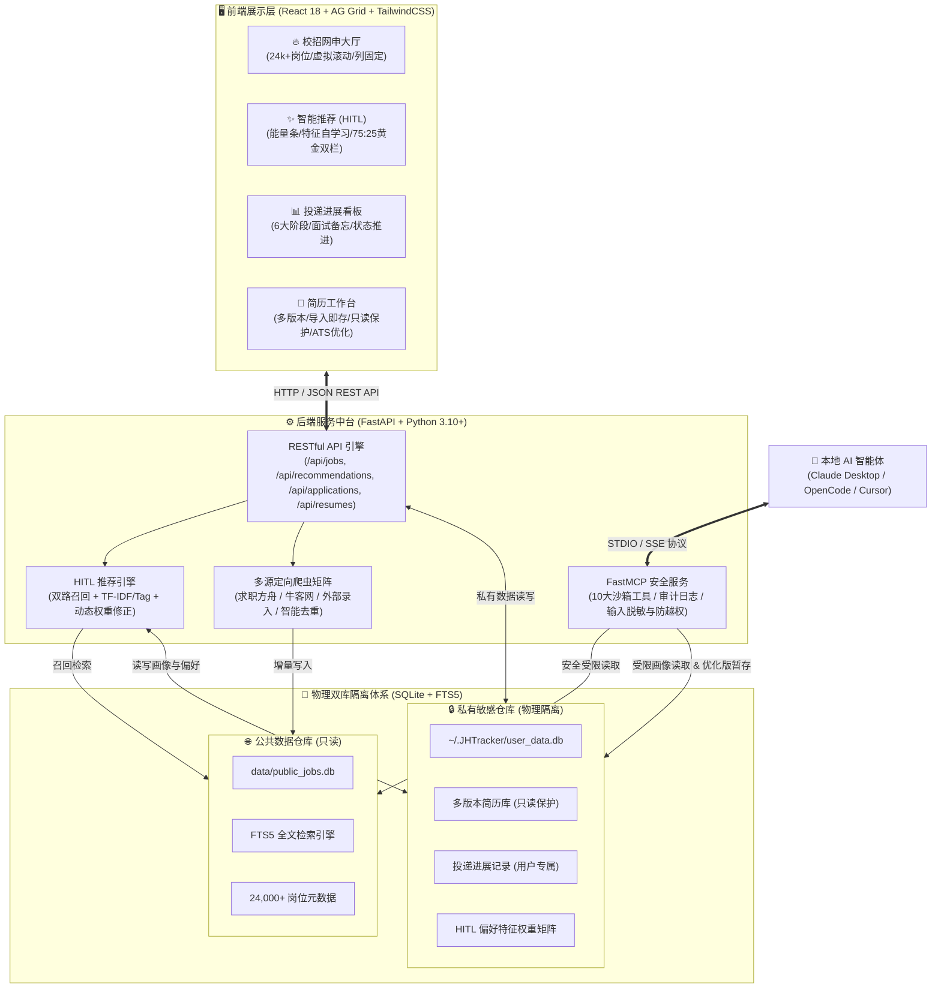
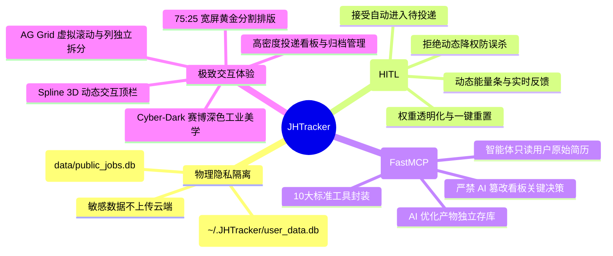

# JHTracker 官方文档中心 📚✨

欢迎查阅 **JHTracker（本地 AI 智能求职求贤追踪与人在环路推荐中台）** 官方全景技术与使用文档。

JHTracker 专为现代求职者、高校毕业生与 AI 开发者量身打造。系统采用 **赛博深色风格（Cyber-Dark）** 极客界面，提供 2.4万+ 岗位全域检索、人在环路（Human-In-The-Loop, HITL）特征自学习偏好推荐、沉浸式投递进展看板、多版本简历工作台与 ATS 匹配分析，并通过 **Model Context Protocol (FastMCP)** 实现与本地智能体（Claude Desktop、OpenCode、Cursor）的高效安全协同。

---

## 🗺️ 系统核心架构全景图

---

## 📚 文档目录与阅读指引

| 类别 | 文档名称 | 核心内容简介 | 适用对象 |
| :--- | :--- | :--- | :--- |
| **快速起步** | **[3分钟极速入门指南](./quickstart.md)** | 环境依赖、一键启动脚本、服务健康检查与首发配置 | 所有人 / 快速体验 |
| **实操指南** | **[全流程用户使用手册](./user-guide.md)** | 网申大厅筛选、HITL 能量条交互、看板拖拽、简历多版本操作全图解 | 求职者 / 终端用户 |
| **系统设计** | **[系统总体架构设计](./architecture.md)** | 双库隔离模型、HITL 闭环算法数学公式、生命周期时序图 | 架构师 / 高级开发者 |
| **数据隐私** | **[数据存储与隐私隔离规范](./data-storage-and-privacy.md)** | 目录安全规范、数据表 DDL、FTS5 检索机制、防越权防篡改模型 | 安全审计 / 数据库管理 |
| **API 参考** | **[RESTful API 完整手册](./api-reference.md)** | 20+ 个核心 API 请求规范、响应格式、状态码定义与示例 | 全栈开发 / 接口联调 |
| **AI 协作** | **[FastMCP 智能体接入指南](./mcp-agent-guide.md)** | 10大开放工具说明、参数约束、JSON 配置范例、安全权限红线守则 | AI 开发者 / Agent 工程师 |
| **开发贡献** | **[开发者环境与架构指南](./developer-guide.md)** | 工程布局、Python/Node 虚拟环境搭建、全套 pytest 单元测试验证 | 二次开发 / 代码贡献者 |
| **数据采集** | **[定向爬虫开发与接入指南](./spider-development.md)** | `BaseJobSpider` 抽象基类、数据清洗流水线、哈希防重入库范式 | 爬虫工程师 / 数据集成 |

---

## 🌟 核心设计原则与价值主张

1. **绝对物理隔离 (Privacy by Physical Isolation)**：全网抓取的 2.4万+ 岗位保存在项目根目录下，而个人的简历原文、投递记录、面试复盘与偏好特征权重**强制存储在操作系统用户私有目录**（`~/.JHTracker/user_data.db`），代码仓库公开开源也不会泄露丝毫个人隐私。
2. **人在环路双向进化 (Human-In-The-Loop Evolution)**：告别传统黑盒协同过滤推荐。系统依据用户对岗位的 `ACCEPT`（感兴趣）与 `REJECT`（不感兴趣/不匹配），在后台实时奖惩行业、分类与城市特征权重；同时提供可视化权重监控面板与一键安全复位。
3. **高密度全周期看板与归档管理**：6 大阶段泳道驱动投递生命周期，紧凑干练的卡片排版搭配进行中/已归档双视图过滤，全面支持流程复盘与历史沉淀。
4. **AI 辅助而非越权 (Assistance Without Overreach)**：智能体（Agent）拥有强大的全网检索与简历 ATS 优化能力，但系统设立了严格的权限红线：智能体**严禁擅自修改投递看板状态**，**严禁覆写用户的原始基准简历**，所有的关键决策权始终牢牢掌握在求职者手中。
