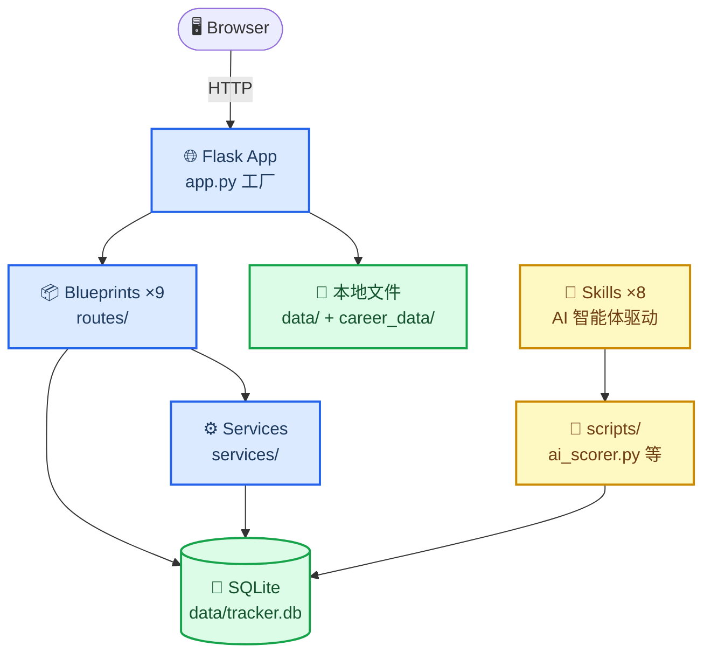

# JHTracker 文档中心

_JHTracker（Job Hunt Tracker）——AI 驱动的求职全流程管理工具。本文档中心面向使用者与开发者，介绍系统架构、数据模型、接口与开发流程。_

---

## 📖 文档索引

| 文档 | 说明 | 适合读者 |
|---|---|---|
| [getting-started.md](getting-started.md) | 快速开始：5 分钟上手指南、MCP 智能体配置与基础用法 | 初学者、使用者 |
| [architecture.md](architecture.md) | 系统架构：技术栈、模块划分、请求生命周期、设计决策 | 开发者、架构评审 |
| [database.md](database.md) | 数据库设计：10 张表的字段说明、关系、迁移管理 | 开发者、运维 |
| [api.md](api.md) | 路由/API 参考：端点清单与 MCP 协议配置说明 | 前端、集成方 |
| [ai-scoring.md](ai-scoring.md) | AI 评分引擎：两阶段评分、省 token 策略、调用方式 | 使用者、开发者 |
| [development.md](development.md) | 开发指南：环境搭建、测试、迁移、代码规范 | 贡献者 |
| [hitl-feedback-loop.md](hitl-feedback-loop.md) | HITL 闭环：Agent 推荐→人审核→反馈→记忆→评分纠偏 | 使用者、开发者 |

---

## 🧭 快速导航

- **新手使用**：请先读根目录 [README.md](../README.md)，包含一键启动、AI 工作流与 Skills 安装方法
- **想了解架构**：读 [architecture.md](architecture.md)，含系统总览图与模块职责表
- **要接接口**：读 [api.md](api.md)，所有端点按 blueprint 组织
- **要改数据库**：读 [database.md](database.md)，字段变更须走 Flask-Migrate
- **要了解 HITL 闭环**：读 [hitl-feedback-loop.md](hitl-feedback-loop.md)，Agent 推荐→人审核→反馈→记忆→评分纠偏全链路
- **要贡献代码**：读 [development.md](development.md) 与根目录 [CONTRIBUTING.md](../CONTRIBUTING.md)

---

## 🗺️ 系统一览

---

## 🎯 设计哲学

JHTracker 围绕三个核心原则构建：

| 原则 | 含义 | 体现 |
|---|---|---|
| **Agent-First（智能体优先）** | MCP 是主要接口，REST API 是 fallback；所有操作优先通过 MCP 工具暴露给 Agent | 36 个 MCP 工具覆盖全部 11 个数据域；Skill 是 Agent 的操作手册 |
| **Human-in-the-Loop（人在回路）** | AI Agent 负责所有能做的操作，人在关键决策点保留控制权 | 创建类操作 Agent 自主执行；删除类操作需 `confirm=True`；投递决策走审批流程 |
| **Data Sovereignty（数据主权）** | 100% 本地存储，数据不离开用户电脑，零云依赖 | SQLite + 本地文件；可备份、可恢复、可迁移 |

---

## 📚 参考

- 根目录 README：[../README.md](../README.md) — 快速开始、AI 工作流、Skills 安装
- 贡献指南：[../CONTRIBUTING.md](../CONTRIBUTING.md)
- 系统 Mermaid 架构一览见上方「系统一览」章节
- 依赖清单：[../requirements.txt](../requirements.txt)、[../requirements-ai.txt](../requirements-ai.txt)

---

_最后更新：2026-07-31 · 维护者：JHTracker 项目组_
