<div align="center">

```ascii
       __  __  ___________________  ___   ________ __ __________ 
      / / / / /_  __/ __ \/   |  / ____/  / //_/ ____// __ \      
 __  / /_/ /_  / / / /_/ / /| | / /      / ,< / __/  / /_/ /      
/ /_/ / __  / / / / _, _/ ___ |/ /___   / /| / /___ / _, _/       
\____/_/ /_/ /_/ /_/ |_/_/  |_|\____/  /_/ |/_____//_/ |_|        
```

### 本地优先・零云端泄露・物理双库隔离的智能求职求贤追踪与推荐底座

<p align="center">
  <a href="README_ZH.md"></a>
  <a href="../README.md"></a>
  <a href="https://github.com/diegosouzapw/JHTracker/releases"></a>
  <a href="../LICENSE"></a>
  <a href="https://fastapi.tiangolo.com/"></a>
  <a href="https://react.dev/"></a>
</p>

<!-- 赛博控制台全景 Hero Banner 预览 -->
<p align="center">
  
</p>

</div>

---

## ⚡ 3 秒数字抓手：用硬指标定义新标准

<div align="center">

| 🏢 **24,180 真实校招岗位** | 🔒 **100% 物理隔离私库** | ⚡ **&lt;50ms 倒排全文检索** | 🤖 **8 大 FastMCP 工具** |
| :---: | :---: | :---: | :---: |
| 仓库自带完整离线校招数据库，首启即用无需抓取等待。 | 个人简历、投递流与权重锁在 `~/.JHTracker`，绝不上云。 | SQLite FTS5 倒排索引 + AG Grid 虚拟滚动，告别白块与卡顿。 | 为 Claude Desktop、Cursor 与 OpenCode 打造的标准智能体底座。 |

</div>

```
传统求职模式:  ❌ 到处找过期链接 ──> ❌ SaaS 简历倒卖骚扰 ──> ❌ 商业竞价黑盒推荐 ──> ❌ 手动复制维护崩溃
JHTracker 标准: ✅ 2.4万岗位大厅 ──> ✅ ~/.JHTracker 物理金库 ──> ✅ HITL 能量条自适应闭环 ──> ✅ FastMCP 一键推送到看板
```

---

## 🎯 5 秒零配置极速体验

无需任何 API Key，无需注册任何商业云服务，开箱即可通过本地终端秒级检索 2.4 万余条高质量校招岗位：

```bash
# 检索本地 SQLite FTS5 倒排索引：查找 Python 与 FastAPI 相关的校招岗位
curl -s "http://127.0.0.1:8000/api/jobs/search?q=Python+FastAPI&limit=2" | jq .
```

```json
{
  "total": 348,
  "items": [
    {
      "id": "job_ali_cloud_902",
      "company": "阿里云计算",
      "title": "后端研发专家 (AI Agent 方向)",
      "salary": "28k-45k · 16薪",
      "city": "杭州",
      "degree": "硕士及以上",
      "apply_url": "https://talent.alibaba.com/campus/position-detail?lang=zh&positionId=...",
      "skills": ["Python", "FastAPI", "FastMCP", "SQLite", "分布式系统"]
    }
  ],
  "latency_ms": 32.4
}
```

---

## 💥 为什么选择 JHTracker？（直面传统求职痛点）

<p align="center">
  
</p>

---

## 🥊 硬核全景矩阵：JHTracker 与传统方案的区别

| 核心维度 | ⚡ **JHTracker** | 🏢 商业求职平台 (Boss/牛客/拉勾等) | 📋 Notion / Excel 统计模板 | 🐍 个人编写的单体爬虫脚本 |
| :--- | :--- | :--- | :--- | :--- |
| **隐私数据控制** | **100% 物理双库硬隔离** (`~/.JHTracker` 与仓库代码完全脱钩) | ⚠️ 集中托管：求职档案与个人凭据存储于第三方公有云服务器 | ⚠️ 依赖云端文档托管平台；存在工作空间或多端同步泄漏隐患 | ⚠️ 散落在本地明文 CSV/JSON 文件中，无沙箱与权限保护 |
| **开箱可用岗位** | **自带 24,000+ 离线真岗位** (已清洗去重，首启即用) | ⚠️ 数据孤岛：各平台彼此割裂，需分别注册登录维护多个账号 | ❌ 初始完全空白：必须手动逐行录入岗位名称、链接与要求 | ⚠️ 维护成本高：目标网站更新排版或接口时脚本容易失效 |
| **推荐透明机制** | **双路召回 + 人在环路 (HITL)** (正向强化与负向衰减自适应学习) | ⚠️ 平台算法黑盒：受商业权重与推荐逻辑主导，难以完全掌控 | ❌ 无推荐能力 (纯静态电子表格无法计算特征与偏好) | ❌ 简单字符匹配规则，缺乏用户行为连续学习能力 |
| **全流程看板** | **6 大阶段高密度虚拟看板** (120px 紧凑布局、面试复盘、备忘) | ⚠️ 投递状态分散在各个平台消息中心，跨平台综合管理繁琐 | ⚠️ 数据量过大时前端卡顿，需手动频繁调整字段与列状态 | ❌ 无可视化交互界面 (仅有终端输出或平铺文件) |
| **本地智能体协同** | **原生 FastMCP 标准协议** (8 大受控工具，无缝适配 Claude/Cursor) | ❌ 缺乏开放协议：未提供供个人本地智能体统一调度的公开接口 | ⚠️ 需自建或配置付费的第三方集成桥接工具 (Zapier/Make) | ⚠️ 自行编写的命令脚本往往缺少标准协议规范与安全防护 |
| **ATS 简历适配** | **精准雷达缺项诊断** (只读保护主简历，针对性衍生版本) | ⚠️ 通用型 AI 建议，较少提供针对具体 JD 的逐字差异化诊断 | ❌ 无此能力 | ❌ 无此能力 |
| **离线与轻量化** | **0 数据埋点、0 行为追踪、完全支持纯离线断网运行** | ⚠️ 依赖持续联网：记录并分析用户会话停留与平台交互行为 | ⚠️ 需维持在线连接以确保多端即时同步 | ⚠️ 依赖目标网站连通性与网络代理质量 |

---

## 🧠 旗舰特性深度剖析：人在环路 (HITL) 自适应引擎

绝大多数商业招聘网站的推荐系统本质上是**商业竞价算法**：无论你怎么点击不感兴趣，平台依然会向你反复推送付费商家的无关职位。

JHTracker 彻底打破黑盒：**算法特征权重完全由你掌控，每一次点击都在实时训练专属于你的本地推荐大脑。**

<p align="center">
  
</p>

### 混合动态打分数学公式

系统对候选岗位 $J$ 与求职者画像 $U$ 计算综合匹配度：

$$\text{FinalScore}(J, U) = 0.50 \cdot S_{\text{skill}}(J, U) + 0.30 \cdot S_{\text{hitl}}(J, W) + 0.20 \cdot S_{\text{freshness}}(J)$$

1. **双路并行召回机制**：
   - **技能定向召回路 (Branch A)**：提取用户当前激活主简历的核心技能词，在 `public_jobs.db` 中进行 SQLite FTS5 倒排全文检索；
   - **最新发布发现路 (Branch B)**：检索最近 24 小时内更新的校招与实习机会，防止信息茧房，探索潜在岗位机遇。
2. **动态特征强化与衰减惩罚**：
   - **接受动作 (ACCEPT)**：该岗位的职能类别、细分行业、所在城市权重在私库 `~/.JHTracker/user_data.db` 中**提升 $+15\%$**，并自动创建一条 `PENDING_APPLY`（待投递）看板记录；
   - **拒绝动作 (REJECT)**：相关维度权重乘以 **$\times 0.70$ 衰减惩罚**，同时设置 **$0.05$ 兜底安全下限**防止误杀整个行业，被拒岗位永久移出未来推荐流。
3. **防刷屏频次熔断 (Anti-Flood)**：
   - 严格限制**同企业未投递推荐岗位最多 3 个**，杜绝大厂上百个同质化岗位刷屏；
   - 自动过滤已被纳入申请看板的岗位，默认推荐匹配分 $\ge 0.40$ 的高质岗位。

---

## 🔒 物理双库硬隔离：构筑绝对的个人数据护城河

<p align="center">
  
</p>

| 数据仓库 | 物理存放路径 | Git 代码库可见性 | 读写权限与控制边界 | 承载数据内容 |
| :--- | :--- | :--- | :--- | :--- |
| **公共岗位库** | `data/public_jobs.db` | 完全随 Git 版本追踪分享 | 智能体只读；后台爬虫增量哈希去重追加 | 24,000+ 离线校招全量岗位、SQLite FTS5 倒排索引表 |
| **用户专属私库** | `~/.JHTracker/user_data.db` | **物理隔离于项目外，永不入 Git** | 操作系统级隔离，智能体仅受控沙箱读取 | 只读保护的主简历与衍生版本、6 态投递流、HITL 权重、面试复盘 |

---

## 🤖 智能体原生实战：FastMCP 协议与工作流

JHTracker 基于标准 **Model Context Protocol (FastMCP)** 实现了跨平台的 Agent 联动支持，通过标准输入输出（`stdio`）提供 8 大受控原子工具：

### 8 大受控 FastMCP 工具清单

1. `job_search(query, city, limit)`：基于 SQLite FTS5 的高速倒排全文检索工具；
2. `job_recommend(top_k, min_score)`：结合用户简历与 HITL 权重的双路召回推荐流；
3. `job_feedback(job_id, action)`：接收用户决策（`ACCEPT` 或 `REJECT`），驱动权重闭环演进；
4. `job_get_detail(job_id)`：获取岗位完整 JD、任职要求与官方网申直达地址；
5. `resume_get_profile()`：安全获取用户当前激活简历解析出的专业技能、学历与意向城市；
6. `resume_optimize(job_id)`：比对目标岗位与当前简历的技能差距，生成定制化修改建议；
7. `job_add_external(...)`：录入用户或 Agent 在外网挖掘到的补充岗位，自带 SHA-256 哈希去重；
8. `job_sync_run(spider_name)`：调度后台定向招聘爬虫运行增量采集。

### 客户端配置示例

#### Claude Desktop 配置 (`claude_desktop_config.json`)
```json
{
  "mcpServers": {
    "jhtracker": {
      "command": "python",
      "args": ["-m", "src.mcp_server"],
      "cwd": "D:\\DJTU\\HermesWorkspace\\JHTracker\\backend"
    }
  }
}
```

#### OpenCode CLI / Cursor 配置 (`opencode.json`)
```json
{
  "$schema": "https://opencode.ai/config.json",
  "mcp": {
    "jhtracker": {
      "type": "local",
      "command": ["python", "-m", "src.mcp_server"],
      "cwd": "D:\\DJTU\\HermesWorkspace\\JHTracker\\backend"
    }
  }
}
```

### 真实终端交互实录切片

```
用户 ▶ “帮我分析当前简历画像，推荐 2 个最匹配且我还没投递过的后端岗位。”

Agent ⚡ 调用工具: jhtracker.job_recommend(top_k=2, min_score=0.75)
Agent ──> 工具返回结果:
[
  {
    "job_id": "ali_cloud_902",
    "company": "阿里云计算",
    "title": "后端研发专家 (AI Agent 方向)",
    "score": 0.92,
    "matched_skills": ["Python", "FastAPI", "SQLite", "FTS5", "React"],
    "missing_skills": ["K8s Operators"],
    "apply_url": "https://talent.alibaba.com/campus/position-detail?..."
  },
  {
    "job_id": "bytedance_rec_401",
    "company": "字节跳动",
    "title": "分布式系统研发工程师 (校招)",
    "score": 0.88,
    "matched_skills": ["Python", "AsyncIO", "分布式缓存", "Git"],
    "missing_skills": ["Raft 共识算法"],
    "apply_url": "https://jobs.bytedance.com/campus/position/..."
  }
]

Agent ▶ “根据你当前激活的主简历技术栈（Python/FastAPI/FastMCP/React），我为你精选了 2 个高度匹配的优质机会：
1. 阿里云计算 — 后端研发专家 (AI Agent 方向) | 匹配度: 92%
   • 核心优势: 你的 FastAPI 与 FastMCP 实践经历与该岗位的 Agent 底座研发要求完全一致。
   • 补强建议: 建议面试前查阅 K8s Operator 编写范式。
   • 官网直达: https://talent.alibaba.com/...
2. 字节跳动 — 分布式系统研发工程师 | 匹配度: 88%
   • 核心优势: 扎实的 AsyncIO 异步并发基础与 SQLite 性能优化功底。
需要我现在基于阿里云的 JD 要求，为你生成一份针对性的定制化简历草稿吗？”
```

---

## 🚀 极速上手体验

### 前置环境要求
- **Python**: `3.10+`
- **Node.js**: `18+` (npm 9+)

### Windows 一键秒启（推荐）

```powershell
# PowerShell 环境：
.\scripts\start.ps1

# CMD 环境：
.\scripts\start.bat
```

脚本会自动检测 Python 虚拟环境、一键后台启动后端服务（端口 `8000`）并在前端 Vite（端口 `5173`）就绪后自动拉起默认浏览器。

### 手动分步启动

```bash
# 1. 启动后端服务
cd backend
python -m venv .venv
# Windows 下: .venv\Scripts\activate
# Linux/macOS 下: source .venv/bin/activate
pip install -r requirements.txt
python src/main.py

# 2. 启动前端服务 (另开一个终端窗口)
cd frontend
npm install
npm run dev
```

在浏览器访问 **`http://localhost:5173`** 即可进入赛博深色工作台。

---

## 🧪 研发质量门禁与测试体系

在提交代码前，请确保通过全套自动化单元测试与前端类型构建门禁：

```bash
# 1. 后端全量测试 (包含 33+ 个 pytest 推荐、HITL 衰减、MCP 安全校验单元测试)
cd backend
python -m pytest

# 2. 前端类型严格检查与生产打包编译
cd frontend
npm run build
```

---

## 🗺️ 版本演进路线图 (Roadmap)

- [x] **v0.1.0 Genesis (当前基线版本)**:
  - 24,000+ 离线真岗位库与 SQLite FTS5 倒排全文检索；
  - 赛博深色系界面、AG Grid v36 虚拟滚动与公司列独立固定；
  - 6 态高密度投递管理看板与面试真题复盘备忘；
  - 多版本简历工作台，导入即存与主简历只读保护；
  - FastMCP 原生服务与 8 大受控智能体工具封装；
  - 物理双库隔离体系 (`~/.JHTracker/user_data.db`)。
- [ ] **v0.2.0 Expansion**:
  - 全国高校就业信息网长尾招聘增量采集管道集成；
  - 笔试与面试日程一键导出为 `.ics` ics日历订阅与微信告警通知；
  - 多模态简历解析能力（支持 PDF、DOCX 及扫描件本地 OCR 提取）。
- [ ] **v1.0.0 Enterprise**:
  - 集成 Ollama / vLLM 本地大模型推理后端，实现 100% 离线隐私改写；
  - 多智能体协同模拟面试系统（支持根据 JD 生成深挖技术问题与好坏答案对比）。

---

## 📚 官方全景技术文档库

查阅完整架构设计、数据表结构定义与接口参考：

- 📖 **[3 分钟极速入门指南](quickstart.md)**
- 📘 **[全流程用户使用手册](user-guide.md)**
- 🏛️ **[系统总体架构设计与数学定义](architecture.md)**
- 🔒 **[数据存储与隐私隔离规范](data-storage-and-privacy.md)**
- 🔌 **[RESTful API 完整手册](api-reference.md)**
- 🤖 **[FastMCP 智能体接入指南](mcp-agent-guide.md)**
- 🛠️ **[开发者环境与架构指南](developer-guide.md)**
- 🕷️ **[定向爬虫开发与接入指南](spider-development.md)**

---

## 📄 开源许可证与隐私宣言

JHTracker 遵循 **[MIT 开源许可证](../LICENSE)**。

**隐私底线宣言**：
1. 您的简历文本、投递进展、面试备忘与行为权重仅保存在本地操作系统主目录 (`~/.JHTracker/user_data.db`)，永不上传任何云端服务器；
2. JHTracker 没有任何形式的用户行为埋点、数据统计或追踪插件；
3. 本地 AI 智能体仅能通过明确受控的 FastMCP 工具读取数据，杜绝越权破坏。
