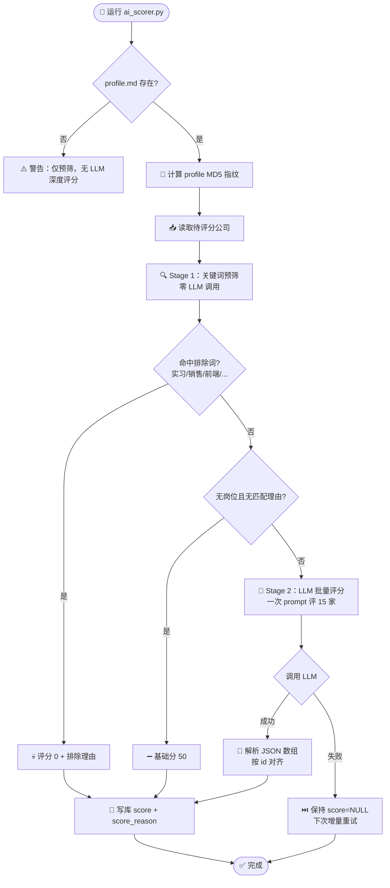

# AI 评分引擎

_JHTracker 的 AI 匹配评分设计：两阶段评分流程、省 token 策略、命令行接口与智能体 Skill 联动。实现位于 `scripts/ai_scorer.py`。_

---

## 🎯 目标

对公司库中的每家公司，结合候选人画像（`data/profile.md`）评估与候选人的匹配度，产出 0-100 分 + 评分理由，写入 `companies.score` / `companies.score_reason`。

核心约束：**500+ 家公司不能一次一家地调 LLM**（成本高、耗时长），因此采用「关键词预筛 + 批量深度评分」两阶段设计。

---

## 🔄 两阶段评分流程



**Stage 1 — 关键词预筛（免费）**：对 `job_type + match_reason` 做排除词匹配（`DEAL_BREAKERS`，`scripts/ai_scorer.py:94`）：实习/intern/管培/保险/销售/客服/运营/市场/行政/HR/人力/财务/会计/审计/法务/公关/前端/大数据/测试开发/产品经理/数据分析/java/go语言/web前端/ui设计 等。命中即得 0 分并记录理由，不消耗 LLM。

**Stage 2 — LLM 批量深度评分**：剩余公司按 `BATCH_SIZE`（默认 15）分组，一次 prompt 传入整组公司信息，要求 LLM 按四维标准输出 JSON 数组：

| 维度 | 分值 | 说明 |
|---|---|---|
| 核心技能匹配 | 40 | 候选人的核心能力是否覆盖岗位需求 |
| 行业相关度 | 20 | 公司行业方向与候选人经验的相关性 |
| 职能契合度 | 25 | 岗位方向是否匹配候选人技术栈 |
| 成长空间 | 15 | 候选人基础能力是否有潜力快速补上 |

评分锚点：90-100 完美匹配 / 70-89 高度匹配 / 50-69 中等 / 30-49 低 / 0-29 不匹配。

---

## 🪙 省 token 三策略

| 策略 | 机制 | 效果 |
|---|---|---|
| **批量评分** | 一次 prompt 评 15 家，输出 JSON 数组 | 500 家从 500 次调用降到 ~34 次（省 90%+） |
| **Profile 指纹缓存** | `data/.profile_hash` 存上次评分的 profile MD5；`--force` 时若指纹未变，跳过 LLM 只重跑预筛 | 重复评分不烧 token |
| **增量评分** | 默认只评 `score IS NULL` 的公司 | LLM 失败的公司保持 NULL，下次自动重试 |

**失败语义**：LLM 返回缺失/解析失败的公司在库中**保持 `score=NULL`**，只写入 `score_reason` 说明，绝不静默给默认分（`scripts/ai_scorer.py:299`、`407`）。

---

## 💻 命令行接口

```bash
# 增量评分（默认：只评 score IS NULL 的公司）
python scripts/ai_scorer.py

# 重新评分所有公司（profile 未变则跳过 LLM，仅重跑预筛）
python scripts/ai_scorer.py --force

# profile 修改后强制 LLM 重评所有公司
python scripts/ai_scorer.py --force --profile-changed

# 只评一家
python scripts/ai_scorer.py --company-id 312

# 自定义批量大小（一次 prompt 评 N 家，默认 15）
python scripts/ai_scorer.py --batch-size 20

# 仅预览待评分公司，不调 LLM
python scripts/ai_scorer.py --dry-run
```

**输出与进度**：写库同时更新 `data/.score_progress.json`（供前端轮询展示进度）；`DEBUG:` 前缀日志为排查 LLM 响应的辅助信息。

---

## 🔌 LLM 提供商

| 优先级 | 提供商 | 配置 |
|---|---|---|
| 1 | Anthropic | `ANTHROPIC_API_KEY`，模型 `AI_MODEL`（默认 `claude-sonnet-4-20250514`） |
| 2 | OpenAI 兼容接口 | `OPENAI_API_KEY` + `AI_BASE_URL`（默认 `http://localhost:20128/v1`，9Router 本地路由），模型默认 `Hermes` |

> 未配置任何 Key 时自动降级：仅跑关键词预筛，无 LLM 深度评分，核心功能不受影响。Key 可通过 `.env` 或环境变量提供（脚本会 `load_dotenv()`）。

---

## 🤖 与智能体 Skill 联动

评分由 **Scorer Skill** 驱动（`skills/career-tracker-scorer/SKILL.md`），对智能体说一句话即可触发，智能体在后台调用 `scripts/ai_scorer.py`：

| 指令 | 行为 |
|---|---|
| `给公司评分` | 增量评分（只评 score 为 NULL 的公司） |
| `重新评分所有公司` | 全量重评（profile 改了用这个） |
| `重新评 汇川技术` | 单公司重评分 |
| `预览待评分公司` | 仅列出待评公司，不调 LLM |

**配套 Skill 生态**：

| Skill | 用途 | 与评分的关系 |
|---|---|---|
| `career-tracker-profile` | 解析简历生成 `data/profile.md` | 评分的前置条件 |
| `career-tracker-scorer` | 执行评分 | 本体 |
| `company-finder` | 联网检索公司入库 | 扩展评分对象 |
| `career-tracker-application` / `career-tracker-offer` / `career-tracker-resume` / `career-tracker-import` / `career-tracker-ops` | 投递/Offer/简历/导入/运维 | 无直接依赖 |

---

## 🔗 相关文档

- [数据库设计](database.md) — `companies.score` / `score_reason` 字段
- [路由/API 参考](api.md) — `/import` 页的评分进度展示
- [README 快速开始](../README.md#career-tracker-scorer-skillai-评分) — Skill 安装方式

---

_最后更新：2026-07-31 · 维护者：JHTracker 项目组_
