# RESTful API 完整参考手册 (API Reference) 📚⚡

JHTracker 后端基于高性能异步框架 **FastAPI** 构建，默认服务地址为 `http://127.0.0.1:8000`。交互式 Swagger UI 可在运行状态下直接访问 `http://127.0.0.1:8000/docs`。

---

## 📑 API 体系导航图

```mermaid
graph TD
    Root["🌐 RESTful API (/api)"] --> Jobs["💼 岗位体系 (/api/jobs)"]
    Root --> Rec["🎯 推荐与 HITL (/api/recommendations, /api/hitl, /api/feedback)"]
    Root --> Resume["📄 简历工作台 (/api/resumes)"]
    Root --> App["📊 投递看板 (/api/applications)"]
    Root --> Stats["📈 仪表盘大屏 (/api/stats)"]
    Root --> Sync["🔄 爬虫数据同步 (/api/sync)"]

    Jobs --> J1["GET /api/jobs (多维分页检索)"]
    Jobs --> J2["GET /api/jobs/{id} (岗位完整JD)"]
    Jobs --> J3["POST /api/jobs/{id}/pin (置顶切换)"]
    Jobs --> J4["POST /api/jobs/{id}/read (已读切换)"]

    Rec --> R1["GET /api/recommendations (双路召回推荐)"]
    Rec --> R2["POST /api/feedback (正负向反馈)"]
    Rec --> R3["GET /api/hitl/weights (特征矩阵监控)"]
    Rec --> R4["POST /api/hitl/sync-from-db (增量同步)"]
    Rec --> R5["POST /api/hitl/weights/reset (权重重置)"]

    Resume --> M1["GET /api/resumes (版本列表)"]
    Resume --> M2["POST /api/resumes (导入新建/持久化)"]
    Resume --> M3["PUT /api/resumes/{id} (更新存盘)"]
    Resume --> M4["DELETE /api/resumes/{id} (安全删除)"]
    Resume --> M5["POST /api/resumes/{id}/optimize (ATS定制优化)"]
```



---

## 1. 通用规范与错误响应

- **基准路径**：`http://127.0.0.1:8000/api`
- **传输编码**：`Content-Type: application/json; charset=utf-8`
- **状态码定义**：
  - `200 OK`：请求成功。
  - `400 Bad Request`：参数缺失、非法字符或校验未通过。
  - `404 Not Found`：指定实体 ID（岗位、简历、投递项）不存在。
  - `422 Unprocessable Entity`：Pydantic Schema 校验失败。
  - `500 Internal Server Error`：服务端未捕获异常。

---

## 2. 统计大屏与指标接口 (Stats)

### 2.1 获取全系统实时概览统计
- **端点**：`GET /api/stats`
- **描述**：聚合公共岗位、投递进展与简历库的实时总量与分布数据。
- **响应示例**：
  ```json
  {
    "total_jobs": 24150,
    "pinned_jobs_count": 12,
    "read_jobs_count": 138,
    "applications_count": {
      "PENDING_APPLY": 5,
      "APPLIED": 8,
      "WRITTEN_TEST": 3,
      "INTERVIEW": 2,
      "OFFER": 1,
      "REJECTED": 4
    },
    "resumes_count": 3
  }
  ```

---

## 3. 公共岗位检索与管理接口 (Jobs)

### 3.1 岗位多维度检索与分页
- **端点**：`GET /api/jobs`
- **描述**：结合 SQLite FTS5 引擎支持毫秒级全文模糊搜索与精准城市过滤。
- **Query 参数**：
  - `query` (string, 可选): 岗位标题、企业名或 JD 关键词。
  - `city` (string, 可选): 城市匹配（精确匹配 location 字段，支持“远程/全国”、“海外”等）。
  - `category` (string, 可选): 职位分类。
  - `source` (string, 可选): 爬虫来源渠道。
  - `is_pinned` (boolean, 可选): 是否仅看置顶岗位。
  - `is_read` (boolean, 可选): 是否已读状态过滤。
  - `limit` (integer, 默认 50): 分页大小。
  - `offset` (integer, 默认 0): 分页偏移。
- **响应示例**：
  ```json
  {
    "items": [
      {
        "id": "job_001",
        "title": "后端开发工程师",
        "company": "示例科技",
        "city": "北京",
        "salary_range": "25k-35k",
        "job_type": "全职",
        "source": "qiuzhifangzhou",
        "detail_url": "https://example.com/job/1",
        "is_pinned": false,
        "is_read": false,
        "created_at": "2026-09-01 10:00:00"
      }
    ],
    "total": 24150,
    "limit": 50,
    "offset": 0
  }
  ```

### 3.2 获取岗位完整 JD 与详情
- **端点**：`GET /api/jobs/{job_id}`
- **描述**：提取职位的完整工作职责、任职资格与官方网申链接。

### 3.3 置顶与已读状态切换
- **置顶切换**：`POST /api/jobs/{job_id}/pin`  
  Body: `{"is_pinned": true}`
- **已读标记**：`POST /api/jobs/{job_id}/read`  
  Body: `{"is_read": true}`

---

## 4. 人在环路 (HITL) 推荐与特征矩阵接口

### 4.1 获取智能岗位推荐流
- **端点**：`GET /api/recommendations`
- **Query 参数**：
  - `resume_id` (string, 可选): 对比的目标简历 ID（缺省时自动使用默认主简历）。
  - `limit` (integer, 默认 10): 返回推荐数。
- **响应示例**：
  ```json
  [
    {
      "job": {
        "id": "job_001",
        "title": "AI 基础设施研发工程师",
        "company": "算力云",
        "city": "上海",
        "salary_range": "30k-45k"
      },
      "score": 0.91,
      "reason": "匹配技能 [Python, CUDA, PyTorch]，城市权重 1.15，行业分类匹配度高"
    }
  ]
  ```

### 4.2 提交正负向人机反馈 (Feedback)
- **端点**：`POST /api/feedback`
- **Request Body**：
  ```json
  {
    "job_id": "job_001",
    "action": "ACCEPT", // "ACCEPT" (接受进入看板并加权) 或 "REJECT" (衰减抑制并不再展示)
    "reason": "技术栈非常吻合"
  }
  ```

### 4.3 查看与重置 HITL 特征权重
- **查看当前特征权重**：`GET /api/hitl/weights`
- **从公共库增量同步元数据**：`POST /api/hitl/sync-from-db`
- **一键重置特征权重归位**：`POST /api/hitl/weights/reset`  
  将所有特征项（分类、行业、城市）重置为基准默认值 `1.0`。

---

## 5. 简历工作台与 ATS 定制接口 (Resumes)

### 5.1 获取简历版本列表
- **端点**：`GET /api/resumes`
- **描述**：同时兼容 `content_markdown`/`content_md` 与 `skills`/`parsed_skills` 别名映射输出。

### 5.2 新建 / 导入简历（自动入库）
- **端点**：`POST /api/resumes`
- **Request Body**：
  ```json
  {
    "title": "2026届计算机硕士校招简历",
    "content_markdown": "# 张三\n\n- 熟练掌握 Python、FastAPI、Docker、PostgreSQL...",
    "category": "GENERAL",
    "is_default": true
  }
  ```
- **说明**：系统将自动生成 UUID ID，解析出技术栈技能列表，并落库至私有库 `~/.JHTracker/user_data.db`。

### 5.3 更新简历存盘
- **端点**：`PUT /api/resumes/{resume_id}`
- **说明**：更新现有简历的内容与属性。

### 5.4 删除简历
- **端点**：`DELETE /api/resumes/{resume_id}`
- **说明**：物理删除指定草稿或废弃版本（默认主简历建议先切换再删除）。

### 5.5 专岗 ATS 定制优化
- **端点**：`POST /api/resumes/{resume_id}/optimize` 或 `POST /api/resumes/optimize`
- **Request Body**：
  ```json
  {
    "resume_id": "res_001",
    "job_id": "job_001",
    "save_as_version": true
  }
  ```
- **响应示例**：
  ```json
  {
    "ats_score": 88,
    "missing_keywords": ["Kubernetes", "Redis Cluster"],
    "suggestions": [
      "建议在微服务项目经验中强化高并发 QPS 及缓存穿透的量化解决案例 (STAR原则)。",
      "补充 Kubernetes 容器编排相关部署描述。"
    ],
    "optimized_markdown": "# 专岗优化后的简历...",
    "ai_version_resume_id": "res_opt_7a8b9c",
    "is_isolated_version": true
  }
  ```

---

## 6. 投递看板与生命周期管理 (Applications)

### 6.1 获取投递记录看板列表
- **端点**：`GET /api/applications`

### 6.2 手动新增外部/线下投递
- **端点**：`POST /api/applications`
- **Request Body**：
  ```json
  {
    "company": "线下直推科技",
    "title": "系统开发工程师",
    "status": "APPLIED",
    "priority": 4,
    "account_memo": "推荐人：李工",
    "interview_notes": ""
  }
  ```

### 6.3 推进流转投递状态（仅用户手动）
- **端点**：`PATCH /api/applications/{application_id}/status`
- **Request Body**：
  ```json
  {
    "status": "INTERVIEW" // PENDING_APPLY | APPLIED | WRITTEN_TEST | INTERVIEW | OFFER | REJECTED
  }
  ```

---

## 7. 爬虫引擎与数据同步 (Sync)

### 7.1 手动触发定向爬虫抓取
- **端点**：`POST /api/sync/run`
- **Query 参数**：
  - `spider_name` (string, 默认 `qiuzhifangzhou`): 爬虫适配器名称。
- **响应示例**：
  ```json
  {
    "success": true,
    "spider": "qiuzhifangzhou",
    "jobs_crawled": 50,
    "jobs_inserted": 12,
    "jobs_updated": 38
  }
  ```
