# RESTful API 完整参考手册 (API Reference) 📚⚡

JHTracker 后端基于高性能异步框架 **FastAPI** 构建，默认服务地址为 `http://127.0.0.1:8000`。交互式 Swagger UI 可在运行状态下直接访问 `http://127.0.0.1:8000/docs`，OpenAPI JSON 规范位于 `http://127.0.0.1:8000/openapi.json`。

---

## 📑 API 体系导航图

```mermaid
graph TD
    Root["🌐 RESTful API (/api)"] --> System["⚙️ 系统运维 (/api/version, /api/health)"]
    Root --> Jobs["💼 岗位检索大厅 (/api/jobs, /api/jobs/stats)"]
    Root --> Rec["🎯 推荐与 HITL 闭环 (/api/recommendations, /api/feedback, /api/hitl/*)"]
    Root --> App["📊 投递生命周期看板 (/api/applications, /api/tracker/overview)"]
    Root --> Resume["📄 简历工作台与 ATS (/api/resumes, /api/resumes/*)"]
    Root --> Agent["🤖 智能体协同与直推 (/api/agent/pushes)"]
    Root --> Spider["🕷️ 爬虫调度与数据同步 (/api/spiders/*)"]

    Jobs --> J1["GET /api/jobs (多维 FTS5 分页检索)"]
    Jobs --> J2["GET /api/jobs/stats (实时指标统计)"]

    Rec --> R1["GET /api/recommendations (双路召回推荐)"]
    Rec --> R2["POST /api/feedback (正负向反馈循环)"]
    Rec --> R3["GET /api/hitl/weights (特征矩阵监控)"]
    Rec --> R4["POST /api/hitl/weights/reset (权重重置归位)"]
    Rec --> R5["POST /api/hitl/sync-from-db (增量元数据同步)"]

    App --> A1["GET /api/applications (看板状态过滤与归档控制)"]
    App --> A2["PATCH /api/applications/{id}/status (推进阶段流转)"]
    App --> A3["PATCH /api/applications/{id}/archive (归档状态切换)"]
    App --> A4["DELETE /api/applications/{id} (删除投递项)"]
    App --> A5["GET /api/tracker/overview (漏斗与阶段聚合指标)"]

    Resume --> M1["GET /api/resumes (版本列表)"]
    Resume --> M2["POST /api/resumes (新建/导入简历)"]
    Resume --> M3["POST /api/resumes/parse (文件上传解析 Markdown)"]
    Resume --> M4["PUT /api/resumes/{id} (更新存盘与关键词矩阵)"]
    Resume --> M5["POST /api/resumes/{id}/set-default (设为主简历)"]
    Resume --> M6["DELETE /api/resumes/{id} (安全删除版本)"]
    Resume --> M7["POST /api/resumes/{id}/optimize (专岗 ATS 定制优化)"]
    Resume --> M8["POST /api/resumes/optimize (按 payload 优化)"]

    Agent --> P1["GET /api/agent/pushes (查询未决推荐)"]
    Agent --> P2["POST /api/agent/pushes (智能体外部直推)"]
    Agent --> P3["DELETE /api/agent/pushes/{id} (忽略直推项)"]

    Spider --> S1["GET /api/spiders/sources (可用爬虫源与状态)"]
    Spider --> S2["POST /api/spiders/sync-batch (批量并发同步)"]
    Spider --> S3["POST /api/spiders/fangzhou/run (求职方舟单源同步)"]
    Spider --> S4["POST /api/spiders/wondercv/run (超级简历单源同步)"]
    Spider --> S5["POST /api/spiders/nowcoder/run (牛客网单源同步)"]
    Spider --> S6["POST /api/spiders/mock/run (测试用例数据回放)"]
```



---

## 1. 通用规范与错误响应

- **基准路径**：`http://127.0.0.1:8000/api`
- **传输编码**：`Content-Type: application/json; charset=utf-8`
- **状态码定义**：
  - `200 OK`：请求成功。
  - `400 Bad Request`：输入校验失败、非法标识符、超限或业务逻辑异常。
  - `404 Not Found`：指定实体 ID（岗位、简历、投递项、直推项）不存在。
  - `422 Unprocessable Entity`：Pydantic Schema 字段类型缺失或校验未通过。
  - `500 Internal Server Error`：服务端未捕获异常。

---

## 2. 系统元信息与健康状态 (System & Health)

### 2.1 获取系统版本信息
- **端点**：`GET /api/version`
- **描述**：返回后端服务版本，作为 Single Source of Truth (SSOT) 供前端与健康检测验证。
- **响应示例**：
  ```json
  {
    "version": "0.1.0",
    "service": "JHTracker Backend"
  }
  ```

### 2.2 健康检查
- **端点**：`GET /api/health`
- **响应示例**：
  ```json
  {
    "status": "healthy",
    "timestamp": "2026-09-06T10:00:00"
  }
  ```

---

## 3. 岗位大厅与全文检索接口 (Jobs)

### 3.1 多维分页与全文检索
- **端点**：`GET /api/jobs`
- **描述**：基于 SQLite FTS5 虚拟表提供毫秒级全文匹配与精确字段筛选。
- **Query 参数**：
  - `keyword` (string, 可选): 岗位标题或描述模糊检索词。
  - `company` (string, 可选): 企业名称过滤。
  - `location` (string, 可选): 城市/地点匹配（支持“远程/全国”、“海外”等）。
  - `city` (string, 可选): 城市快捷筛选别名。
  - `industry` (string, 可选): 所属行业（如“互联网/AI/芯片”）。
  - `batch` (string, 可选): 招聘批次（如“2026秋招”、“春招提前批”）。
  - `education_req` (string, 可选): 学历要求（“本科”、“硕士”、“博士”）。
  - `has_referral` (boolean, 可选): 是否含有内推码。
  - `since_date` (string, 可选): 仅拉取指定日期后的岗位（格式 `YYYY-MM-DD`）。
  - `limit` (integer, 默认 50): 分页大小（上限 200）。
  - `offset` (integer, 默认 0): 分页偏移量。
- **响应示例**：
  ```json
  {
    "items": [
      {
        "id": "fangzhou_abc123",
        "title": "后端开发工程师 (AI Agent)",
        "company": "阿里巴巴集团",
        "location": "杭州 / 阿里总部",
        "industry": "互联网/算力",
        "salary_range": "28k-45k · 16薪",
        "education_req": "硕士及以上",
        "batch": "2026秋招",
        "publish_date": "2026-09-01",
        "detail_url": "https://talent.alibaba.com/campus/...",
        "source_site": "qiuzhifangzhou"
      }
    ],
    "total": 24180,
    "limit": 50,
    "offset": 0
  }
  ```

### 3.2 岗位大屏实时统计指标
- **端点**：`GET /api/jobs/stats`
- **描述**：聚合 24k+ 岗位底层分布，包含总岗位数、最新发布日期、Top 行业分布、Top 核心城市岗位数等。
- **响应示例**：
  ```json
  {
    "total_jobs": 24180,
    "latest_date": "2026-09-05",
    "top_industries": [
      {"industry": "互联网/IT", "count": 6820},
      {"industry": "人工智能/大模型", "count": 4150}
    ],
    "top_cities": [
      {"city": "北京", "count": 5210},
      {"city": "上海", "count": 4830},
      {"city": "深圳", "count": 3950},
      {"city": "杭州", "count": 2860}
    ]
  }
  ```

---

## 4. 人在环路 (HITL) 推荐与特征矩阵 (Recommendations & Feedback)

### 4.1 获取个性化推荐流
- **端点**：`GET /api/recommendations`
- **描述**：执行双路召回算法（技能定向倒排召回 + 24小时最新鲜岗位探测），融入 HITL 动态矩阵特征分与同企业频次规避。
- **Query 参数**：
  - `resume_id` (string, 可选): 对比目标简历 ID（缺省时自动使用默认主简历）。
  - `min_score` (float, 默认 0.40): 过滤低契合度岗位的硬门槛。
  - `limit` (integer, 默认 20): 返回推荐候选数。
  - `max_jobs_per_company` (integer, 默认 3): 同一集团企业最大挂载限制。
- **响应结构**：
  ```json
  [
    {
      "job": {
        "id": "job_001",
        "title": "AI 基础设施研发工程师",
        "company": "算力云",
        "location": "上海",
        "salary_range": "30k-45k"
      },
      "raw_match_score": 0.88,
      "adjusted_score": 0.93,
      "recommend_reason": "核心技能 [Python, CUDA, PyTorch] 高度契合，HITL 城市权重 1.15x",
      "feature_breakdown": {
        "skill_overlap": ["Python", "FastAPI", "Docker"],
        "missing_skills": ["K8s Operators"],
        "hitl_multiplier": 1.15
      }
    }
  ]
  ```

### 4.2 提交人机交互正负反馈 (Feedback)
- **端点**：`POST /api/feedback`
- **描述**：
  - `ACCEPT`：关联特征权重提升 **+15%**，并在私库 `applications` 中自动建立 `PENDING_APPLY` 投递项。
  - `REJECT`：关联特征权重按指数衰减（$\times 0.70$，最低安全底线 **0.05**），该岗位永久加入私库剔除黑名单。
- **Request Body**：
  ```json
  {
    "job_id": "fangzhou_abc123",
    "action": "ACCEPT", // "ACCEPT" 或 "REJECT"
    "reason": "技术栈与项目经验非常匹配"
  }
  ```

### 4.3 查看 HITL 特征权重分布
- **端点**：`GET /api/hitl/weights`
- **描述**：返回包含分类、行业、城市维度的权重分布，以及当前正向/负向行为统计计数。

### 4.4 重置 HITL 特征矩阵
- **端点**：`POST /api/hitl/weights/reset`
- **Request Body**（可选）：
  ```json
  {
    "feature_key": "city:北京" // 留空则重置所有特征至基准值 1.0
  }
  ```

### 4.5 从公共库增量同步特征元数据
- **端点**：`POST /api/hitl/sync-from-db`
- **描述**：从 `public_jobs.db` 中扫描新出现的标准分类与核心城市，注册至特征池，保留已有学习权重。

---

## 5. 投递看板与状态流转接口 (Applications & Tracker)

### 5.1 获取投递记录看板列表
- **端点**：`GET /api/applications`
- **Query 参数**：
  - `status` (string, 可选): 指定阶段过滤（`PENDING_APPLY` / `APPLIED` / `WRITTEN_TEST` / `INTERVIEW` / `OFFER` / `REJECTED`）。
  - `include_archived` (boolean, 默认 true): 是否包含已归档记录（前端主看板通常传 `false` 保持清爽）。

### 5.2 推进流转投递状态
- **端点**：`PATCH /api/applications/{app_id}/status`
- **Request Body**：
  ```json
  {
    "new_status": "INTERVIEW",
    "note": "二面技术面约在周三下午 14:00",
    "schedule_time": "2026-09-09T14:00:00"
  }
  ```

### 5.3 投递项归档状态切换
- **端点**：`PATCH /api/applications/{app_id}/archive`
- **Request Body**：
  ```json
  {
    "is_archived": true
  }
  ```

### 5.4 删除指定投递项
- **端点**：`DELETE /api/applications/{app_id}`
- **描述**：物理删除私库中的投递跟踪条目。

### 5.5 求职漏斗与阶段大盘统计
- **端点**：`GET /api/tracker/overview`
- **描述**：返回当前各阶段活跃卡片数、已归档数及求职漏斗转化率分布。

---

## 6. 简历工作台与 ATS 定制接口 (Resumes)

### 6.1 获取全部简历版本
- **端点**：`GET /api/resumes`
- **描述**：返回用户私库中的所有简历，兼容 `content_markdown` 与 `parsed_skills` 映射。

### 6.2 新建 / 导入简历
- **端点**：`POST /api/resumes`
- **Request Body**：
  ```json
  {
    "title": "后端架构师_2026校招版",
    "content_markdown": "# 个人简历\n\n熟练运用 Python, FastAPI...",
    "category": "GENERAL",
    "is_default": true
  }
  ```

### 6.3 上传并解析本地简历文件
- **端点**：`POST /api/resumes/parse`
- **Request Format**：`multipart/form-data` (字段名 `file`)
- **描述**：支持接收 PDF/Markdown 格式文件，解析出标准化结构与关键词后返回供工作台编辑。

### 6.4 更新简历存盘
- **端点**：`PUT /api/resumes/{resume_id}`
- **Request Body**：
  ```json
  {
    "title": "后端架构师_2026校招版_v2",
    "content_markdown": "# 更新后的简历内容...",
    "target_position": "AI 后端研发专家",
    "skills": ["Python", "FastAPI", "FastMCP", "Docker", "PyTorch"]
  }
  ```

### 6.5 设为默认主简历
- **端点**：`POST /api/resumes/{resume_id}/set-default`
- **描述**：将指定版本设为主简历，其他版本自动取消默认，该简历将作为后续 HITL 推荐引擎的核心画像。

### 6.6 删除指定简历
- **端点**：`DELETE /api/resumes/{resume_id}`

### 6.7 专岗 ATS 差异诊断与定制优化
- **基于已存简历优化**：`POST /api/resumes/{resume_id}/optimize`
- **按自定义 payload 优化**：`POST /api/resumes/optimize`
- **Request Body**：
  ```json
  {
    "resume_id": "res_default_uuid",
    "job_id": "fangzhou_abc123",
    "save_as_version": true,
    "engine": "auto",
    "ai_config": {
      "base_url": "http://127.0.0.1:11434/v1",
      "api_key": "optional_api_key",
      "model": "deepseek-chat"
    }
  }
  ```
- **字段说明**：
  - `engine`：执行引擎，可选 `"auto"` | `"custom_api"` | `"opencode"` | `"hermes"` | `"builtin"`。
  - `ai_config`：可选，当使用用户自定义大模型 API (`custom_api`) 时传入的 OpenAI 兼容配置参数。
- **响应示例**：
  ```json
  {
    "ats_score": 89,
    "missing_keywords": ["Kubernetes", "Redis Cluster"],
    "suggestions": [
      "在微服务分布式章节强化高并发处理与 STAR 原则量化数据。",
      "针对 JD 要求补充 Kubernetes 容器集群化编排经验。"
    ],
    "optimized_markdown": "# 专岗定制优化简历...",
    "ai_version_resume_id": "res_opt_9a8b7c",
    "is_isolated_version": true
  }
  ```

---

## 7. 本地智能体协同与直推 (Agent Pushes)

### 7.1 获取智能体推荐队列
- **端点**：`GET /api/agent/pushes`
- **描述**：获取外部 Agent（如 Claude / OpenCode / 爬虫寻源 Agent）直推给用户的未决职位卡片。

### 7.2 智能体推送新候选岗位
- **端点**：`POST /api/agent/pushes`
- **Request Body**：
  ```json
  {
    "job_id": "fangzhou_abc123",
    "recommend_reason": "AI 寻源 Agent 匹配度高：具备 95% 技能重合度且公司处于秋招招聘旺季",
    "match_score": 0.95,
    "agent_name": "JobSourcingAgent"
  }
  ```

### 7.3 忽略/移除直推项
- **端点**：`DELETE /api/agent/pushes/{push_id}`

---

## 8. 定向爬虫调度与数据同步 (Spiders)

### 8.1 查询可用爬虫源
- **端点**：`GET /api/spiders/sources`
- **描述**：返回系统注册的全部爬虫源（`qiuzhifangzhou`, `wondercv`, `nowcoder`, `mock`）的运行状态、最近同步记录与数据量。

### 8.2 批量并发同步任务
- **端点**：`POST /api/spiders/sync-batch`
- **Request Body**：
  ```json
  {
    "sources": ["qiuzhifangzhou", "wondercv", "nowcoder"],
    "days": 7
  }
  ```

### 8.3 运行单源爬虫
- **求职方舟**：`POST /api/spiders/fangzhou/run` (支持 query 参数 `days=7`)
- **超级简历 WonderCV**：`POST /api/spiders/wondercv/run` (支持 query 参数 `pages=3`)
- **牛客网 Nowcoder**：`POST /api/spiders/nowcoder/run` (支持 query 参数 `pages=5&since_date=2026-07-01`)
- **Mock 回放爬虫**：`POST /api/spiders/mock/run` (用于离线集成测试)
