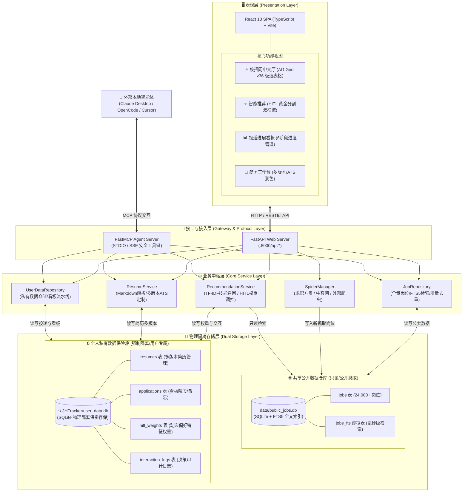
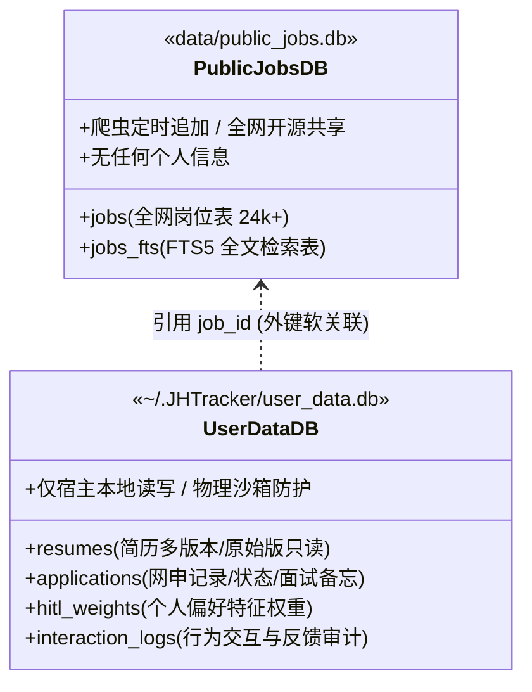
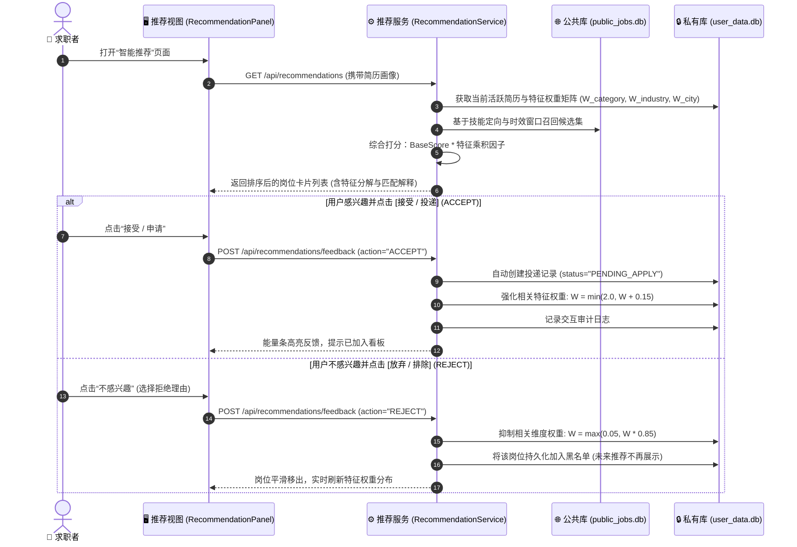
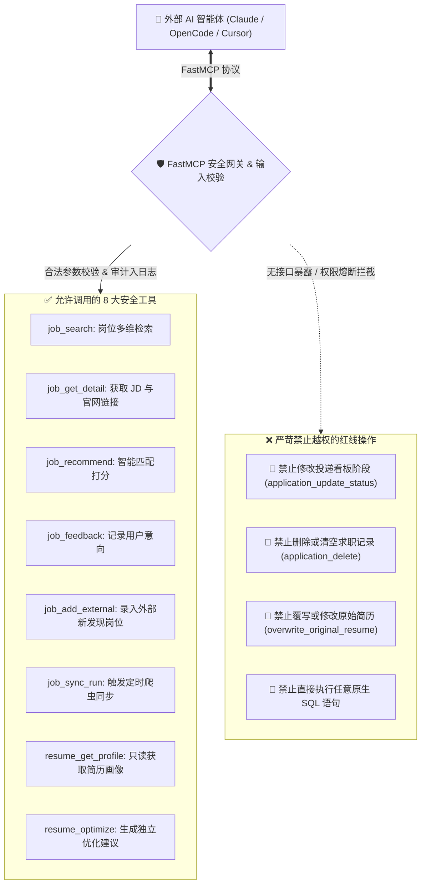

# JHTracker 系统架构与核心设计文档 🏗️📐

本文档详细定义了 **JHTracker（本地 AI 智能求职求贤追踪与人在环路推荐中台）** 的总体分层架构、存储物理隔离设计、人在环路（HITL）演化闭环、FastMCP 智能体协作协议及系统安全边界规范。

---

## 1. 系统总体架构全景 (System Architecture)

JHTracker 采用 **“赛博深色可视化前端 + 异步高并发服务中枢 + 物理双库隔离 + FastMCP 智能体协同”** 的现代分层设计。



---

## 2. 物理双库隔离与数据主权模型 (Data Isolation Model)

系统从架构根源上将 **公共全网数据** 与 **个人敏感求职隐私** 彻底解耦，消除数据泄露与越权风险：



| 存储维度 | 公共数据仓库 (`data/public_jobs.db`) | 私有敏感保险箱 (`~/.JHTracker/user_data.db`) |
| :--- | :--- | :--- |
| **存储路径** | 项目目录相对路径 `data/public_jobs.db` | 用户家目录绝对路径 `~/.JHTracker/user_data.db` |
| **数据性质** | 全网公开爬取的招聘公告、职位描述、官方网址、内推码 | 个人简历、联系方式、投递记录、面试复盘、薪资备忘、偏好特征 |
| **开源安全性** | 随项目代码仓库共享、迁移与版本管理，无泄漏风险 | 绝不进入代码版本库，由操作系统用户权限物理沙箱保护 |
| **索引机制** | SQLite FTS5 全文索引（毫秒级全文分词匹配） | 标准 B-Tree 索引，支持高频事务与状态即时更新 |
| **写入权限** | 仅定向爬虫与 `job_add_external` 接口可写入去重 | 仅用户 Web 界面以及受审计的 AI 优化工具可受控写入 |

---

## 3. 人在环路 (HITL) 动态自适应闭环机制

JHTracker 彻底摒弃了死板固化的排序打分，建立了基于用户实时正负反馈的 **人在环路（Human-In-The-Loop）动态自进化引擎**。



### 3.1 核心打分公式

$$\text{FinalScore}(Job) = \Big( \alpha \cdot \text{SkillMatch}(\text{Resume}, Job) + \beta \cdot \text{Recency}(Job) \Big) \times \prod_{k \in \{category, industry, city\}} W_k$$

- **技能匹配度 $\text{SkillMatch}$**：采用简历技能词云与岗位 JD 标签的 Jaccard 相似度与 TF-IDF 向量余弦值加权计算。
- **时效加权 $\text{Recency}$**：依据发布时间衰减，优先保障最新 30~90 天内的鲜活校招岗位。
- **动态权重乘积 $\prod W_k$**：初始化基准权重为 $1.0$。

### 3.2 防误杀与弹性机制 (Anti-Overkill Rules)
- **非线性软抑制**：单次拒绝仅削减 15% 权重（乘以 $0.85$），而非直接置零拉黑整个行业，保留容错空间。
- **严格衰减下限**：设置全局保护底线 $W_{min} = 0.05$，杜绝因极端反馈导致该分类下所有推荐彻底断流。
- **透明管控与一键复位**：前端侧边栏实时展示各大维度权重柱状图，支持用户手动增量同步数据库元数据或一键将全部权重复位为 $1.0$。

---

## 4. 简历多版本工作台架构与保护机制

为解决大模型与智能体篡改求职者原始个人信息的痛点，JHTracker 建立了 **“原始只读基准 + 独立专岗优化副本”** 的双轨版本模型。

```mermaid
graph LR
    subgraph ImportZone ["📥 简历录入"]
        PDF["📄 本地 PDF / Word"] -->|本地智能解析| Parser["简历结构化解析器"]
        Parser -->|提取技能与文本| OrigResume["📝 原始基准简历 (ORIGINAL)<br/>version_type: 'ORIGINAL'<br/>🔒 严格只读保护 / 权威底本"]
    end

    subgraph EditZone ["🛠️ 多版本衍生与 ATS 优化"]
        OrigResume -->|人工另存或编辑| Version2["📋 自定义版本 (CUSTOMIZED)"]
        OrigResume -->|输入目标岗位 JD| Optimizer["AI ATS 专岗定制引擎"]
        Optimizer -->|生成针对性优化版| AIResume["✨ AI 优化版本 (AI_OPTIMIZED)<br/>parent_resume_id: 关联原版<br/>针对高频考点量化指标"]
    end

    subgraph StorageZone ["💾 私有安全持久化"]
        OrigResume -->|自动入库 (POST)| UDB[("~/.JHTracker/user_data.db")]
        Version2 -->|保存更新 (PUT)| UDB
        AIResume -->|独立版本保存 (POST)| UDB
    end
```

1. **导入自动入库**：当用户上传或导入简历文本后，系统立即通过 `POST /api/resumes` 自动持久化落库并生成 UUID，彻底防止页面切换导致草稿丢失。
2. **基准版本防篡改**：标记为 `ORIGINAL` 的主简历对外部 MCP 智能体**完全只读**，智能体无权覆写。
3. **AI 版本独立存证**：AI 针对具体岗位优化生成的简历，自动赋予 `version_type = "AI_OPTIMIZED"` 并记录 `parent_resume_id` 形成完整的血缘追溯链。

---

## 5. FastMCP 智能体协同与安全红线 (Security Boundaries)

通过 FastMCP 协议，外部大模型（如 Claude Desktop、OpenCode 等）可作为“专属求职顾问”接入系统，但必须恪守以下边界：



### 5.1 八大公开安全工具

1. **`job_search`**：按关键词、公司、城市、时效窗口快速检索岗位。
2. **`job_get_detail`**：获取指定岗位的完整职责、任职要求与原网页投递链接。
3. **`job_recommend`**：基于指定简历画像调用推荐引擎获取契合岗位推荐。
4. **`job_feedback`**：提交对岗位的感兴趣（ACCEPT）或跳过（REJECT）反馈。
5. **`job_add_external`**：将外部社交平台、论坛发现的招聘信息去重录入公共库。
6. **`job_sync_run`**：触发指定站点的增量网络爬虫。
7. **`resume_get_profile`**：只读获取用户的简历技能与摘要，禁止获取未授权信息。
8. **`resume_optimize`**：针对特定岗位输出 ATS 量化修改建议并独立存为新版本。

### 5.2 安全权限红线
- **决策主权在人**：投递状态（投递/筛选/笔试/面试/Offer）是高严肃度的求职进程，智能体**严禁操作看板状态**。
- **输入强校验与审计**：所有入参均经过 `SAFE_IDENTIFIER_PATTERN` 正则与字符串安全清洗，拦截 SQL 注入与路径穿越，每次调用均记录审计日志。
