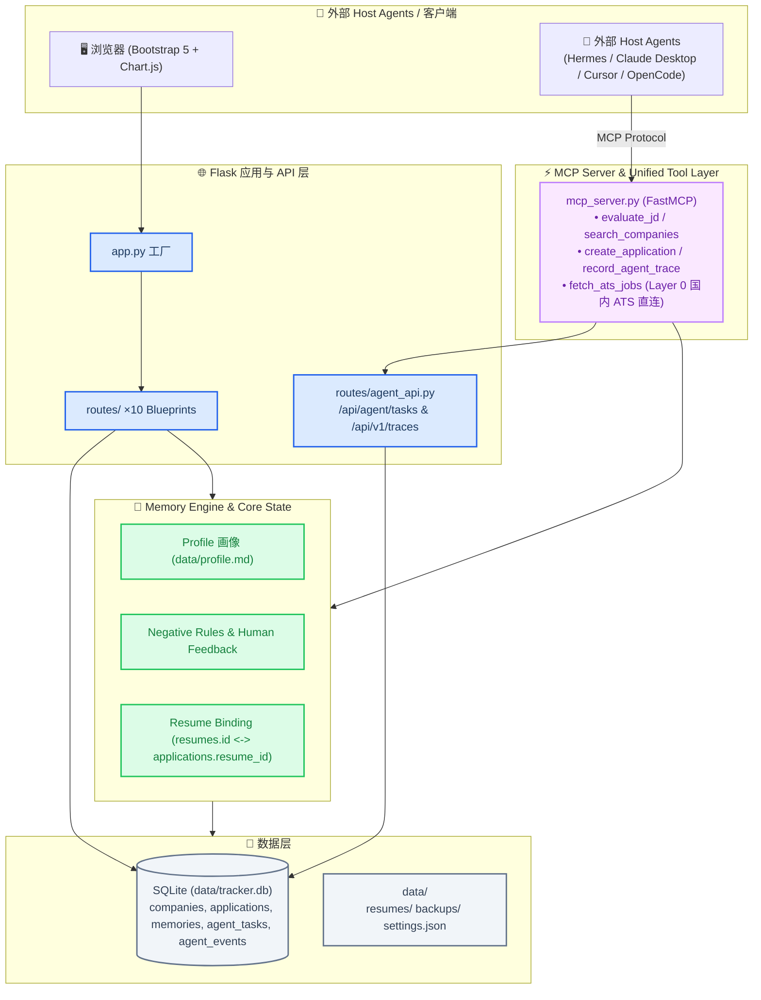
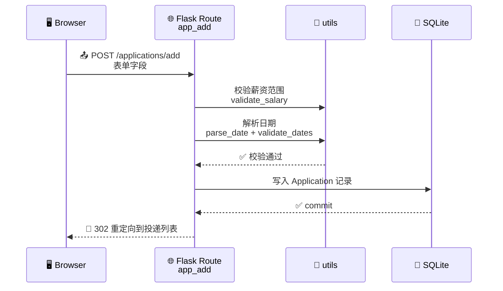
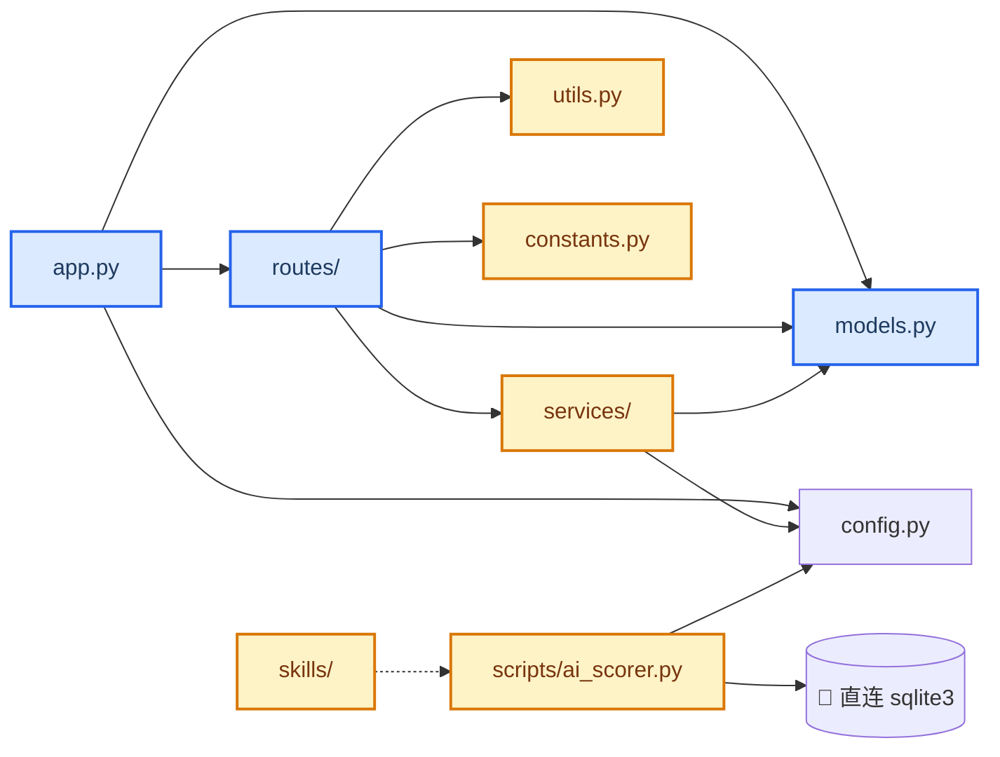
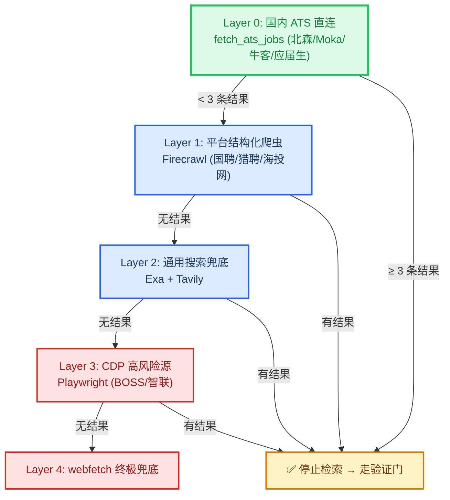

# 系统架构

_JHTracker 的架构设计文档：技术栈、模块划分、请求生命周期与关键设计决策。_

---

## 🏗️ 架构总览

JHTracker 是一个**本地优先**的单体 Flask 应用：浏览器直接访问本机 5000 端口的 Flask 服务，所有数据落在本地 SQLite 数据库与文件系统，无任何云依赖。AI 能力（评分、简历解析、公司检索）以**可选**方式接入：核心业务不依赖 AI，未配置 API Key 时系统自动降级为关键词规则。



---

## 🧩 关键组件

| 组件 | 职责 | 技术 | 关键文件 |
|---|---|---|---|
| 应用工厂 | 初始化 Flask、注册 blueprint、注入全局模板变量 | Flask 3.0 | `app.py` |
| 配置中心 | 路径、密钥、分页、AI 参数，全部支持环境变量覆盖 | 标准库 | `config.py` |
| ORM 模型 | 8 张表的定义与关系 | SQLAlchemy 2.0 | `models.py` |
| 路由层 | HTTP 入口，页面渲染 + 表单处理 + Agent API | Flask Blueprint | `routes/` ×10 |
| MCP 服务 | Agent-Native 接口，暴露 MCP 资源与工具 | FastMCP / mcp SDK | `mcp_server.py` |
| 业务服务 | 归档节流、用户设置持久化 | 标准库 | `services/` |
| ATS 岗位检索 | 国内 ATS 平台直连（北森/Moka/牛客/应届生），返回结构化岗位 + form_type | 标准库 + requests | `services/sourcing/ats_fetcher.py` |
| 工具函数 | 日期/薪资校验、Markdown 表格解析、安全文件名 | 标准库 | `utils.py` |
| 业务常量 | 状态机、行业/城市枚举、优先级规则 | 标准库 | `constants.py` |
| AI 评分引擎 | 关键词预筛 + LLM 批量评分，直连 SQLite | anthropic / openai | `scripts/ai_scorer.py` |
| 智能体 Skills | 公司检索、简历解析、评分、投递管理等 AI 工作流 | Markdown Skill | `skills/` ×8 |

---

## 🔄 请求生命周期

以「新增一条投递记录」为例，说明一次典型请求的处理链路：



**要点：**

- 所有写操作都是**表单 POST + 服务端重定向**（PRG 模式），避免刷新重复提交
- 校验失败（`ValueError`）静默回退，不抛 500
- 重定向使用 `_safe_redirect`（`routes/application.py:19`）：仅允许同源 referrer，防开放重定向

---

## 🗂️ 模块职责与依赖关系



**依赖规则：**

- `routes/` 只做「收表单 → 调服务 → 渲染/重定向」，业务逻辑下沉到 `services/`
- `scripts/ai_scorer.py` 是独立进程，不走 Flask，直接 `sqlite3` 读写数据库，与 Web 应用通过 `config.py` 共享路径配置
- `constants.py` 与 `utils.py` 是纯函数模块，不依赖任何业务模块，可被任意层引用

---

## 🪜 分层检索协议（Sourcing Layered Retrieval）

国内招聘生态无开放 API，Agent 寻岗按数据源稳定性分 5 层降级，免费稳定源优先、高风险源兜底。



**关键规则：**

- **Layer 0 优先**：校招场景必须先调 `fetch_ats_jobs`，命中 ≥3 条直接停止
- **CDP 降级兜底**：BOSS/智联 CDP 反爬成本高，仅在前 3 层全空时触发
- **平台路由二维化**：`enterprise_preference × job_scenario`（校招/社招）路由到不同平台组合
- **form_type 透传**：Layer 0 自动识别 `form_type`（structured/open_question/attachment/one_click），写入 application 记录，供 `application-executor` 选择网申填写策略

**技术路径决策：MCP 工具下沉 + Skill 编排混合**

| 数据源 | 稳定性 | 技术路径 |
|---|---|---|
| 北森/Moka/牛客/应届生 ATS 公开接口 | 高 | 下沉为 `fetch_ats_jobs` MCP 工具（代码实现、可单测） |
| BOSS/智联/拉勾 CDP 爬虫 | 低（反爬常变） | 保留 skill 编排（改 Markdown 即可适配） |
| Firecrawl/Exa/Tavily 通用搜索 | 中 | 保留 skill 编排（agent 现场决策） |


---

## 📁 目录结构

```
career-tracker/
├── app.py                  # 应用工厂与启动入口
├── mcp_server.py           # MCP (Model Context Protocol) 服务入口
├── config.py               # 集中配置（环境变量可覆盖）
├── constants.py            # 业务常量与优先级/行业推断规则
├── extensions.py           # db / migrate 实例（独立于 app）
├── models.py               # 8 张表 ORM 定义（含 AgentTask / AgentEvent）
├── utils.py                # 工具函数
├── routes/                 # 10 个 blueprint
│   ├── dashboard.py        #   看板（漏斗/分布/紧急截止/SSE 推送）
│   ├── company.py          #   公司库
│   ├── application.py      #   投递跟踪 + 归档
│   ├── note.py             #   笔记
│   ├── timeline.py         #   甘特图时间线
│   ├── import_data.py      #   公司清单导入/重同步
│   ├── backup.py           #   备份导出/恢复
│   ├── resume.py           #   简历版本管理
│   ├── profile.py          #   候选人画像
│   └── agent_api.py        #   Agent API 端点 & Agent Trace 轨迹
├── services/               # 业务逻辑
│   ├── settings.py         #   用户设置（settings.json）
│   ├── archive.py          #   投递归档（每日节流）
│   ├── safety_guard.py     #   网申安全分类（敏感字段/提交按钮识别）
│   ├── submission_executor.py  # 网申预填执行器（Phase 1 dry_run）
│   └── sourcing/           #   岗位检索
│       └── ats_fetcher.py  #     国内 ATS 直连（北森/Moka/牛客/应届生）
├── scripts/                # 命令行工具
│   ├── ai_scorer.py        #   AI 评分引擎
│   └── ...                 #   其他辅助脚本
├── skills/                 # 跨平台 AI 智能体 Skill ×8
├── templates/              # Jinja2 模板
├── static/                 # 前端资源（Bootstrap/Chart.js/KaTeX 本地化）
├── career_data/            # 公司清单 Markdown 数据源
├── data/                   # 运行时数据（gitignore）
│   ├── tracker.db          #   SQLite 数据库
│   ├── resumes/            #   简历文件
│   ├── backups/            #   备份 ZIP
│   ├── profile.md          #   候选人画像
│   └── settings.json       #   用户设置
├── migrations/             # Flask-Migrate 迁移脚本
└── tests/                  # pytest 测试
```

---

## 💡 关键设计决策

| 决策 | 选择 | 理由 |
|---|---|---|
| **100% 本地优先** | SQLite + 本地文件 | 数据不离开用户电脑；零部署成本 |
| **Blueprint 聚合** | `routes/__init__.py` 导出 `ALL_BLUEPRINTS` | 新增功能页只需加一个文件 + 一行注册 |
| **AI 可降级** | 未配置 Key 自动走关键词预筛 | AI 是增强而非必需，核心流程永不阻塞 |
| **评分直连 DB** | 脚本绕过 Flask 直接用 `sqlite3` | 评分是长任务，与 Web 进程解耦；共享 `config.py` 保证路径一致 |
| **表单 PRG 模式** | POST 后 302 重定向 | 防刷新重复提交；配合同源校验防开放重定向 |
| **设置存 JSON** | `data/settings.json` + 环境变量默认值 | 用户可改设置但无需动代码；`services/settings.py` 统一读写 |
| **归档节流** | `data/.archive_last_run` 每日一次 | 自动归档不打扰，规则见 `services/archive.py:80` |
| **前端零构建** | Bootstrap 5 + 原生 JS，vendor 本地化 | 双击 `start.bat` 即可用，无 npm 依赖 |
| **MCP 覆盖全部 REST API 能力** | MCP 工具从 9 扩至 36 个，覆盖 11 个数据域 | Agent 通过 MCP 协议即可完成全部操作，无需 HTTP fallback |
| **Agent 自主执行 / 删除需审批** | 读/创建/更新操作 Agent 自主执行；删除操作需传 `confirm=True` | 在自动化效率和数据安全之间取得平衡 |
| **三原则设计哲学** | Agent-First + Human-in-the-Loop + Data Sovereignty | 统一指导所有功能设计和开发决策 |
| **国内 ATS 直连下沉为 MCP 工具** | 北森/Moka/牛客/应届生公开接口封装到 `services/sourcing/ats_fetcher.py`，暴露为 `fetch_ats_jobs` MCP 工具 | 接口稳定可单测；避免 agent 现场决策解析逻辑，省 token、结果稳定 |
| **MCP 工具下沉 + Skill 编排混合路径** | 稳定数据源（ATS 直连）下沉为 MCP 工具；反爬常变源（BOSS/智联 CDP）保留 skill 编排 | 按数据源稳定性分层：稳定的下沉、易变的保留 skill，反爬变化时改 Markdown 即可 |
| **分层检索协议 5 层结构** | Layer 0 ATS 直连 → Layer 1 Firecrawl → Layer 2 Exa/Tavily → Layer 3 CDP → Layer 4 webfetch | 免费稳定源优先、高风险源兜底；CDP 仅在前 3 层全空时触发 |
| **平台路由二维化** | `enterprise_preference × job_scenario`（校招/社招）二维路由 | 校招与社招数据源差异巨大，一维路由会漏源 |
| **外部安全区备份 (External Data Vault)** | 备份物理隔离至 `~/.career-tracker/backups/`，结合 SQLite 在线快照与画像封包 | 既不推送到 Git 远程保护隐私，又防止 Agent 误删工作区导致全盘丢失 |
| **非测试环境 drop_all 熔断** | ORM/初始化层禁止非测试环境直接 drop_all | 从代码层杜绝 Agent 误调用清库操作 |

---

## 🔗 相关文档

- [数据库设计](database.md) — 表结构与关系
- [路由/API 参考](api.md) — 全部端点
- [AI 评分引擎](ai-scoring.md) — 评分流程与省 token 策略
- [开发指南](development.md) — 本地开发与测试

---

_最后更新：2026-08-26 · 维护者：JHTracker 项目组_
