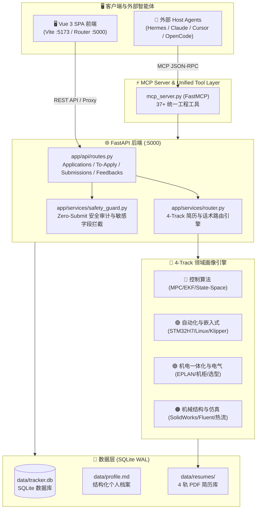
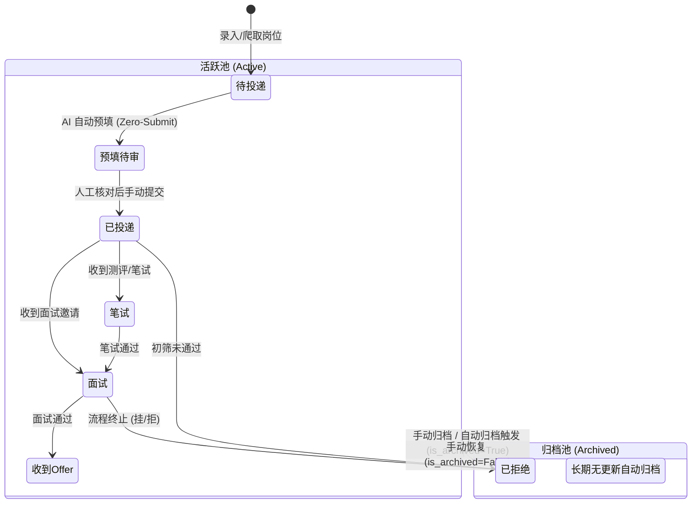

# JHTracker 2.0 架构规范 (Architecture v2.0)

## 1. 系统架构总览

JHTracker 2.0 采用前后端分离的 Agent-Native Monorepo 架构。后端基于 FastAPI (Python 3.11+) + SQLAlchemy 2.0，数据持久化于本地 SQLite (WAL 模式)；前端基于 Vue 3 + Vite + TypeScript + Pinia + Tailwind CSS 构建模块化 SPA；外部智能体通过 FastMCP 协议与 MCP 工具层交互。

---

## 2. 4-Track 招聘工程细分与智能路由模型

根据 2027 届机械工程硕士研究背景（控制理论、嵌入式系统、机电一体化、流固热耦合），系统实现 4 轨动态路由：

| 轨道标识 (`track_key`) | 轨道名称 | 核心关键词 | 对应简历资产 | 话术亮点 |
|---|---|---|---|---|
| `control` | 🔵 控制算法 | MPC, EKF, 状态空间, 运动控制, 轨迹规划, 观测器, 论文, 专利 | `王云鹤_简历_控制.pdf` | 突出 EI 检索学术成果、发明专利、状态滤波与动力学建模 |
| `embedded_auto` | 🟣 自动化与嵌入式 | STM32, RK3588, Linux, Klipper, FreeRTOS, 固件, 驱动, PLC, CAN/RS485 | `王云鹤_简历_自动化.pdf` | 突出主控板分布式架构、固件开发与机器人国奖成果 |
| `mechatronics` | 🟢 机电一体化与电气 | EPLAN, ECAD, 电气柜, 抗干扰, 传感器选型, 步进伺服, 综合 | `王云鹤_简历_机电.pdf` | 突出 500mm 大幅面工业整机机电一体化联调与电气布线经验 |
| `mechanical_cfd` | 🟠 机械结构与仿真 | SolidWorks, 结构设计, CoreXY, 热流, CFD, Fluent, ANSYS, 有限元 | `王云鹤_简历_机械.pdf` | 突出 500mm 高温恒温腔体结构设计与多物理场耦合仿真 |

---

## 3. 投递全生命周期与状态机 (State Machine)

投递生命周期包含双重维度的状态流转：**业务进展阶段** 与 **活跃/归档生命周期**。

---

## 4. Zero-Submit 预填与核对站流程 (Human-in-the-Loop)

为避免外部爬虫或脚本自动向招聘网站误提交虚假或未核实信息，系统强制执行 **Zero-Submit** 机制：

1. **Phase 1 (Agent 预填)**：通过 Playwright / CDP 连接浏览器，抓取表单字段，将个人档案信息注入 DOM 输入框中。
2. **Phase 2 (阻断与快照)**：识别表单 Submit 按钮并强制拦截点击事件，将预填字段键值对与 DOM 状态快照保存至 `application_submissions`。
3. **Phase 3 (人工审计站 `/submissions/:id`)**：用户在 Web 工作台逐项核验表单字段、期望薪资与自荐信，点击直达招聘页面。
4. **Phase 4 (手动提交与状态回写)**：用户在真实浏览器完成最终点击，系统更新状态为 `已投递`。
