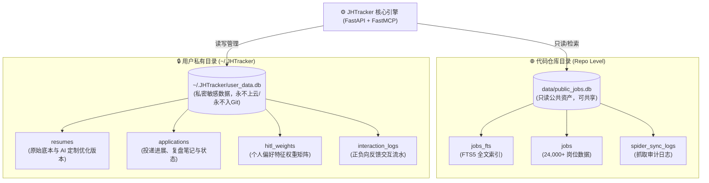
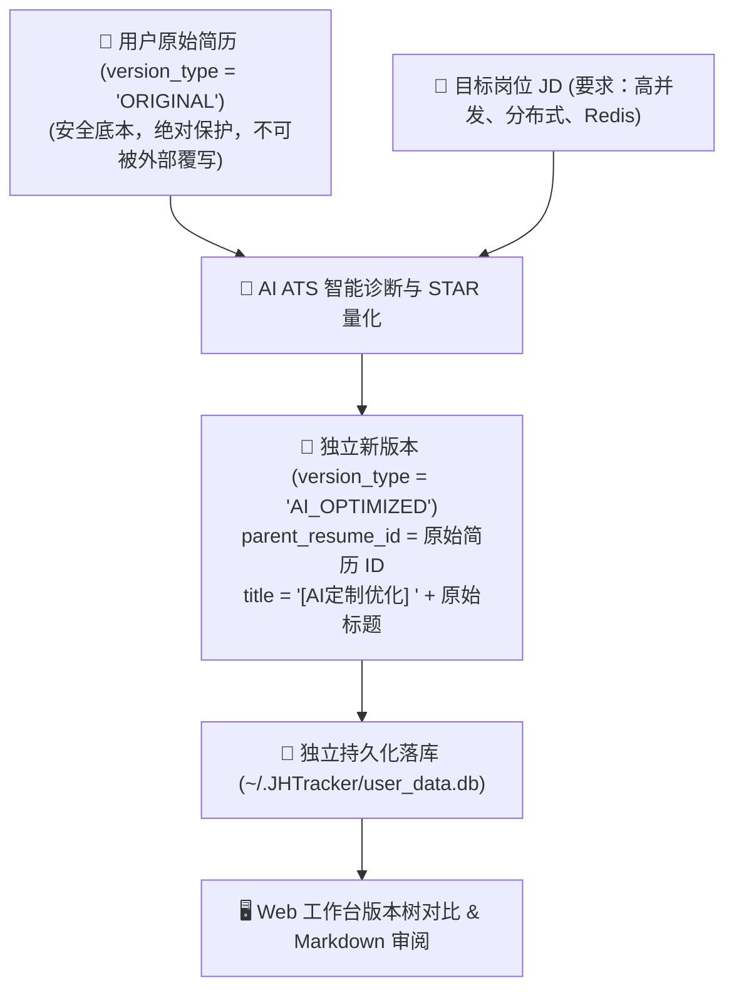

# 数据存储与隐私物理隔离规范 (Data Storage & Privacy) 🛡️💾

JHTracker 确立了业界领先的**本地优先（Local-First）**与**公共数据 / 敏感数据物理隔离架构**。本文档详细说明数据库设计、物理文件切分、字段字典以及简历版本隔离机制。

---

## 1. 双数据库物理隔离设计图

### 物理隔离原则对比表

| 特性维度 | 公共数据库 (`public_jobs.db`) | 私有用户库 (`user_data.db`) |
| :--- | :--- | :--- |
| **物理存储路径** | 项目工作区 `data/public_jobs.db` | 操作系统用户根目录 `~/.JHTracker/user_data.db` |
| **数据性质** | 公开爬取的网络招聘数据，不包含任何个人敏感信息 | 求职者个人简历、真实姓名、联系方式、投递记录、面试复盘笔记 |
| **版本管理 (Git)** | 允许随源码或作为公开种子资产共享/分发 | **绝对禁止提交到 Git 仓库**（全局 `.gitignore` 保护） |
| **智能体访问权限** | 允许无限制全文搜索、阅读、下钻分析 | **只读/受控**（仅开放技能摘要与只读分析，严禁篡改看板与原始简历） |

---

## 2. 核心数据表结构与字段字典

### 2.1 公共岗位表 (`jobs`)
- **存储文件**：`public_jobs.db`
- **字段规范**：

| 字段 | 类型 | 约束 | 业务说明 |
| :--- | :--- | :--- | :--- |
| `id` | `TEXT` | `PRIMARY KEY` | 岗位唯一哈希 ID（格式如 `fangzhou_{hash}`） |
| `title` | `TEXT` | `NOT NULL` | 职位名称 |
| `company` | `TEXT` | `NOT NULL` | 招聘企业全称 |
| `city` | `TEXT` | 默认 `'全国'` | 工作地点城市（支持精确匹配） |
| `salary_range` | `TEXT` | 默认 `'面议'` | 薪资范畴 |
| `job_type` | `TEXT` | `NOT NULL` | 类别：`CAMPUS` / `SOCIAL` / `INTERN` |
| `category` | `TEXT` | 可为空 | 职位行业方向（如“研发/技术/算法”） |
| `source` | `TEXT` | `NOT NULL` | 抓取数据源渠道（如 `qiuzhifangzhou`） |
| `source_url` | `TEXT` | 可为空 | 官方网申地址或直达入口链接 |
| `description` | `TEXT` | 可为空 | 岗位职责与工作内容 |
| `requirements` | `TEXT` | 可为空 | 任职要求与必备技术栈 |
| `skills` | `TEXT` | 可为空 | JSON 数组字符串，记录提取的技术标签 |
| `deadline` | `TEXT` | 可为空 | 投递截止日期（`YYYY-MM-DD`） |
| `is_pinned` | `INTEGER` | 默认 `0` | 是否置顶标记（`1`: 置顶, `0`: 否） |
| `is_read` | `INTEGER` | 默认 `0` | 是否已读标记（`1`: 已读, `0`: 未读） |
| `created_at` | `TEXT` | `DEFAULT datetime` | 抓取入库时间戳 |

### 2.2 简历与版本控制表 (`resumes`)
- **存储文件**：`~/.JHTracker/user_data.db`
- **字段规范**：

| 字段 | 类型 | 约束 | 业务说明 |
| :--- | :--- | :--- | :--- |
| `id` | `TEXT` | `PRIMARY KEY` | 简历唯一标识符（如 `res_001` 或 UUID） |
| `title` | `TEXT` | `NOT NULL` | 简历标题（如“2026计算机校招主简历”） |
| `category` | `TEXT` | 默认 `'GENERAL'` | 分类：通用版或专岗定制版 |
| `file_path` | `TEXT` | 默认 `""` (可选) | 关联本地简历源文件路径（解除强必填限制） |
| `content_md` | `TEXT` | 可为空 | 简历完整 Markdown 正文内容 |
| `target_job_id` | `TEXT` | 可为空 | 专岗定制时绑定的目标职位 ID |
| `parsed_skills` | `TEXT` | 可为空 | JSON 数组字符串，已提取的技术栈特征 |
| `is_default` | `INTEGER` | 默认 `0` | 是否为默认主简历（`1`: 是, `0`: 否） |
| `version_type` | `TEXT` | 默认 `'ORIGINAL'` | **版本隔离标签**：`ORIGINAL`（原始底本） / `AI_OPTIMIZED`（AI优化版） |
| `parent_resume_id` | `TEXT` | 可为空 | 父简历 ID（用于追溯优化衍生链） |
| `created_at` | `TEXT` | `DEFAULT datetime` | 创建时间戳 |
| `updated_at` | `TEXT` | `DEFAULT datetime` | 最后更新存盘时间戳 |

### 2.3 投递跟踪表 (`applications`)
- **存储文件**：`~/.JHTracker/user_data.db`
- **字段规范**：

| 字段 | 类型 | 约束 | 业务说明 |
| :--- | :--- | :--- | :--- |
| `id` | `TEXT` | `PRIMARY KEY` | 投递记录唯一标识符 |
| `job_id` | `TEXT` | 可为空 | 关联的公共库岗位 ID（支持自定义线下岗位） |
| `company` | `TEXT` | `NOT NULL` | 投递企业名称 |
| `title` | `TEXT` | `NOT NULL` | 投递职位名称 |
| `resume_id` | `TEXT` | 可为空 | 投递时关联绑定的简历版本 ID |
| `status` | `TEXT` | `NOT NULL` | 状态泳道：`PENDING_APPLY` / `APPLIED` / `WRITTEN_TEST` / `INTERVIEW` / `OFFER` / `REJECTED` |
| `apply_date` | `TEXT` | 可为空 | 实际网申日期（`YYYY-MM-DD`） |
| `priority` | `INTEGER` | 默认 `3` | 关注优先级（1~5 星级） |
| `account_memo` | `TEXT` | 可为空 | 网申账号、内推码或流程备注 |
| `interview_notes` | `TEXT` | 可为空 | 笔试复盘、面试真题与考点笔记 |
| `is_archived` | `INTEGER` | 默认 `0` | 是否归档标记（`1`: 已归档/主看板隐藏, `0`: 活跃进行中） |

### 2.4 人在环路特征权重表 (`hitl_weights`)
- **存储文件**：`~/.JHTracker/user_data.db`
- **字段规范**：
  - `feature_type`: 特征维度（`category` 类别 / `industry` 行业 / `city` 城市）。
  - `feature_key`: 特征名称（如 `"北京"`、`"人工智能"`）。
  - `weight`: 浮点型乘数（初始 `1.0`，衰减下限底线 `0.05`，上限 `2.0`）。
  - `updated_at`: 动态反馈调整时间戳。

### 2.5 智能体推送候选表 (`agent_pushes`)
- **存储文件**：`~/.JHTracker/user_data.db`
- **字段规范**：
  - `id`: 推送记录唯一标识符。
  - `job_id`: 关联的岗位唯一 ID。
  - `recommend_reason`: AI 智能体提炼的个性化推荐依据。
  - `match_score`: 智能体评估的技能契合度（0.0 ~ 1.0）。
  - `agent_name`: 推荐来源智能体名称（如 `JobSourcingAgent`）。
  - `created_at`: 推送入库时间戳。

---

## 3. 原始简历与 AI 优化版本隔离流转机制

1. **原始简历不可侵犯原则**：
   - 标识为 `version_type = "ORIGINAL"` 的简历判定为求职者本人维护的核心资产。
   - 后端逻辑对主简历施加只读保护，智能体仅有权读取技能特征用于推荐计算，禁止以优化为由覆盖原始底本。
2. **AI 定制版本独立存证机制**：
   - 当调用 `resume_optimize` 或前端点击“专岗定制”时，算法生成针对该岗位的独立分析报告与量化修改建议。
   - 生成内容以带有 `version_type = "AI_OPTIMIZED"` 与 `parent_resume_id` 的新纪录落库，绝不污染原稿。
   - 前端左侧版本栏自动形成衍生版本树，求职者可随时对比改动，并自由选择导出或投递使用。
