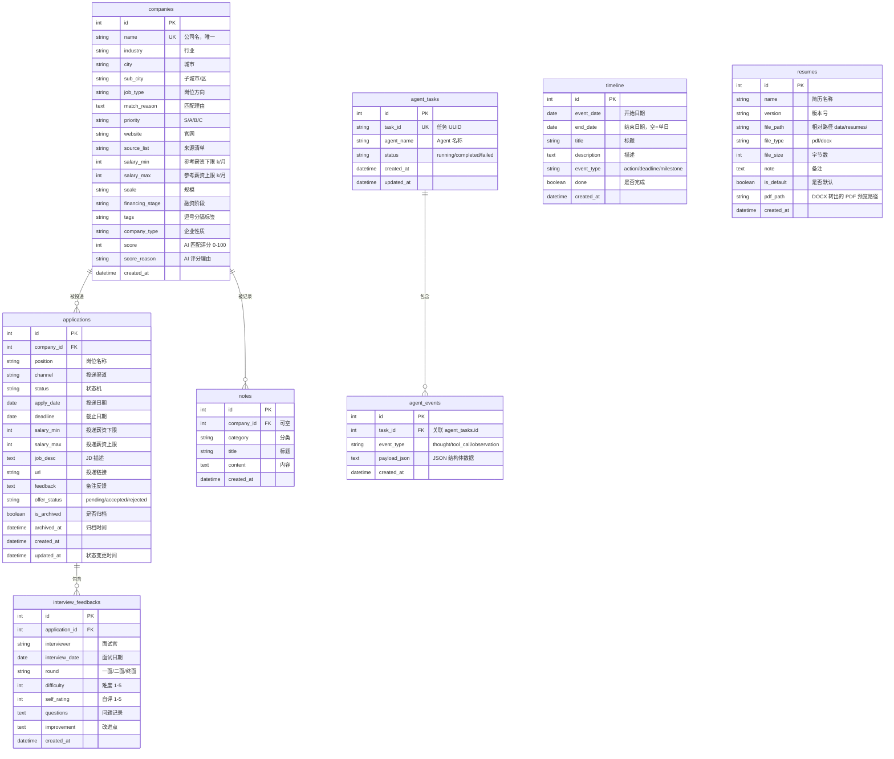
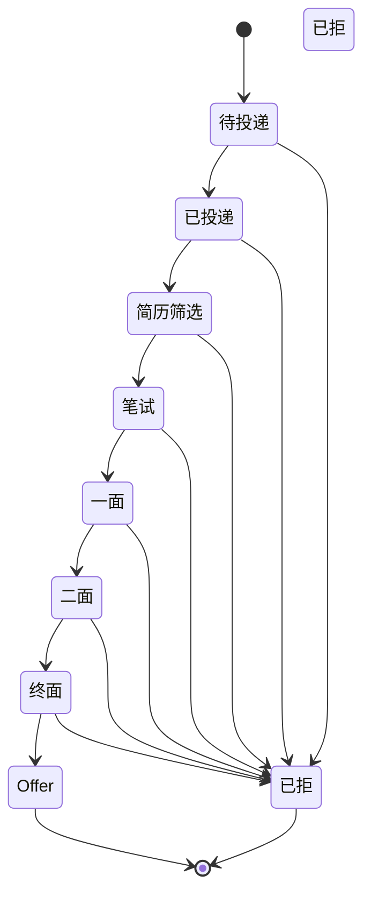
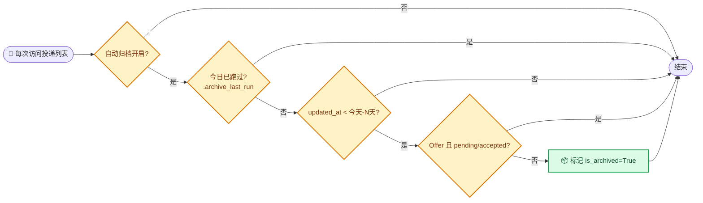

# 数据库设计

_JHTracker 的数据模型：6 张表、字段说明、实体关系与迁移管理。定义见 `models.py`，迁移脚本位于 `migrations/versions/`。_

---

## 📋 表清单

| 表名 | ORM 模型 | 用途 | 关系 |
|---|---|---|---|
| `companies` | `Company` | 公司库（含 AI 评分） | 1:N applications / notes |
| `applications` | `Application` | 投递记录（状态机 + 归档） | N:1 company；1:N feedbacks |
| `notes` | `Note` | 笔记（可挂公司） | N:1 company（可空） |
| `timeline` | `Timeline` | 甘特图时间线节点 | 无外键 |
| `interview_feedbacks` | `InterviewFeedback` | 面试复盘 | N:1 application |
| `resumes` | `Resume` | 简历版本 | 无外键 |
| `agent_tasks` | `AgentTask` | Agent 任务日志与状态 | 1:N agent_events |
| `agent_events` | `AgentEvent` | Agent 推理与执行步骤事件 | N:1 agent_task |

---

## 🗺️ ER 图



---

## 🏷️ 关键枚举与规则

### 投递状态机（`Application.status`）



> 注：状态流转是**自由编辑**（任意状态可互相切换），上图为典型流程。完整枚举见 `constants.py:3`。

### 其他枚举

| 字段 | 取值 | 定义位置 |
|---|---|---|
| `Company.priority` | `S` / `A` / `B` / `C` | `constants.py:24`（含按公司名关键词推断规则） |
| `Company.scale` | 少于50人 / 50-200人 / 200-1000人 / 1000-5000人 / 5000人以上 | `constants.py:53` |
| `Company.financing_stage` | 未融资 / 天使轮 / A轮 / B轮 / C轮 / D轮及以上 / 已上市 / 国企 / 外企 | `constants.py:54` |
| `Application.offer_status` | `pending` / `accepted` / `rejected` | `constants.py:38` |
| `Timeline.event_type` | `action` / `deadline` / `milestone` | 自由字符串，模板按类型着色 |

---

## 🔑 归档机制（`is_archived`）

投递记录支持**自动归档**：`updated_at` 超过 N 天（默认 15，可配）且不在保护名单内的活跃记录，会被标记为 `is_archived=True`。

**保护规则**（`services/archive.py:14`）：状态为 `Offer` 且 `offer_status ∈ {pending, accepted}` 的记录**永不自动归档**。



---

## 🧬 迁移管理

项目使用 **Flask-Migrate**（Alembic）管理 schema 变更，历史迁移见 `migrations/versions/`：

| 迁移 | 内容 |
|---|---|
| `8f5f295b6215` | 初始：company salary / application offer 等基础字段 |
| `a1b2c3d4e5f6` | 投递记录新增归档字段 `is_archived` / `archived_at` |
| `3ccaa5ea3b4a` | 简历表新增 DOCX→PDF 预览路径 `pdf_path` |

**新增字段的标准流程**（详见 [development.md](development.md#数据库迁移)）：

```bash
flask db migrate -m "描述"
flask db upgrade
```

> ⚠️ 注意：`app.py` 启动时调用 `db.create_all()`，它**只建表、不迁移**。已有库变更 schema 必须走 `flask db upgrade`。

---

## 🔗 相关文档

- [系统架构](architecture.md) — 模块与数据流
- [路由/API 参考](api.md) — 操作这些表的端点
- [开发指南](development.md) — 迁移与测试流程

---

_最后更新：2026-07-31 · 维护者：JHTracker 项目组_
