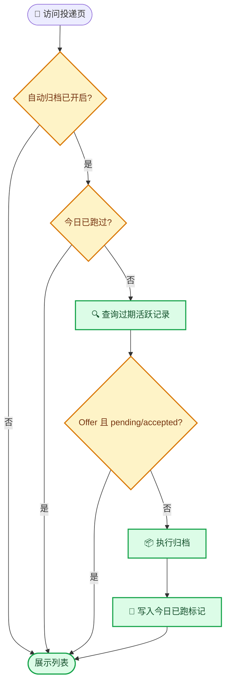

# 投递记录归档功能设计

_投递记录自动归档：超过指定天数未更新的活跃记录，按规则自动标记归档。本文档在实现前记录设计决策，与 [数据库设计](database.md) 和 [路由 API](api.md) 互补。_

---

## 📌 背景与动机

随着使用，投递列表会积累大量**已完成**（Offer / 已拒）或**长期无动静**的记录，干扰日常查看。归档将这些"冷记录"移出主视图，又不删除，可在归档页随时找回，保持主列表清爽。

**核心约束：**

- **Offer 待定/已接受的记录绝不可自动归档**——用户在评估 Offer，误归档会造成数据丢失感
- 归档必须**可逆**：任何时候可恢复
- 用户必须能**随时调整**天数阈值与开关状态
- 自动归档不能对数据库造成额外负担

---

## 🎯 功能设计

### 触发时机

每次用户访问「投递记录」页（`GET /applications`）时，检查是否满足自动归档条件，满足则执行一次归档。**不另起后台进程**——与用户操作同进程完成，无需常驻任务。



### 归档判定条件

一条记录被归档，须**同时**满足：

| # | 条件 | 来源 |
|---|---|---|
| 1 | `is_archived = false`（尚未归档） | 数据库 |
| 2 | `updated_at < 今天 - N 天`（N 为设置的天数，默认 15） | 数据库 + 设置 |
| 3 | 非「Offer 且 `offer_status ∈ {pending, accepted}`」 | 业务规则（保护） |

> N 天阈值存储在 `data/settings.json`，用户可在 UI 修改，不重启即生效。

### 保护规则

```
禁止自动归档：status == 'Offer' AND offer_status IN ('pending', 'accepted')
```

已拒、已接受（accepted）、无状态的 Offer（offer_status 空）不受保护——用户已做决策，可归档。

---

## ⚙️ 设置与配置

### 可配置项

| 配置 | 类型 | 默认 | 说明 |
|---|---|---|---|
| `archive_stale_days` | int | `15` | 超过此天数未更新视为可归档 |
| `archive_auto_enabled` | bool | `true` | 是否开启自动归档 |

**三层配置优先级（高 → 低）：**

1. **Web UI**（`data/settings.json`）：用户在前端修改，立即生效
2. **环境变量**（`JH_ARCHIVE_STALE_DAYS` / `JH_ARCHIVE_AUTO`）：启动时生效，写配置前读取
3. **代码默认值**：15 天、开启

UI 设置覆盖环境变量；环境变量覆盖代码默认值。

### 节流机制

自动归档**每日最多执行一次**，通过 `data/.archive_last_run` 文件记录上次运行日期（`YYYY-MM-DD`）。同一用户、不同会话不重复触发。

> 手动归档（「执行归档」按钮、单条归档）不受节流限制。

---

## 🖥️ 前端 UI 设计

### 投递列表页 (`/applications`)

#### 1. 活跃 / 归档 视图切换

页面顶部加入标签切换：

- **活跃**（默认）：展示 `is_archived=false` 的记录，同原有列表
- **归档**：展示 `is_archived=true` 的记录，每条显示归档时间

```
┌─────────────────────────────────────┐
│  [ 活跃 (12) ]  [ 归档 (3) ]        │
└─────────────────────────────────────┘
```

#### 2. 归档设置面板（可折叠）

位于活跃视图顶部，仅活跃视图可见：

```
┌─ ⚙️ 归档设置 ▾ ─────────────────────┐
│  [15] 天未更新的记录自动归档          │
│  ☑ 自动归档                         │
│  [ 保存 ]  [ 立即执行归档 ]          │
│  当前有 3 条记录即将归档              │
└─────────────────────────────────────┘
```

- 天数输入框：最小 1，保存到 `settings.json`
- 自动归档开关：勾选开启
- 「立即执行归档」：手动触发，忽略节流
- 即将归档数量：`stale_count`，由后端计算

#### 3. 单条归档 / 恢复

每条记录卡片右侧增加：

- 活跃视图 → 「归档」按钮
- 归档视图 → 「恢复」按钮（同位置）

#### 4. 已归档记录样式

已归档记录卡片以**半透明**显示（`opacity: 0.55`），视觉上区分于活跃记录。

---

## 🔧 实现文件清单

| 文件 | 改动类型 | 说明 |
|---|---|---|
| `models.py` | 字段 | 新增 `is_archived` / `archived_at` |
| `config.py` | 配置 | `ARCHIVE_STALE_DAYS` / `ARCHIVE_AUTO_ENABLED` |
| `services/archive.py` | 新增 | 归档业务逻辑（查询/归档/恢复/节流） |
| `services/settings.py` | 新增 | 用户设置读写（settings.json） |
| `routes/application.py` | 扩展 | 新增 6 个归档相关端点、`_maybe_auto_archive` 钩子 |
| `templates/applications.html` | 扩展 | 前端：视图切换 + 设置面板 + 归档/恢复按钮 |
| `migrations/versions/` | 新增 | 归档字段迁移 |

---

## 🧪 验收标准

| # | 标准 |
|---|---|
| 1 | 创建一条记录，更新 `updated_at` 到 16 天前，访问投递页 → 自动归档，主列表消失 |
| 2 | 一条 `status=Offer, offer_status=pending` 的记录，即使过期也不归档 |
| 3 | 同一天多次访问投递页，只执行一次归档 |
| 4 | 关闭自动归档后，过期记录不再被归档 |
| 5 | 在归档页点击「恢复」，记录回到活跃列表，`archived_at` 清空 |
| 6 | 设置 1 天阈值后，1 天前未更新的记录当天即被归档 |
| 7 | 手动执行归档按钮立即归档，不受节流影响 |

---

## 🔗 相关文档

- [数据库设计 · 归档机制](database.md#归档机制is_archived) — 表字段与 ER
- [路由 API · 投递跟踪](api.md#-投递跟踪-routesapplicationpy) — 归档端点清单
- [系统架构](architecture.md) — `services/` 模块职责

---

_最后更新：2026-07-31 · 维护者：JHTracker 项目组_
