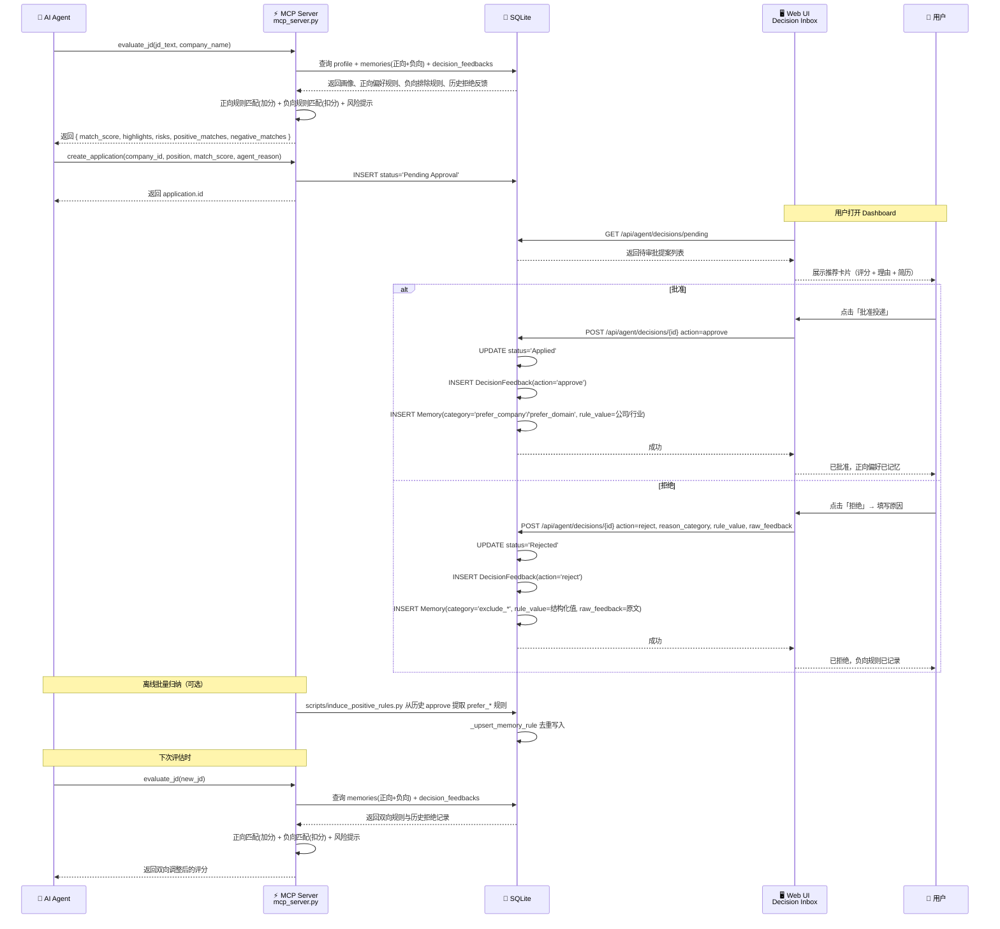

# HITL 人机协同反馈闭环

_JHTracker 的 Human-in-the-Loop 闭环设计：Agent 自动推荐 → 人类审核决策 → 反馈记忆 → 评分纠偏。实现分布于 `models.py`、`mcp_server.py`、`routes/agent_api.py`、`templates/dashboard.html`。_

---

## 🎯 目标

在 Agent 自动化和人类控制权之间建立平衡：AI Agent 负责挖掘岗位、评估匹配度、生成推荐提案，但**所有投递决策必须由人类最终批准**。人类的每次批准/拒绝反馈都被持久化为**双向记忆规则**（正向 `prefer_*` + 负向 `exclude_*`），反哺到后续评估中，使 Agent 推荐越来越精准贴合个人偏好。

```
Agent 挖掘 → 推荐提案 → 人类审核 → 批准(正向记忆)/拒绝(负向记忆) → 反馈记忆 → 下次评分纠偏
                                          ↓
                              批量归纳脚本（离线 LLM 归纳正向规则）
```

---

## 🗺️ 完整闭环



---

## 📦 数据模型

### DecisionFeedback（决策反馈）

记录人类对 Agent 推荐提案的每一次审核决策，是 HITL 闭环的核心审计线索。

| 字段 | 类型 | 说明 |
|---|---|---|
| `id` | int PK | 自增主键 |
| `application_id` | int FK | 关联 `applications.id` |
| `action` | string | `approve` / `reject` / `edit` |
| `reason_category` | string | `tech_mismatch` / `salary_low` / `company_reputation` / `location` / `general` |
| `raw_feedback` | text | 人类原始反馈文本 |
| `created_at` | datetime | 创建时间 |

### Memory（双向偏好规则）

从人类 approve/reject 反馈中提取的结构化规则，按极性分两组，用于 Agent 后续评估的双向纠偏。

| 字段 | 类型 | 说明 |
|---|---|---|
| `id` | int PK | 自增主键 |
| `application_id` | int FK | 关联 `applications.id`，可空 |
| `category` | string | 见下方双向类别表 |
| `rule_value` | string | 结构化值（如 `ROS`、`Java`、`外包`），**仅存短关键词，不再存原始反馈** |
| `raw_feedback` | text | 人类原始反馈评语原文（仅 reject 分支写入） |
| `created_at` | datetime | 创建时间 |

**类别极性表**（`constants.py` 定义）：

| 极性 | 来源 | 类别 |
|---|---|---|
| 正向 `positive` | approve 分支 / 批量归纳脚本 / 手动修正 | `prefer_tech` / `prefer_domain` / `prefer_company` / `salary_expected` / `culture_fit` |
| 负向 `negative` | reject 分支 / 手动修正 | `exclude_tech` / `exclude_company` / `salary_too_low` / `general` |

> 极性判断规则：以 `prefer_` 开头或为 `salary_expected` 视为正向，其余视为负向（见 `constants.memory_polarity`）。写入前按 `(category, rule_value)` 去重，避免重复规则污染评分。

### 关系

```
Application 1──N DecisionFeedback  (一条投递可有多条审核记录)
Application 1──N Memory            (一条投递可产生多条正向/负向记忆)
```

---

## 🔄 HITL 决策流程

### 三动作决策模型

| 动作 | 状态变更 | 副作用 |
|---|---|---|
| `approve` | `Pending Approval` → `Applied` | 记录 `DecisionFeedback(action='approve')` + 写入正向 `Memory(prefer_company/prefer_domain)` |
| `reject` | `Pending Approval` → `Rejected` | 记录 `DecisionFeedback(action='reject')` + 写入负向 `Memory(exclude_*)`，`rule_value` 存结构化值，`raw_feedback` 存原文 |
| `edit` | 不变 | 更新 `position`/`resume_id`/`match_score`/`agent_reason` + 记录 `DecisionFeedback(action='edit')` |

### 正向规则的补充来源

approve 分支只能从单条 application 提取简单特征（公司名/行业），覆盖面有限。系统提供两条补充路径：

| 来源 | 工具 | 适用场景 |
|---|---|---|
| **批量归纳**（方案 3） | `scripts/induce_positive_rules.py` | 离线从历史 approve 记录 LLM 归纳 `prefer_*` 规则，带 profile 指纹缓存，省 token、质量优先 |
| **手动修正**（方案 1 补充） | MCP `add_memory_rule(category, rule_value, polarity)` / REST `/api/v1/...` | 用户或 Agent 发现归纳偏差时显式增删正向规则 |

### 拒绝反馈分类

用户在拒绝时可选择以下分类，帮助 Agent 理解拒绝原因：

| 分类 | 说明 |
|---|---|
| `tech_mismatch` | 技术栈偏离/不匹配 |
| `salary_low` | 薪资不达预期 |
| `company_reputation` | 公司/行业风评问题 |
| `location` | 工作地点不符合 |
| `general` | 其他原因 |

---

## 📊 反馈 → 记忆 → 评分纠偏

### evaluate_jd 的反馈感知逻辑

`mcp_server.py` 中的 `evaluate_jd`（核心逻辑抽到 `_evaluate_jd_inner`，与 `batch_evaluate_jds` 共用）在执行评估时，会同时查询 `memories` 表的双向规则和 `decision_feedbacks` 表的历史拒绝反馈：

```python
# 正向规则（prefer_* / salary_expected）
cursor.execute("SELECT category, rule_value FROM memories
    WHERE category IN ('prefer_tech','prefer_domain','prefer_company','salary_expected','culture_fit')
      AND rule_value IS NOT NULL AND rule_value != ''")

# 负向规则（exclude_* / salary_too_low / general）
cursor.execute("SELECT category, rule_value FROM memories
    WHERE category IN ('exclude_tech','exclude_company','salary_too_low','general')
      AND rule_value IS NOT NULL AND rule_value != ''")

# 历史 reject feedback 分词命中
cursor.execute("SELECT raw_feedback FROM decision_feedbacks
    WHERE action = 'reject' AND raw_feedback IS NOT NULL
    ORDER BY id DESC LIMIT 20")
```

匹配规则（子串匹配，对 `rule_value` 为空的记录跳过）：

| 匹配条件 | 加/扣分 | 输出 |
|---|---|---|
| 命中 `Memory` **正向**规则 | 每条 +4 分，上限 +20 分 | highlights：匹配用户偏好规则 |
| 命中 `Memory` **负向**规则 | 每条 -15 分 | risks：触发负向偏好排查规则 |
| 匹配历史拒绝反馈特征 | 每条 -10 分，上限 -30 分 | risks：匹配过往拒绝反馈特征 |
| 包含"外包"/"驻场" | 上限 30 分 | risks：岗位包含外包/驻场特征关键词 |

### 完整评分公式

```
基础分 = 75
+ 命中正向规则（每条 +4 分，上限 +20 分）   ← 新增
- 命中负向规则（每条 -15 分）
- 匹配历史拒绝反馈（每条 -10 分，上限 -30 分）
- 外包/驻场关键词（上限 30 分）
最终分 = clamp(0, 100)
```

---

## 🖥️ UI：Decision Inbox（决策收件箱）与 Agent 协同侧栏

位于 Dashboard 看板页面右侧 `col-lg-4` 协同侧栏中，将待审批的 Agent 推荐提案置于首屏黄金右上区域。

### 功能特性

- **双栏分屏布局**：左侧 `col-lg-8` 展示漏斗与数据图表，右侧 `col-lg-4` 集中放置 Decision Inbox 和 Agent Task Center
- **推荐卡片**：紧凑型微型卡片显示公司名、岗位、匹配分、Agent 分析简报、原始 JD 链接
- **独立滚动**：Decision Inbox 面板设置固定最大高度（380px）并支持内部滚动
- **批准按钮**：一键批准，状态变更为 `Applied`
- **拒绝按钮**：弹出模态框，选择反馈分类 + 填写具体原因，提交后状态变更为 `Rejected`
- **HTMX 自动轮询**：使用 HTMX 每 15 秒自动拉取局部渲染模板（`hx-trigger="load, every 15s"`）

### 交互流程

```
┌───────────────────────────────────────────────────┬────────────────────────────┐
│ 👈 左侧 8 列：数据分析主区                       │ 👉 右侧 4 列：Agent 协同侧栏 │
│                                                   │                            │
│ • 核心指标 & 漏斗                                 │ 📬 Decision Inbox (待审批) │
│ • 城市 / 行业分布图表                             │ ┌────────────────────────┐ │
│ • AI 匹配得分 vs 薪资散点图                        │ │ [85分] 汇川技术        │ │
│                                                   │ │ 嵌入式工程师  [批准][拒绝]│ │
│                                                   │ └────────────────────────┘ │
│                                                   │                            │
│                                                   │ ⚡ Agent Task Center       │
│                                                   │ 📌 待办节点 & 最近动态     │
└───────────────────────────────────────────────────┴────────────────────────────┘
```

---

## 🖥️ UI：Agent Task Center（任务中心）

位于 Decision Inbox 下方，展示 Agent 后台任务的实时状态。

### 功能特性

- **任务列表**：显示 Agent 名称、Task ID、状态（completed/failed/running）、事件数
- **状态徽章**：`completed` 绿色 / `failed` 红色 / `running` 黄色
- **待审批联动**：显示来自 Decision Inbox 的待审批数量
- **Trace 链接**：点击跳转到 `/traces` 审计页面
- **自动轮询**：每 15 秒自动刷新

---

## 🖥️ UI：Trace 审计页面 (`/traces`)

独立的 Agent 执行轨迹审计页面，用于调试和回溯 Agent 行为。

### 功能特性

- **手风琴式布局**：每个任务一个可折叠面板
- **事件时间线**：按时间顺序展示 thought / tool_call / observation / evaluation_result 等事件
- **JSON 负载展示**：每个事件的 payload 以 `<pre>` 格式化展示
- **状态标识**：任务级状态徽章（completed/failed/running）
- **自动清理**：访问页面时自动删除超过 30 天（可配置环境变量 `JH_TRACES_RETENTION_DAYS`）的过期轨迹，每日最多一次
- **手动清空**：页面顶部「清空全部轨迹」按钮，带确认弹窗，不可恢复

---

## 🔗 相关文档

- [数据库设计 · DecisionFeedback & Memory](database.md#🗺️-er-图) — 表字段与关系
- [路由/API 参考 · HITL 端点](api.md#🧑‍⚖️-hitl-decision-endpoints-apiagent) — 决策 API 详情
- [MCP & Skills 集成指南](SKILLS_AND_MCP_GUIDE.md#4-人机协同-hitl-推荐与审核全流程) — HITL 工作流
- [AI 评分引擎](ai-scoring.md) — `scripts/ai_scorer.py` 评分流程

---

_最后更新：2026-07-31 · 维护者：JHTracker 项目组_