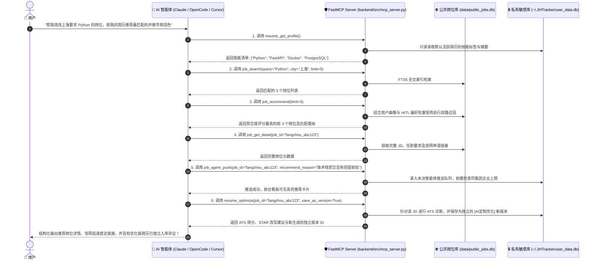
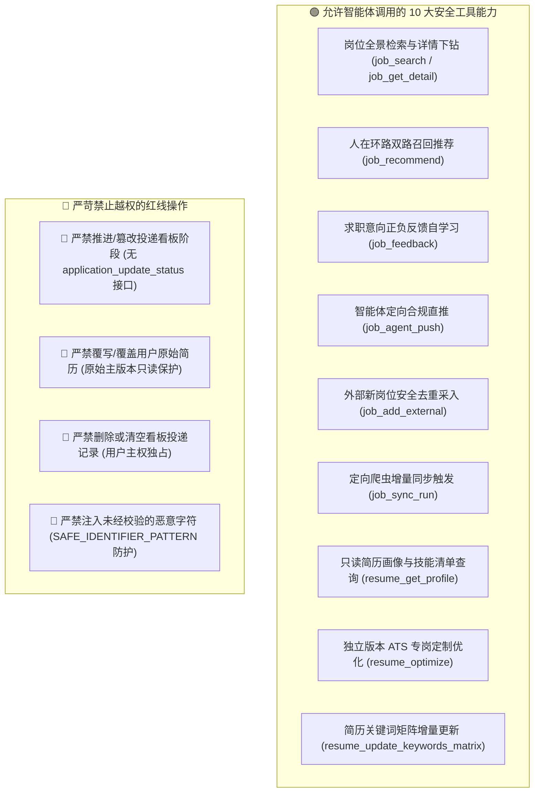

# AI 智能体与 FastMCP 开放接入指南 (MCP Agent Guide) 🤖🔌

JHTracker 全面遵循 Anthropic 提出的 **Model Context Protocol (MCP)** 标准，内置了基于 FastMCP 的高性能本地服务（`backend/src/mcp_server.py`）。

通过 MCP 协议，外部现代 AI 智能体（如 Claude Desktop、OpenCode、Cursor、Cline 等）能够以结构化、高安全、带审计的方式协同求职者开展岗位全景检索、人在环路推荐打分、智能体协同直推、外网职位安全采入、关键词矩阵动态补齐与专岗 ATS 简历优化。

---

## 1. 智能体交互架构与数据流图



---

## 2. 智能体开放设计哲学与权限红线 (Security Boundary)

智能体是求职者的**参谋中枢与信息助手**，绝非主观决策的替代者。JHTracker 底层设立了严格的权限隔离与安全红线：



- **决策主权在人**：投递看板阶段流转（投递/笔试/面试/Offer）是高度严肃的人生决策，**智能体无权直接流转看板状态**。
- **智能体推送频控机制**：调用 `job_agent_push` 时严格受到安全门禁约束：
  - **已投递企业绝对排除**：若用户已向某公司投递过任何岗位，智能体严禁向该企业继续盲目推荐。
  - **未决上限阈值防护**：同一公司在看板与推荐队列中最多挂载 **3 个** 未决岗位，防范单一公司职位霸屏与投递资源挤兑。
- **基准简历只读保护**：用户的原始主简历具有只读属性，AI 优化结果仅作为带有 `version_type = "AI_OPTIMIZED"` 的独立版本持久化，绝不污染原始底本。
- **参数强校验**：所有标识符与文本均受到 `SAFE_IDENTIFIER_PATTERN = r"^[a-zA-Z0-9_\-一-龥]{1,128}$"` 正则安全约束，支持中文后缀并杜绝 SQL 注入与路径穿越。

---

## 3. 完整 FastMCP 10 大工具链规格参考 (Tools Pool)

| 编号 | 工具名称 | 输入参数 | 功能说明与约束 | 返回结果规范 |
| :---: | :--- | :--- | :--- | :--- |
| 1 | `job_search` | `query: str`<br>`city: Optional[str]`<br>`limit: int = 10` | 基于 FTS5 引擎全文模糊检索公共岗位库，自动过滤空值。 | 包含 `total` 命中数与 `jobs` 简要元数据列表。 |
| 2 | `job_recommend` | `resume_id: Optional[str]`<br>`limit: int = 5` | 基于用户简历技能余弦度与 HITL 特征权重计算契合度最高的岗位。 | 推荐列表（包含 `score` 匹配分值与 `match_reason` 解释）。 |
| 3 | `job_feedback` | `job_id: str`<br>`action: str`<br>`reason: Optional[str]` | 提交对岗位的感兴趣 (`ACCEPT`) 或跳过 (`REJECT`) 决策，驱动权重自学习与自动建单。 | 操作状态与反馈持久化确认结果。 |
| 4 | `job_agent_push` | `job_id: str`<br>`recommend_reason: str`<br>`match_score: float = 0.95`<br>`agent_name: str = "JobSourcingAgent"` | 智能体直接向用户界面推送高价值职位，内置已投递拦截与同公司上限限制。 | 包含 `push_id` 与推送确认状态字典。 |
| 5 | `job_get_detail` | `job_id: str` | 依据职位唯一 ID，提取完整职责、任职要求与官方网申直达链接。 | 完整职位字典对象（包含 `url`、`description` 等）。 |
| 6 | `job_add_external`| `company: str`<br>`title: str`<br>`url: str`<br>`location: Optional[str]`<br>`description: Optional[str]`<br>`requirements: Optional[str]`<br>`salary_range: Optional[str]`<br>`skills: Optional[List[str]]`<br>`job_type: str = "CAMPUS"` | 将外部招聘渠道、社交媒体发现的新岗位去重录入公共库（MD5 安全哈希）。 | 录入状态、生成哈希 ID 与是否为新增条目。 |
| 7 | `job_sync_run` | `spider_name: str = "qiuzhifangzhou"`<br>`limit: int = 50` | 触发运行指定的定向招聘网站爬虫（支持 `qiuzhifangzhou`, `wondercv`, `nowcoder`）。 | 爬虫采集统计数据与增量抓取报告。 |
| 8 | `resume_get_profile`| `resume_id: Optional[str] = None` | 只读提取指定简历或默认活跃简历的技能词云与摘要画像。 | 包含 `resume_id`、`title` 与 `skills` 标签列表。 |
| 9 | `resume_optimize` | `job_id: Optional[str] = None`<br>`resume_id: Optional[str] = None`<br>`save_as_version: bool = True` | 诊断简历与目标 JD 的差距，按 STAR 原则生成建议并可选独立存为新版本。 | 包含 `ats_score`、`suggestions`、优化内容与新生成的 `version_id`。 |
| 10 | `resume_update_keywords_matrix` | `resume_id: str`<br>`keywords_to_add: List[str]`<br>`category_tag: Optional[str] = None` | 增量更新简历的技能关键词矩阵并触发权重池扩展，支持行业专岗演进。 | 更新状态与合并后的完整 skills 列表。 |

---

## 4. 常见主流 AI 客户端接入配置

### 4.1 OpenCode 配置接入

在项目根目录或全局的 `opencode.json`（或 `~/.config/opencode/opencode.json`）中添加 MCP Server 配置：

```json
{
  "$schema": "https://opencode.ai/config.json",
  "mcp": {
    "servers": {
      "jhtracker": {
        "command": "python",
        "args": [
          "<PROJECT_ROOT>/backend/src/mcp_server.py"
        ],
        "env": {
          "PYTHONPATH": "<PROJECT_ROOT>/backend"
        }
      }
    }
  }
}
```

### 4.2 Claude Desktop 配置接入

编辑 Claude Desktop 配置文件：
- **Windows**: `%APPDATA%\Claude\claude_desktop_config.json`
- **macOS**: `~/Library/Application Support/Claude/claude_desktop_config.json`

```json
{
  "mcpServers": {
    "jhtracker": {
      "command": "python",
      "args": [
        "-m",
        "src.mcp_server"
      ],
      "cwd": "<PROJECT_ROOT>/backend",
      "env": {
        "PYTHONPATH": "<PROJECT_ROOT>/backend"
      }
    }
  }
}
```

### 4.3 Cursor / Windsurf / Cline 配置接入

在 Cursor 设置页面的 `Features -> MCP Servers` 中点击 **Add New MCP Server**：
- **Name**: `JHTracker`
- **Type**: `command`
- **Command**: `python path/to/JHTracker/backend/src/mcp_server.py`

---

## 5. 典型应用场景实战范例

### 场景一：自然语言复合查岗与简历速配

**用户提问**：
> “请查看我的简历，找出库里最匹配的 3 个自动驾驶或者大模型岗位，给出投递链接和匹配理由。”

**智能体自动化调用链路**：
1. 智能体调用 `resume_get_profile()` 获取当前简历画像。
2. 智能体调用 `job_recommend(limit=3)` 计算并返回得分最高的 3 个岗位。
3. 智能体针对最高分岗位调用 `job_get_detail(job_id=...)` 提取其职责与官网投递入口。
4. 智能体向用户结构化呈现分析，并附上直达链接。

### 场景二：针对特定心仪岗位的专岗版本定制与矩阵同步

**用户提问**：
> “我对 ID 为 `fangzhou_550e8400` 的大厂核心平台岗非常感兴趣，请帮我做一份专岗定制简历，并把缺失的关键技能同步到技能库中！”

**智能体自动化调用链路**：
1. 智能体调用 `job_get_detail(job_id="fangzhou_550e8400")` 深入了解高频考点。
2. 智能体调用 `resume_optimize(job_id="fangzhou_550e8400", save_as_version=True)` 触发 ATS 评分与 STAR 强化。
3. 智能体调用 `resume_update_keywords_matrix(resume_id=..., keywords_to_add=["K8s Operators", "gRPC"])` 动态拓展技能图谱。
4. 后端服务自动在 `~/.JHTracker/user_data.db` 中创建带有 `AI_OPTIMIZED` 标签的新简历。
5. 智能体向用户汇报：“已生成针对该岗位的独立定制版本（ID: `res_ai_xxx`），重点量化了分布式缓存与高并发 QPS 指标；原简历保持安全无损，新技能矩阵已同步，可随时在 Web 端审阅预览！”

### 场景三：外部寻源智能体主动发现与受控直推

**寻源 Agent 自动化工作流**：
1. Agent 外部抓取到某独角兽新发出的高匹配校招岗位，调用 `job_add_external(...)` 录入公共库。
2. Agent 评估该职位与用户技术栈高度契合，准备推送前调用 `job_agent_push(job_id=...)`。
3. JHTracker 底层安全拦截层核验该企业不在用户“已投递黑名单”内，且未决直推数未超标（$\le 3$），成功存入推荐流。
4. 求职者打开 Web 页面即可看到醒目的“AI 直推卡片”并决定是否一键申报。
