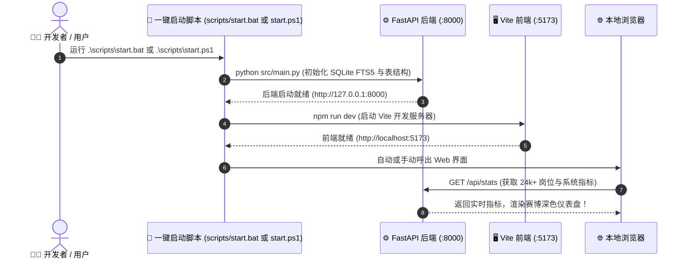

# 3分钟极速入门指南 (Quickstart) ⏱️🚀

本文档指引您在 3 分钟内完成 **JHTracker（本地 AI 智能求职求贤追踪与人在环路推荐中台）** 的本地环境部署、一键全栈启动与健康自检。

---

## 1. 启动全流程时序全景



---

## 2. 环境准备与要求

在运行之前，请确保您的本地计算机已安装以下基础运行环境：

| 依赖组件 | 最低版本要求 | 检查命令 | 功能定位 |
| :--- | :--- | :--- | :--- |
| **Python** | 3.10+ | `python --version` | 运行 FastAPI、FastMCP、推荐算法与爬虫中台 |
| **Node.js** | 18.0+ (LTS 推荐) | `node --version` | 驱动 Vite、React 18 与 AG Grid 前端应用 |
| **npm** | 9.0+ | `npm --version` | 前端依赖包管理与打包构建 |
| **Git** | 任意主流版本 | `git --version` | 源码拉取与分支协同 |

> 💡 **全平台支持**：系统在 Windows 10/11、macOS (Apple Silicon M系列 / Intel) 与 Linux (Ubuntu / Debian / CentOS) 均已完成充分测试与适配。

---

## 3. 依赖极速安装

首次拉取代码后，在项目根目录下分别安装后端与前端的依赖包：

### 3.1 后端依赖安装
```bash
cd backend
python -m pip install -r requirements.txt
```

### 3.2 前端依赖安装
```bash
cd ../frontend
npm install
```

---

## 4. 一键启动全栈服务

项目提供了跨平台一键启动脚本，位于 `scripts/` 目录，可自动化拉起后端 Web API 服务与前端开发服务器：

### Windows 用户 (推荐)

- **方式 A（CMD 批处理）**：在终端执行：
  ```cmd
  .\scripts\start.bat
  ```
- **方式 B（PowerShell 脚本）**：
  ```powershell
  .\scripts\start.ps1
  ```

### macOS / Linux 用户

打开两个终端窗口分别执行：
```bash
# 终端 1: 启动后端核心引擎
cd backend
python src/main.py

# 终端 2: 启动前端可视化看板
cd frontend
npm run dev
```

---

## 5. 运行验证与端口清单

启动成功后，可在浏览器中通过以下地址进行访问与验证：

```
+---------------------------------------------------------------------------------+
| 服务组件                      | 访问地址 / 协议端口      | 核心用途              |
+---------------------------------------------------------------------------------+
| 🖥️ Web 可视化中台 (前端)      | http://localhost:5173   | 赛博深色求职全景大厅   |
| ⚙️ RESTful API 引擎 (后端)    | http://127.0.0.1:8000   | 核心数据接口与推荐计算 |
| 📖 Swagger API 交互文档       | http://127.0.0.1:8000/docs | 接口在线调试与 Schema |
| 🤖 FastMCP 智能体协作端口      | python src/mcp_server.py| STDIO / SSE 智能体桥接|
+---------------------------------------------------------------------------------+
```

### 快速自检命令（可选）
在终端运行全套单元测试，验证核心模块状态：
```bash
cd backend
python -m pytest
```
看到 `39 passed` 即表示系统一切就绪！

---

## 6. 首次上手黄金三步走 (First Steps)


1. **第 1 步：导入您的第一份简历**：
   - 打开 Web 界面，点击顶部导航栏 **“📄 简历工作台”**。
   - 点击 **“导入简历”** 或直接粘贴您的个人 Markdown 简历内容并点击保存，系统将**自动入库**并将其标记为默认主版本。
2. **第 2 步：浏览与多维筛选岗位**：
   - 切换至 **“🔥 校招网申大厅”**，利用快捷城市胶囊（如北京、上海、深圳）和关键词搜索快速筛选合适职位。
   - 对感兴趣但暂未投递的职位点击 **“置顶”**，方便稍后聚焦。
3. **第 3 步：体验人在环路智能推荐与投递看板**：
   - 切换至 **“✨ 智能推荐”**，系统会比对您的技能词云并输出匹配能量条与理由。
   - 点击 **“✅ 感兴趣 / 投递”**，该岗位将瞬间移入 **“📊 投递进展看板”** 的“待申请”泳道中，开启全流程求职追踪！
