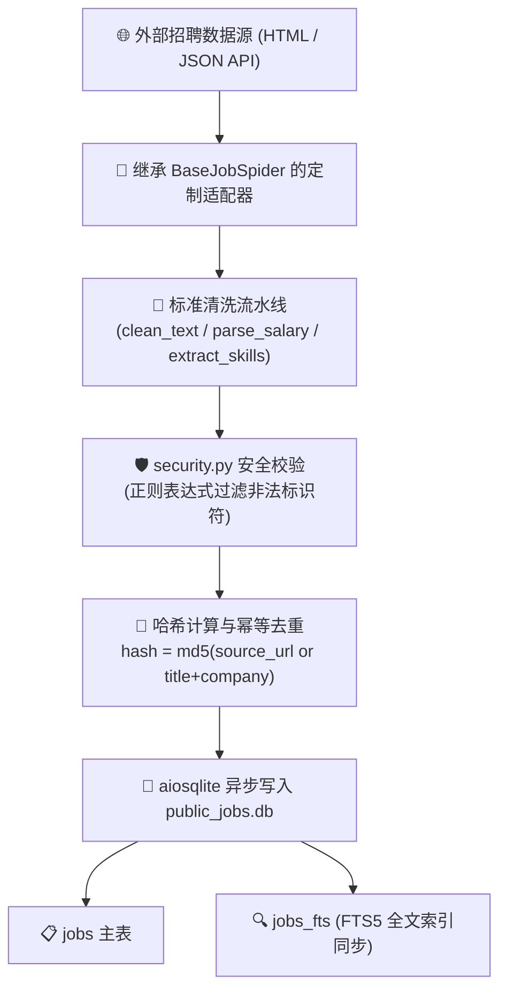

# 定向爬虫与数据采集接入指南 (Spider Development) 🕷️📦

JHTracker 采用模块化的定向爬虫体系（Spider Adapter Pattern），支持将全网招聘网站、校招门户、聚合社区的数据源高效抓取、标准化清洗并幂等入库。

---

## 1. 架构总览与清洗流水线



### 核心特性
- **数据完全解耦**：所有爬虫采集的数据严格仅进入 `data/public_jobs.db`，与求职者的个人隐私库完全隔离。
- **天然幂等去重（Idempotent）**：基于 `source + url` 或 `title + company` 生成稳定且唯一的散列哈希 ID，重复抓取自动转换为增量更新，杜绝脏数据。
- **全文检索自动同步**：更新 `jobs` 数据时，底层机制同步更新 `jobs_fts` 虚拟表，使得前端大厅即刻可以对新职位进行毫秒级全文匹配。

---

## 2. 爬虫基类 `BaseJobSpider` 规范

所有定向爬虫适配器均需置于 `backend/src/services/spiders/` 目录下，并继承 `BaseJobSpider`。

### 核心抽象接口：

```python
from abc import ABC, abstractmethod
from typing import List
from src.models import JobItem

class BaseJobSpider(ABC):
    @property
    @abstractmethod
    def name(self) -> str:
        """爬虫唯一标识符 (例如: 'qiuzhifangzhou', 'boss', 'nowcoder')"""
        pass

    @abstractmethod
    async def crawl(self, keyword: str = "", limit: int = 50) -> List[JobItem]:
        """
        异步抓取主逻辑
        :param keyword: 检索关键词
        :param limit: 抓取上限数量
        :return: 标准化清洗后的 JobItem 对象列表
        """
        pass
```

---

## 3. 标准数据模型与字段映射

爬虫抓取到的原始数据必须映射为统一的 `JobItem` 模型：

| 字段名称 | 类型 | 是否必填 | 说明与清洗要求 |
| :--- | :--- | :--- | :--- |
| `id` | `str` | 是 | 唯一 ID。建议格式：`{spider_name}_{md5(detail_url)[:16]}` |
| `title` | `str` | 是 | 职位名称，去除前缀特殊符号与括号备注 |
| `company` | `str` | 是 | 公司企业全称或官方标准简称 |
| `city` | `str` | 是 | 工作城市，清洗为标准城市名（如“北京”、“深圳”、“远程/全国”） |
| `salary_range` | `str` | 否 | 薪资范畴（如“25k-35k · 15薪”、“200-300元/天”） |
| `job_type` | `str` | 是 | 类别：`"CAMPUS"` (校招)、`"SOCIAL"` (社招)、`"INTERN"` (实习) |
| `category` | `str` | 否 | 业务领域分类（如“研发/技术/算法”） |
| `source` | `str` | 是 | 数据源标识（必须与 `spider.name` 保持一致） |
| `source_url` | `str` | 是 | 网申投递地址或官方职位原网链接 |
| `description` | `str` | 否 | 岗位工作职责正文 |
| `requirements` | `str` | 否 | 岗位任职资格与技术要求 |
| `skills` | `List[str]`| 否 | 提取的技术标签（如 `["Python", "Redis", "Docker"]`） |
| `deadline` | `str` | 否 | 截止投递日期（`YYYY-MM-DD` 格式） |

---

## 4. 10分钟实战：接入一个新的招聘爬虫

以接入假想的校招网 `campus_spider` 为例：

### Step 1: 创建爬虫实现 `backend/src/services/spiders/campus_spider.py`

```python
import hashlib
import httpx
from typing import List
from bs4 import BeautifulSoup
from src.models import JobItem
from src.services.spiders.base_spider import BaseJobSpider

class CampusSpider(BaseJobSpider):
    @property
    def name(self) -> str:
        return "campus_spider"

    async def crawl(self, keyword: str = "", limit: int = 50) -> List[JobItem]:
        jobs: List[JobItem] = []
        target_url = f"https://example-campus.com/api/jobs?query={keyword}&page_size={limit}"
        
        headers = {
            "User-Agent": "Mozilla/5.0 (Windows NT 10.0; Win64; x64) AppleWebKit/537.36"
        }

        async with httpx.AsyncClient(timeout=15.0, headers=headers) as client:
            resp = await client.get(target_url)
            if resp.status_code != 200:
                return []
            
            data = resp.json()
            for item in data.get("list", []):
                raw_url = item.get("apply_link", "")
                # 生成唯一且幂等的 ID
                hash_id = f"campus_{hashlib.md5(raw_url.encode()).hexdigest()[:16]}"
                
                jobs.append(JobItem(
                    id=hash_id,
                    title=item.get("title", "").strip(),
                    company=item.get("company_name", "").strip(),
                    city=item.get("city", "全国").strip(),
                    salary_range=item.get("salary", "面议").strip(),
                    job_type="CAMPUS",
                    category="研发/技术",
                    source=self.name,
                    source_url=raw_url,
                    description=item.get("desc", ""),
                    requirements=item.get("requirements", ""),
                    skills=item.get("tags", []),
                    deadline=item.get("deadline")
                ))
        return jobs
```

### Step 2: 注册至爬虫调度工厂 `job_sync_service.py`

在 `backend/src/services/job_sync_service.py` 中引入并追加至 `get_available_spiders()` 列表（当前内置支持 `qiuzhifangzhou`、`nowcoder` 与 `wondercv`）：
```python
from src.services.spiders.campus_spider import CampusSpider

def get_available_spiders():
    return {
        "qiuzhifangzhou": FangzhouJobSpider(),
        "nowcoder": NowcoderJobSpider(),
        "wondercv": WonderCVJobSpider(),
        "campus_spider": CampusSpider(),
    }
```

### Step 3: 运行自动化单元测试验证

编写测试用例 `backend/tests/test_spider_campus.py` 并执行：
```bash
python -m pytest backend/tests/test_spider_campus.py -v
```
入库后，在大厅界面即可直接按来源 `campus_spider` 或关键词实时检索到新职位！
