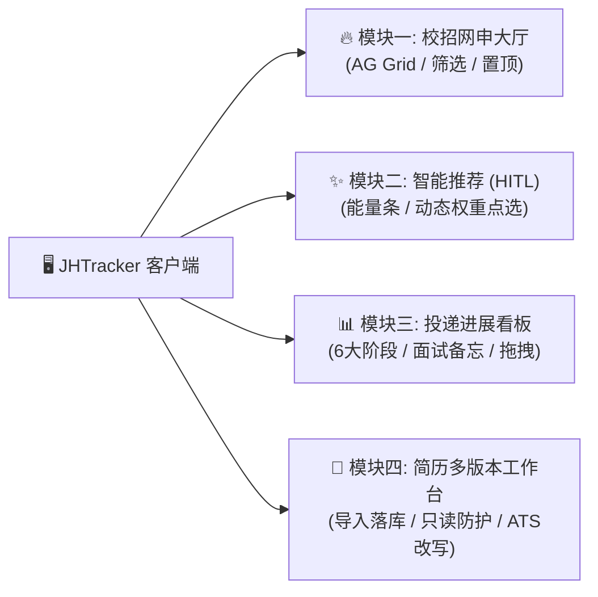
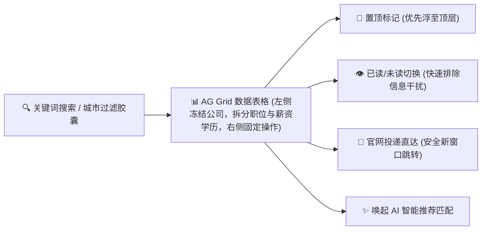
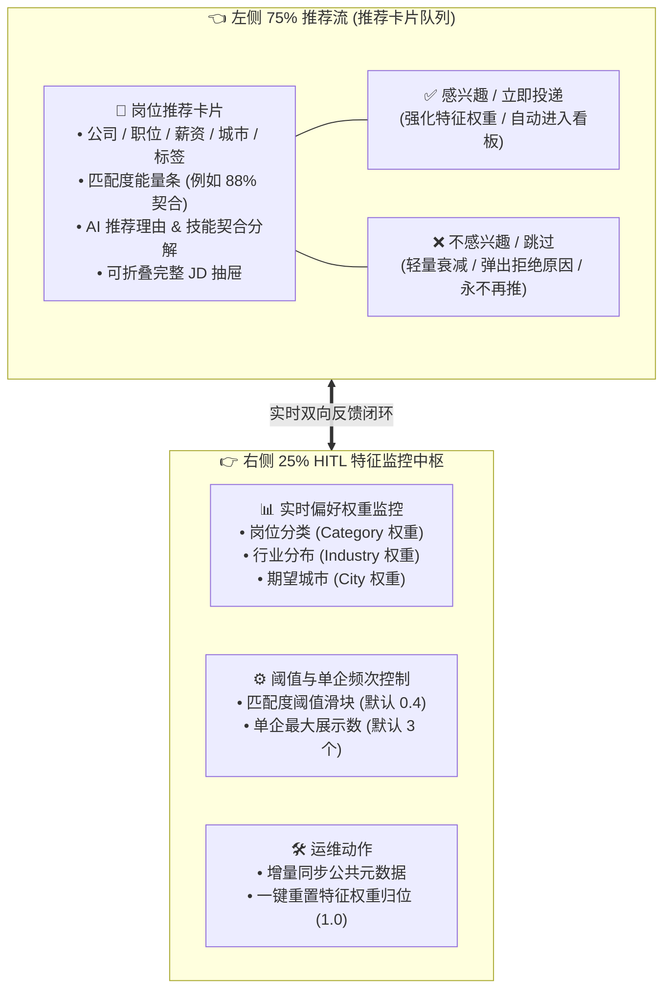
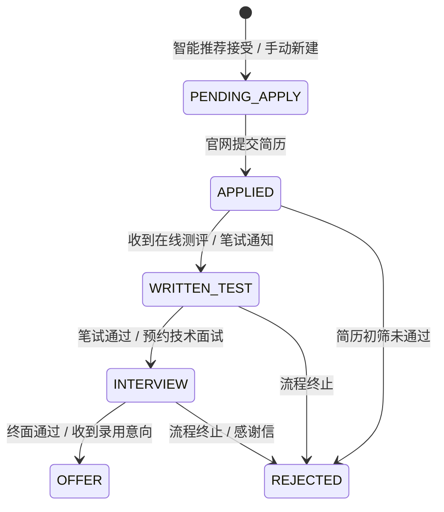
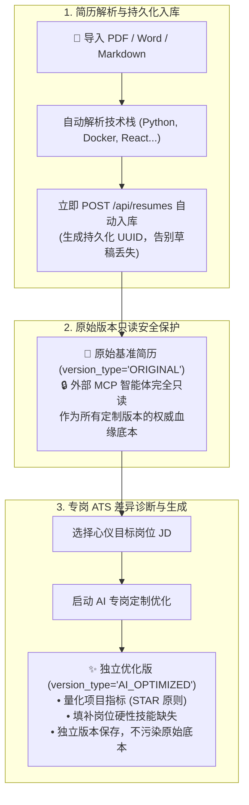

# 全流程用户使用手册 (User Guide) 📘🚀

JHTracker（Job Hunter Tracker）是一款专注于求职体验、本地数据安全与 AI 深度赋能的求职管理中台。本手册详细阐述系统四大核心业务板块的交互规范、操作流程与最佳实践。

---

## 📑 模块导航目录



1. [系统总体界面与交互概览](#1-系统总体界面与交互概览)
2. [模块一：校招网申大厅 (Job Board)](#2-模块一校招网申大厅-job-board)
3. [模块二：人在环路 (HITL) 智能推荐 (Smart Recommender)](#3-模块二人在环路-hitl-智能推荐-smart-recommender)
4. [模块三：投递进展看板 (Application Kanban)](#4-模块三投递进展看板-application-kanban)
5. [模块四：简历工作台与多版本管理 (Resume Workbench)](#5-模块四简历工作台与多版本管理-resume-workbench)
6. [常见使用问题解答 (FAQ)](#6-常见使用问题解答-faq)

---

## 1. 系统总体界面与交互概览

系统采用赛博深色科技风格（Cyber-Dark, 主背景 `#0a0b10`，卡片 `#11131c`，边框 `#24283b`），辅以高饱和青蓝（Cyan）与电光紫（Purple）标识，并集成 **Spline 3D 动态交互顶栏** 与平滑降级机制。

```
+---------------------------------------------------------------------------------------------------+
|  [Briefcase] JHTracker  v2.0 赛博旗舰版               [🔥校招网申]  [✨智能推荐]  [📊进展看板]  [📄简历工作台]  |
|  本地 AI 智能求职与人在环路决策管理平台                         [🛡️ 本地隐私隔离模式 ~/.JHTracker]          |
+---------------------------------------------------------------------------------------------------+
|  Main Content Area (自适应宽屏 1880px 最大宽度，黄金视界，流畅交互)                                   |
+---------------------------------------------------------------------------------------------------+
```

- **四大核心导航切换**：
  - **🔥 校招网申大厅**：2.4万+ 岗位全域浏览，AG Grid v36 企业级表格，极速毫秒级响应。
  - **✨ 智能推荐 (HITL)**：基于个人简历画像的 Jaccard/TF-IDF 双路召回与人在环路动态强化。
  - **📊 投递进展看板**：6 大阶段垂直管道，追踪每一次网申、笔试、面试与 Offer 归宿。
  - **📄 简历多版本工作台**：导入即持久化落库，原始底本只读防护，专岗 ATS 差异诊断。
- **状态常显徽章**：右上角显示 `🛡️ 本地隐私隔离模式 (~/.JHTracker)`，提醒用户私密数据均在本地安全存储。

---

## 2. 模块一：校招网申大厅 (Job Board)

校招网申大厅聚合了来自求职方舟、牛客网及全网公开爬取的 2.4万+ 优质岗位。底层采用 **AG Grid React v36** 高性能虚拟滚动引擎，支撑海量数据集下的零卡顿极速体验。



### 核心功能与操作技巧

1. **多维度条件组合过滤**：
   - **快捷城市胶囊栏 (FilterPillsBar)**：预置北京、上海、深圳、杭州、广州、成都、武汉、南京以及“远程/全国”、“海外”等主流选项。
   - **招聘批次与类型**：支持快速筛选 2026 届秋招、春招实习、日常实习或社招岗位。
   - **时效窗口滑块**：支持筛选 30 天、90 天或指定日期内新发布的优质岗位。
2. **企业级表格列冻结与操作**：
   - **左侧冻结列**：公司名称固定悬浮在左侧，左右横向滚动时始终保持可见。
   - **中间数据列**：岗位名称（340px 独立列宽）、薪资/学历要求（独立列）、工作城市、行业分类、招聘批次与发布日期，信息层级清晰、告别拥挤。
   - **右侧固定操作列**：
     - **网申直达**：点击直接跳转至企业官方招聘主页或校招网申页面。
     - **一键送入推荐**：点击“AI 匹配”，系统将自动携带该岗位并切换至推荐面板进行深度契合度剖析。

---

## 3. 模块二：人在环路 (HITL) 智能推荐 (Smart Recommender)

传统黑盒算法经常发生“拒绝一个岗位，从此再也刷不到同类好公司”的过拟合问题。JHTracker 采用 **75:25 宽屏黄金分割排版** 与 **人在环路双向动态特征自进化机制**。



### 推荐交互机制

1. **匹配度能量条与维度解析**：
   - 每张推荐卡片顶部展示当前岗位与您活跃简历的匹配能量条（0%~100%）。
   - 展开“查看匹配详情”，系统会清晰列出已命中的技术栈关键词、缺失的技术栈以及时效加分项。
2. **正向反馈动作 (ACCEPT)**：
   - 点击“感兴趣 / 申请”，系统会自动在**投递看板**中创建一条初始状态为 `待申请 (PENDING_APPLY)` 的投递卡片，无需手动录入。
   - 后台对该岗位的相关特征权重进行正向加权（单次 $+0.15$，上限 $2.0$）。
3. **负向反馈动作 (REJECT)**：
   - 点击“不感兴趣”，可勾选“薪资不符”、“技术栈偏差”、“城市不考虑”或“暂无意向”。
   - 算法针对该具体岗位永久拉黑不再推荐；针对所属行业与城市执行平滑降权（乘以 $0.85$），并受限于最低保护地板价（$0.05$），确保绝不误杀。
4. **侧边栏特征全透明控制**：
   - 右侧直观展现当前正在生效的各维度权重数值。
   - 若您改变了求职意向，可点击 **“重置偏好权重”**，瞬间恢复全维度 $1.0$ 的中立初始状态。
5. **智能体专属推送与一键直连网申**：
   - 外部 Agent 顾问（如 Job-Advisor）通过 FastMCP `job_agent_push` 推荐的岗位会直接呈现在候选池中，附带匹配理由与精准匹配分。
   - 智能推荐卡片点击“感兴趣 / 立即投递”时，系统将直接注入企业直聘网申 URL 自动创建 `PENDING_APPLY` 任务，免去二次检索与复制。

---

## 4. 模块三：投递进展看板 (Application Kanban)

投递看板全面接管求职生命周期，以垂直泳道的形式直观呈现所有网申进展。



### 看板六大阶段定义

| 阶段代码 | 阶段显示名称 | 阶段含义与典型操作 |
| :--- | :--- | :--- |
| `PENDING_APPLY` | 📝 待申请 | 已确定意向但尚未提交，卡片展示官网直达链接与岗位关键要求。 |
| `APPLIED` | 📨 已网申 | 简历已在企业系统提交，记录网申日期与投递岗位。 |
| `WRITTEN_TEST` | 💻 笔试 / 测评 | 收到牛客/赛码网等平台笔试邀约，记录测评截止时间。 |
| `INTERVIEW` | 🎙️ 面试中 | 经历一面、二面、交叉面与 HR 面，实时保存面试复盘。 |
| `OFFER` | 🎉 已获 Offer | 成功录用，记录意向薪资、沟通津贴与签订三方备忘。 |
| `REJECTED` | 🥀 流程终止 | 收到感谢信或放弃投递，沉淀复盘备忘。 |

### 核心操作与安全准则

- **高密度紧凑排版**：全面优化卡片垂直与水平内边距，移除高消耗阴影微动效，单屏容纳更多投递任务，状态流转一目了然。
- **一键归档与双重视图**：支持对已终止或放弃的投递进行一键归档（`is_archived`），顶部支持随时切换“进行中”与“查看已归档”，保持主看板清爽干净。
- **安全红线保障**：**投递阶段的推进属于用户核心主权**。系统坚决禁止外部 AI 智能体跨越权限修改看板状态，所有卡片流转必须由求职者在界面上手动拖拽或点击状态按钮完成。
- **面试备忘与复盘面板**：点击卡片即可呼出详细抽屉，记录面试官提问核心算法、系统设计深水区考点，以及后续需要查漏补缺的知识盲区。

---

## 5. 模块四：简历工作台与多版本管理 (Resume Workbench)

求职过程中，“一刀切”的通用简历很难通过各家企业的特定 ATS（简历筛选系统）。JHTracker 构建了 **“原始底本只读防护 + 专岗 AI 独立衍生”** 的双轨工作台。



### 操作全流程指引

1. **导入与编辑简历**：
   - 点击 **“导入简历”** 支持上传 `.pdf`、`.docx` 或纯文本 Markdown。
   - 系统提取技能标签后，**立即触发接口自动入库**并刷新版本列表，彻底解决页面刷新丢失编辑的问题。
   - **内置纯原生全语法 Markdown 渲染引擎**：无外部重型依赖，完整支持 H1~H4 标题分级、无序/有序列表、行内加粗、斜体、行内代码、独立代码块、引用块及分割线排版，同时与技能高亮标签无缝结合，提供如同 Typora 般的清爽排版。
   - 编辑器支持分屏实时 Markdown 预览与草稿未存库警示（`AlertCircle` 标识）。
2. **基准简历防护机制**：
   - 用户的原始主简历具有唯一权威性，系统后台通过代码层权限阻断任何外部智能体对 `ORIGINAL` 简历的写入操作。
3. **专岗 AI 定制优化与灵活模型配置**：
   - 在工作台选择任意目标岗位，点击 **“AI 专岗定制优化”**。
   - **多通道 AI 引擎支持**：支持配置用户自定义的大模型 API（`custom_api`，兼容 OpenAI / DeepSeek / Ollama / 本地网关，可设置 Base URL、API Key 与 Model 名称），同时也原生支持通过 `opencode` 或 `hermes` CLI 代理执行，具备内置启发式规则（`builtin`）兜底保障。
   - 系统比对简历与 JD 的高频考察点，提供 STAR 原则量化改写建议。
   - 优化后的简历将**作为全新的独立版本记录**存储在数据库中，并在双栏对比视图中清晰展现差异，保留父版本关联 ID，随时可一键切换比对。

---

## 6. 常见使用问题解答 (FAQ)

### Q1: 系统的岗位数据存放在哪里？会泄露我的投递信息吗？
**A**: 绝不会。JHTracker 坚持 **Local-First（本地优先）** 架构。所有公开招聘信息存储在代码目录下的 `data/public_jobs.db`；而您的个人简历、投递记录、面试复盘与行为偏好权重**全部保存在您的系统用户私有目录 `~/.JHTracker/user_data.db`** 中。即使您将项目代码推送至 GitHub，您的个人隐私也绝不会外泄。

### Q2: 为什么 AI 智能体不能帮我直接在看板里把岗位改成“已通过”？
**A**: 这是核心的**安全权限红线**。求职进展是涉及用户严肃人生决策的主流程，AI 智能体的职责是提供岗位情报、推荐候选与简历润色建议。系统底层严格封禁了通过 MCP 接口修改看板与删除求职记录的权限，确保掌控权始终在您手中。

### Q3: 为什么导入简历后刷新页面，版本列表还在？
**A**: 这是经过重点优化的特性。简历解析成功后，系统前端会立即向后端 `POST /api/resumes` 完成持久化落库并生成唯一 UUID，不再停留在前端易失内存中，保障您的每次心血改动都安全无虞。

### Q4: 如何配置我自己的大模型（如 DeepSeek、OpenAI、本地 Ollama）来调优简历？
**A**: 在简历工作台右上角点击 **“AI 引擎设置”** 齿轮图标，勾选“自定义 OpenAI 兼容 API”。填写您的 API 端点（例如 `https://api.deepseek.com/v1` 或本地 `http://127.0.0.1:11434/v1`）、API Key 以及模型名称（如 `deepseek-chat` 或 `qwen2.5`）。配置保存在本地浏览器中，调用优化时将以秒级响应直接返回量化改写结果，无需在 Windows 下受限于子进程冷启动。
